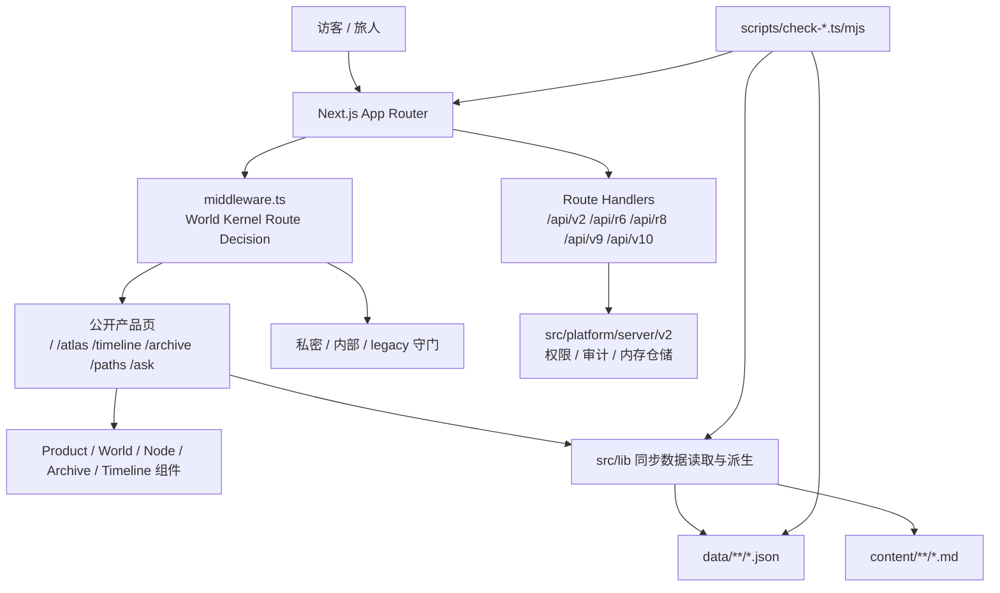

# WorldOS / 古月浮屿项目摸底报告

> [!NOTE]
> 摸底日期：2026-07-04  
> 摸底范围：`README.md`、`docs/`、`data/`、`src/app`、`src/components`、`src/lib`、`src/platform`、`src/server`、`scripts`、`package.json`。  
> 结论基于当前工作区代码与文档，不包含外部线上环境验证。

## 1. 核心结论

`word-life` 是一个以 Next.js + TypeScript 实现的静态优先个人数字世界项目。它的产品名是 **古月浮屿 / WorldOS**，定位不是传统博客，而是把技术文章、项目记录、灵感、生活记忆、公开展示、私密档案和 AI 协作协议组织成一个长期可维护的个人数字世界。

当前项目已经进入 **WorldOS v1 产品化旅程基线 / World Kernel 收束期**：

- 公开产品主线已经收束到首页、地图、时间流、档案馆、路径、AI 灯塔、宪章、关于页、状态页、节点详情和路径详情。
- 历史阶段线、V/R/R8 动态宇宙、治理页、生产页、证据页等仍保留在仓库中，但通过 World Kernel route policy 降级为 legacy/reference 或 internal。
- 数据和内容以 JSON + Markdown 为主，页面同步读取静态数据，适合静态构建、备份和迁移。
- 服务端 API 已有 V2 边界样板，包括 owner token、权限、审计和内存仓储，但尚不是完整持久化后端。
- 当前状态必须保持 `productionLive: false`、`releaseReady: false`、`cleanProductionReady: false`，因为真实 Preview/Production URL、线上 smoke、HTTPS、Web Vitals、可访问性快照、人工签收和真实回滚演练仍未补齐。

## 2. 项目背景

项目要解决的不是“做一个博客”，而是一个更宽的个人数字系统问题：

- 传统博客过于文章列表化，难以承载项目、记忆、生活、失败复盘和灵感碎片。
- 普通知识库像仓库，缺少路径、世界感、访客友好性和长期叙事。
- 普通作品集偏结果展示，不能很好承载过程、私密层和未来回望。
- AI 接入如果没有边界，容易变成普通聊天框，甚至越权影响内容和隐私。

项目愿景可以拆成四层：

| 方向 | 含义 |
|---|---|
| 对外 | 可进入、可探索、可停留的公开世界 |
| 对内 | 可维护、可记录、可整理的创世台 |
| 对未来 | 可导出、可回望、可传承的生命档案 |
| 对 AI | 可读、可审计、可边界化协作的世界协议 |

## 3. 产品需求

### 3.1 用户角色

| 角色 | 主要需求 |
|---|---|
| 古月本人 / 造物主 | 记录技术、整理项目、沉淀灵感、保存生活、管理私密、和 AI 协作、长期回望、导出备份 |
| 普通访客 / 旅人 | 快速理解这里是什么，找到技术、项目、生活和世界设计内容，不迷路 |
| 深潜者 | 理解个人数字世界的设计、宪章、数据模型和演化逻辑 |
| 未来的自己 | 查看某年关注点、旧项目、旧灵感和成长轨迹 |
| 家人 / 孩子 | 在受保护边界内保存家庭记忆，并为未来导出和传承预留空间 |
| AI | 读取授权内容、生成建议、辅助整理，但不越权、不自动发布、不替人决定 |

### 3.2 V1 必须成立的产品能力

- 首页不是文章列表，而是世界入口。
- Atlas 世界地图提供区域、路径、节点的空间导航。
- 节点详情页统一承载文章、项目、记忆、规则、文档等内容。
- 时间流展示公开世界事件和节点成长记录。
- 档案馆提供现实检索视图。
- 精选路径降低第一次进入的理解门槛。
- AI 灯塔以低光模式提供只读导览和路径推荐。
- 世界宪章、关于页、状态页负责解释世界规则、现实口径和运行状态。
- 无 AI 配置时，地图、时间流、档案馆、路径和节点阅读仍能完整运行。

### 3.3 当前不应继续扩张的范围

World Kernel 审计已经明确冻结继续扩展 R8.x / V / R 新功能线。当前阶段优先级是：

- 架构审计
- 内核收束
- 路由守门
- 脚本合并
- 真实生产证据

## 4. 技术栈

| 层级 | 当前实现 |
|---|---|
| Web 框架 | Next.js 15 App Router |
| UI | React 19、Tailwind CSS、部分 Framer Motion、lucide-react |
| 语言 | TypeScript strict |
| 内容 | Markdown / MDX、JSON |
| 搜索 | Fuse.js 依赖已引入，档案馆侧为本地检索方向 |
| 校验 | Zod schema、TypeScript、ESLint、大量自定义 check scripts |
| 服务端样板 | Next.js Route Handlers + `src/platform/server/v2` in-memory repository |
| 构建 | `npm run build` 先跑数据和公开构建检查，再执行自定义构建 wrapper |

关键配置：

- `next.config.ts` 启用 MDX，构建时忽略 ESLint/TypeScript 错误，原因是项目用独立 `npm run lint` 和 `npm run typecheck` 做门禁。
- `tsconfig.json` 使用 `strict: true`，路径别名 `@/* -> ./src/*`。
- `tailwind.config.ts` 定义了 `ink/paper/mist/moss/lake/night/gold` 等世界视觉色彩。

## 5. 架构总览



### 5.1 正式主线

正式主线由以下部分构成：

- `src/app/page.tsx`
- `src/app/about/page.tsx`
- `src/app/atlas/page.tsx`
- `src/app/timeline/page.tsx`
- `src/app/archive/page.tsx`
- `src/app/ask/page.tsx`
- `src/app/paths/page.tsx`
- `src/app/paths/[id]/page.tsx`
- `src/app/node/[slug]/page.tsx`
- `src/app/manifesto/page.tsx`
- `src/app/status/page.tsx`
- `src/components/product/*`
- `src/components/world/*`
- `src/components/node/*`
- `src/components/archive/*`
- `src/components/timeline/*`
- `src/lib/world-kernel-*`
- `src/lib/product-routes.ts`
- `data/domains/experience/*`
- `data/core/relations.json`
- `data/core/world-events.json`

### 5.2 Legacy / internal 层

仓库中仍保留大量历史阶段页和组件，例如：

- `src/app/v*`
- `src/app/r*`
- `src/app/phase-*`
- `src/components/r8-*`
- `src/features/r*`
- `scripts/check-r*`
- `scripts/check-phase-*`

它们不是当前公开产品入口。当前策略是保留历史参考，但禁止回流污染公开主线。

## 6. 路由与边界

路由边界由 `src/lib/product-routes.ts` 和 `src/lib/world-kernel-boundary.ts` 定义，`middleware.ts` 执行。

| 路由类别 | 行为 |
|---|---|
| 公开主路由 | `/`、`/about`、`/forbidden`、`/atlas`、`/timeline`、`/archive`、`/paths`、`/ask`、`/manifesto`、`/status` |
| 深层公开路由 | `/node/*`、`/paths/*` |
| legacy redirect | `/world -> /atlas`、`/world-map -> /atlas`、`/time-river -> /timeline`、`/lighthouse -> /ask` 等 |
| private guarded | `/private-archive`、`/private-ai`、`/r4-creator`、`/r6-service`、`/r7-evolution`、`/ai-workbench` 等重定向到 `/forbidden` |
| internal guarded | 阶段页、治理页、生产页、证据页、服务适配页等重定向到 `/archive` |

关键判断：

- 私密、创世台、服务桥和 AI 工作台不能依赖前端隐藏，必须由路由边界拦截。
- 未知路由交给 Next.js 404 或动态路由处理，不能自动进入产品主导航。

## 7. 数据与内容模型

### 7.1 当前数据规模

| 项目 | 数量 |
|---|---:|
| 节点 | 52 |
| 公开节点 | 52 |
| 一级区域 | 8 |
| 路径 | 13 |
| 公开路径 | 13 |
| 关系 | 82 |
| 世界事件 | 21 |

节点类型分布：

| 类型 | 数量 |
|---|---:|
| article | 20 |
| project | 6 |
| fragment | 2 |
| memory | 3 |
| rule | 10 |
| document | 8 |
| event | 2 |
| path | 1 |

### 7.2 数据事实源

| 数据 | 文件 |
|---|---|
| 节点 | `data/domains/experience/nodes.json` |
| 区域 | `data/domains/experience/areas.json` |
| 路径 | `data/domains/experience/paths.json` |
| 关系 | `data/core/relations.json` |
| 世界事件 | `data/core/world-events.json` |
| 世界状态 | `data/core/world-state.json` |
| 导航契约 | `data/domains/experience/navigation-state-contract.json` |
| 发布证据 | `data/release/*`、`data/world-kernel/*` |

### 7.3 类型与校验

核心类型在 `src/lib/types.ts`，Zod schema 在 `src/lib/schemas.ts`。`scripts/validate-world-data.ts` 校验：

- area id 唯一。
- node id 和 slug 唯一。
- node 的 `areaId` 必须存在。
- public node 必须有 summary。
- AI 生成且未 review 的节点不能 public。
- relation 两端节点必须存在。
- path 引用的 node slug 必须存在。
- world event 引用的 node / area 必须存在。

## 8. 核心模块

### 8.1 页面层 `src/app`

页面层非常薄，主要负责：

- 生成 metadata。
- 从 `src/lib` 读取静态数据。
- 组合产品组件。
- 对动态详情页执行 `notFound()`。

例子：

- 首页读取 `areas`、`featuredNodes`、`publicNodes`、`paths`、`events` 后传给 `ProductHome`。
- 节点详情页通过 `generateStaticParams()` 只生成公开节点，并在运行时再次检查 `node.visibility === 'public'`。
- 路径详情页只从公开路径生成静态参数。

### 8.2 产品组件层 `src/components/product`

这一层承担当前公开世界的产品体验：

- `ProductHome`
- `ProductBackdrop`
- `ProductJourneyDock`
- `ProductRouteGuide`
- `ProductWorldCompass`
- `ProductWorldBoundaries`

它的职责是把“世界语言”翻译为现实可理解的入口、路径、边界和回路。

### 8.3 世界组件层 `src/components/world`

这一层包括：

- `WorldShell`
- `CompassNav`
- `MobileNav`
- `AtlasMap`
- `AreaNodeCluster`

`WorldShell` 是所有页面的外壳，包含 skip link、背景、桌面导航、主要内容、旅程 dock、footer 和移动导航。

### 8.4 内容阅读层

关键文件：

- `src/app/node/[slug]/page.tsx`
- `src/components/node/*`
- `src/components/reading/*`
- `src/lib/content.ts`
- `src/lib/node-reading.ts`
- `src/lib/reading-comfort.ts`

特点：

- Markdown 内容从 `contentPath` 读取。
- 节点页有面包屑、封面、阅读头、阅读舒适条、目录、正文、关系 rail 和下一步动作。
- `readContentFile()` 做了基础路径清理，避免直接读取项目根目录之外的路径。

### 8.5 AI 灯塔

当前公开 `/ask` 不是完整 AI 聊天，也不调用模型。它以低光模式运行：

- 只读公开路径和公开节点。
- 解释“我在哪、能去哪、下一步看什么”。
- 推荐路径和节点。
- 不写入、不修改、不读取私密层。

这是符合“AI 是灯塔，不是太阳”的当前实现。

### 8.6 服务端 V2 样板

`src/platform/server/v2` 提供：

- `domain.ts`：角色、权限、审计事件、内容记录、vault 记录类型。
- `context.ts`：从 `GUYUE_OWNER_TOKEN` 或 `R8_OWNER_TOKEN` 识别 owner，否则默认为 viewer。
- `permissions.ts`：基于角色的权限表。
- `audit.ts`：内存审计日志。
- `repository.ts`：内存内容仓储和 vault 仓储。
- `response.ts`：统一 JSON response。

`src/server/v2` 当前是兼容 re-export，README 指向未来应逐步迁移到 `@/platform/server/v2/*`。

> [!WARNING]
> 这一层是服务化平台的边界样板，不是生产级持久化后端。数据存在内存中，重启即丢失。

## 9. 脚本与门禁

`package.json` 当前有 761 个 scripts，其中：

| 类别 | 数量 |
|---|---:|
| `check*` 脚本 | 564 |
| `print` 相关脚本 | 148 |
| `build*` 脚本 | 7 |
| `release` 相关脚本 | 74 |
| `world-kernel` 相关脚本 | 6 |
| `worldos` 相关脚本 | 6 |

推荐理解方式：

- 日常开发：`npm run dev`
- 基础门禁：`npm run check`、`npm run typecheck`、`npm run lint`
- 产品发布口径：`npm run check:product-release`
- World Kernel 收束：`npm run check:world-kernel-consolidation`
- 本地生产证据：`npm run check:world-kernel-production`
- RC 快速门禁：`npm run check:release:rc:fast`
- 完整发布门禁：`npm run check:release`

脚本数量已经是项目治理重点。现有文档的方向是保留历史脚本，但把长期默认入口收束为更少、更清晰的门禁。

## 10. 代码体量

当前工作区文件计数：

| 区域 | 文件数 |
|---|---:|
| `src/app` | 114 |
| `src/components` | 441 |
| `src/features` | 197 |
| `src/lib` | 161 |
| `data` | 1058 |
| `scripts` | 761 |
| `docs` | 861 |
| Git 跟踪文件 | 3715 |

这说明项目已经不是小型博客代码库，而是一个高度文档化、数据化、阶段化的产品仓库。后续维护的关键不是继续加文件，而是降低主线认知成本。

## 11. 当前实现成熟度

| 能力 | 状态 | 说明 |
|---|---|---|
| 公开产品入口 | 已实现 | 首页、地图、时间流、档案馆、路径、灯塔、关于、宪章、状态 |
| 节点阅读 | 已实现 | 静态生成公开节点，支持 Markdown 内容、目录、阅读舒适度、关系导览 |
| 数据契约 | 已实现 | TypeScript 类型 + Zod schema + validation scripts |
| 路由守门 | 已实现 | middleware + World Kernel route decision |
| 私密模型 | 已建模 | visibility、permissions、private/vault 概念存在 |
| 私密真实访问 | 未完成 | 当前 private/internal 公开路由被 redirect，未见完整授权页面体验 |
| AI 真实能力 | 未完成 | 当前公开灯塔是静态低光导览，不调用模型 |
| 服务端持久化 | 未完成 | V2 server 是内存样板 |
| 发布证据 | 部分完成 | 本地门禁与证据台账存在，外部真实上线证据缺失 |
| 脚本治理 | 进行中 | 数量很大，已有 RC3 主线治理方向 |

## 12. 风险与关注点

### 12.1 主线被历史阶段线淹没

V/R/R8/phase 文件大量存在，未来开发者很容易误以为这些都是当前产品入口。必须继续维护主线代码地图、route policy 和 legacy boundary check。

### 12.2 脚本数量过高

761 个 scripts 和 564 个 check scripts 会造成门禁选择成本。长期应把日常入口压缩为少数固定命令，历史批次脚本归档为 legacy。

### 12.3 构建配置允许忽略 lint/type errors

`next.config.ts` 中 `ignoreDuringBuilds` 和 `ignoreBuildErrors` 为 true。这本身有明确理由，即 lint/typecheck 由独立门禁执行，但团队必须坚持发布前运行 `npm run lint` 和 `npm run typecheck`，否则构建通过不能代表类型安全。

### 12.4 服务化能力仍是样板

`src/platform/server/v2` 还没有数据库、真实会话、持久化审计、真实 vault 加密、任务队列和外部 AI provider。不能把它描述为已完成平台后端。

### 12.5 生产状态必须诚实

当前仓库反复强调不能伪装 production live。后续如果要把 releaseReady 改为 true，需要真实外部证据，而不是本地 wrapper 或报告文件。

## 13. 建议的接手路径

### 13.1 第一天只看这些文件

1. `README.md`
2. `docs/README.md`
3. `docs/10-development-history/world-kernel/world-kernel-architecture-audit-v1.md`
4. `docs/10-development-history/world-kernel/worldos-1-rc3-mainline-governance.md`
5. `content/documents/worldos-mainline-code-map.md`
6. `content/documents/route-ownership-map.md`
7. `src/lib/product-routes.ts`
8. `src/lib/world-kernel-boundary.ts`
9. `middleware.ts`
10. `src/app/page.tsx`
11. `src/components/product/ProductHome.tsx`
12. `src/app/node/[slug]/page.tsx`
13. `src/lib/types.ts`
14. `src/lib/schemas.ts`
15. `scripts/validate-world-data.ts`
16. `scripts/check-product-release.ts`

### 13.2 开发前先确认的问题

- 这次改动属于公开产品主线、内部治理页、legacy/reference，还是服务化平台样板？
- 是否会让 private/family/vault 内容进入公开索引、sitemap、robots 或静态页面？
- 是否会新增 V/R/R8/phase 概念线？如果会，原则上应停止。
- 是否需要更新 JSON schema、校验脚本和公开内容门禁？
- 是否会影响 releaseReady / productionLive 口径？如果没有真实外部证据，不应改为 true。

### 13.3 推荐命令

```bash
npm ci
npm run dev
npm run validate:world
npm run check:product-release
npm run typecheck
npm run lint
```

需要做发布前判断时，再追加：

```bash
npm run check:world-kernel-consolidation
npm run check:world-kernel-production
npm run check:release:rc:fast
```

## 14. 一句话给未来维护者

这个项目的核心不是“页面很多”，而是 **以世界协议组织个人内容，以路由边界保护公开/私密，以门禁维持长期演化诚实**。后续开发要优先保护主线清晰度、数据边界和发布证据，而不是继续堆新宇宙层。
