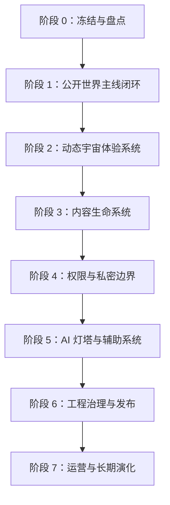

# WorldOS 当前主线路线图与任务板

状态：调研后规划稿  
日期：2026-07-05  
适用范围：暂停零散开发后，用于后续批量推进公开世界、动态宇宙、内容生命、权限边界、AI 灯塔与发布运营。

> [!IMPORTANT]
> 本文档不是新的愿景扩写，而是当前仓库的执行路线图。后续开发应按阶段和批次推进，不再按单个组件零散补丁推进。

## 1. 核心判断

WorldOS 当前已经具备静态博客、公开世界主路由、内容节点、路径、地图、时间线、档案馆、AI 灯塔雏形，以及一组动态 surface 和边界检查。真正的问题不是“缺一个组件”，而是：

- 公开主线还没有完全收束成低门槛体验。
- 动态宇宙效果已经开始接入，但缺少统一体验语法和批量验收标准。
- 真实内容、检索、路径、节点关系还需要形成内容生命循环。
- 权限原则已经有工程基础，但后续私密能力必须继续坚持后端控制权限、前端只体现结果。
- `_legacy` 阶段资产很多，必须先筛选、再回流，不能继续把历史页面当主线堆入口。

因此，下一阶段推进方式应从“做一个页面/组件”改成“阶段批次制”：

```text
阶段目标 -> 批次任务 -> 数据层 -> 页面层 -> 组件层 -> 边界检查 -> 验收命令 -> 阶段总结
```

## 2. 外部资料与对比结论

### 2.1 调研来源

| 来源 | 类型 | 关键经验 | 对 WorldOS 的启发 |
| --- | --- | --- | --- |
| [Quartz](https://quartz.jzhao.xyz/) | 数字花园静态生成器 | Markdown 内容可转为带搜索、反链、图谱的公开网站 | WorldOS 应保留静态优先和内容可迁移性，公开世界不要依赖重后端才能阅读 |
| [Obsidian Publish](https://obsidian.md/help/publish) | 连接笔记发布 | 通过悬浮预览、Graph view、Stacked pages 帮助读者探索非线性知识 | 节点页应强化预览、关系、下一步，而不是只做文章详情页 |
| [TiddlyWiki](https://tiddlywiki.com/) | 非线性个人网页笔记本 | 单文件、长期可保存、可定制，强调个人知识主权 | WorldOS 的文档、数据和内容协议要保持可导出、可迁移、可长期保存 |
| [Logseq](https://logseq.com/) | 隐私优先知识库 | 关注 privacy、longevity、user control | 私密档案和 AI 能力必须以后端权限、审计、人工确认为基础 |
| [World Anvil](https://www.worldanvil.com/) | 世界构建工具 | 以 wiki-like articles、interactive maps、historical timelines 组织世界 | Atlas、Timeline、Archive 应作为世界对象系统，而不是普通分类页 |
| [Kanka](https://docs.kanka.io/en/latest/overview.html) | 世界构建与活动管理 | 用 calendars、interactive maps、timelines、组织、家族、角色等对象管理复杂世界 | WorldOS 可借鉴“对象类型 + 关系 + 过滤视图”，但不照搬 RPG 复杂度 |
| [Docusaurus](https://docusaurus.io/docs) | 文档与内容网站工程化 | 文档、博客、版本、搜索、React 交互的成熟内容站能力 | 工程治理和内容发布要分层：日常检查、阶段检查、发布检查 |
| [Astro Starlight](https://starlight.astro.build/) | 高性能文档站 | 导航、搜索、国际化、SEO、可读排版、内容集合 | WorldOS 可以借鉴内容集合与可访问性，但不迁移技术栈 |
| [Next.js App Router](https://nextjs.org/docs/app/getting-started/server-and-client-components) | 当前项目技术基线 | Server Components 负责数据和组合，Client Components 只负责交互 | 继续坚持后端/服务端构建公开 surface，前端只消费结果 |
| [GSAP Accessible Animation](https://gsap.com/resources/a11y/) | 动效可访问性 | 使用 prefers-reduced-motion / matchMedia 降级动效 | 动态宇宙必须有低动效模式，不以牺牲阅读舒适度换沉浸感 |

### 2.2 不能照搬的地方

| 外部模式 | 不照搬原因 | WorldOS 采用方式 |
| --- | --- | --- |
| 完整 Obsidian/Logseq 笔记发布 | 容易变成工具展示，弱化世界体验 | 保留节点、反链、路径，但用世界语言重新组织 |
| World Anvil/Kanka 的 RPG 对象复杂度 | 角色、家族、活动管理过重，不符合低门槛目标 | 只吸收地图、时间线、对象关系、筛选视图 |
| Docusaurus/Starlight 的文档站形态 | 会把项目拉回“文档/博客站” | 借鉴搜索、结构化内容、发布治理，不照搬 UI |
| 过量 3D/WebGL 宇宙 | 成本高、移动端和可访问性风险高 | 先做轻量动态 surface、星图、时间流、路径反馈 |
| AI 自动维护世界 | 权限和可信度风险高 | AI 只做建议、解释、导览，进入 owner 模式前必须审计 |

## 3. 当前项目定位

WorldOS 当前应被定义为：

```text
静态优先的个人数字世界。
公开侧像一个可进入的世界，维护侧像一套可审计的内容与权限协议。
```

当前阶段不应该继续扩张新概念，而应该完成三件事：

1. 让公开访问者看懂、走通、停留。
2. 让世界感从“文案描述”变成“动态体验”。
3. 让真实内容能持续进入世界，并被地图、路径、时间线、档案馆同时吸收。

## 4. 阶段划分



## 5. 阶段 0：冻结与盘点

目标：停止零散开发，形成当前项目事实源。

### 批次 0.1：主线资产盘点

- 盘点正式公开路由：`/`、`/atlas`、`/timeline`、`/archive`、`/paths`、`/paths/[id]`、`/node/[slug]`、`/ask`、`/status`。
- 盘点当前正式组件：`product`、`world`、`atlas`、`timeline`、`archive`、`paths`、`node`、`ask`、`status`。
- 标记 `_legacy` 可回流资产：动态宇宙、世界入口、地图、时间河、AI 灯塔、私密档案、运营发布。
- 标记废弃或仅参考资产，避免误接入正式主线。

验收：

```bash
npm run check:mainline
npm run check:boundary
```

### 批次 0.2：检查脚本分层

- 日常检查：`lint`、`typecheck`、`check:dynamic-world`、`check:boundary`。
- 内容检查：`check:content`、`check:experience:public`。
- 发布检查：`check:release:rc`、`check:rc:full`。
- 将“阶段任务对应检查命令”写入任务板。

验收：

```bash
npm run lint
npm run typecheck
npm run check:dynamic-world
npm run check:boundary
```

### 阶段 0 完成标准

- 有一份主线资产表。
- 有一份 legacy 回流候选表。
- 有一份检查命令分层表。
- 后续开发可以按阶段批次推进。

## 6. 阶段 1：公开世界主线闭环

目标：普通访问者不看说明，也能理解和探索 WorldOS。

### 批次 1.1：首页入口收束

- 首页只保留最关键入口：进入世界、走 8 分钟路径、看地图、进档案馆、问灯塔。
- 首页文案优先中文、低门槛，避免内部工程词。
- 首屏必须明确“这是什么”“怎么开始”“边界是什么”。

验收：

```bash
npm run check:homepage
npm run check:experience:public
```

### 批次 1.2：地图、路径、节点闭环

- `/atlas` 表达世界地图和区域关系。
- `/paths` 表达适合新手的阅读路线。
- `/paths/[id]` 表达路径旅程、进度和下一步。
- `/node/[slug]` 表达节点阅读、关系、返回路径。

验收：

```bash
npm run check:atlas
npm run check:path-guidance
npm run check:node-reading
```

### 批次 1.3：时间线与档案馆闭环

- `/timeline` 表达时间河流，不只是事件列表。
- `/archive` 表达档案馆和检索入口。
- 搜索、筛选、空状态都使用中文、可解释。
- 档案馆只显示公开内容，不能通过前端筛选绕过边界。

验收：

```bash
npm run check:timeline
npm run check:content-archive
npm run check:boundary
```

### 阶段 1 完成标准

- 新用户 3 分钟内能走完：首页 -> 路径 -> 节点 -> 地图/档案馆。
- 所有主路由有清晰下一步。
- 所有公开数据来自公开查询或公开 surface。

## 7. 阶段 2：动态宇宙体验系统

目标：让“动态世界/宇宙”成为统一体验，而不是分散动画。

### 批次 2.1：动态体验语法

- 定义 6 类动效语法：抵达、浮现、连接、流动、聚焦、反馈。
- 每类动效定义适用场景、默认时长、降级方式。
- 建立统一 hook 和组件约束，避免每个组件单独写动画策略。

验收：

```bash
npm run check:dynamic-world
npm run lint
npm run typecheck
```

### 批次 2.2：主路由动态 surface 全覆盖

- 首页：世界脉冲和实时导览。
- Atlas：星图、连接线、区域聚焦。
- Timeline：时间河流、事件聚焦。
- Archive：档案检索导览和主题入口。
- Paths：路径旅程、进度和下一步。
- Node：节点开启仪式、关系浮现。
- Ask：灯塔问答台和边界提示。
- Status：世界运行状态。

验收：

```bash
npm run check:dynamic-world
npm run build
```

### 批次 2.3：可访问性与性能降级

- 支持 `prefers-reduced-motion`。
- 移动端减少大面积运动。
- 保证 CSS 基础状态可读，JS/GSAP 失败时页面不空白。
- 只在必要 client component 中使用动效。

验收：

```bash
npm run check:reading-comfort
npm run check:performance
npm run check:preview-performance
```

### 阶段 2 完成标准

- 用户能感知世界在运行。
- 动效不遮挡阅读、不造成迷路。
- 低动效模式和移动端体验可用。

## 8. 阶段 3：内容生命系统

目标：让真实内容能进入世界，并自动被地图、路径、时间线、档案馆吸收。

### 批次 3.1：内容模型收束

- 明确内容类型：文章、项目、笔记、生活记录、作品、日志、路径节点。
- 每个内容必须具备：标题、摘要、公开性、区域、关系、生命周期、推荐路径。
- 建立内容质量门槛：无摘要、无关系、无区域、无正文的内容不得进入精选。

验收：

```bash
npm run check:content
npm run validate:world
```

### 批次 3.2：真实内容补齐

- 选择优先补齐的 20 到 30 个真实节点。
- 每个一级区域至少有代表节点。
- 每条核心路径至少有足够正文节点。
- 时间线事件与节点、区域互相关联。

验收：

```bash
npm run check:worldos-content-density
npm run check:experience:public
```

### 批次 3.3：检索与再发现

- 档案馆支持稳定搜索、筛选、主题入口。
- 节点页支持相关节点、路径返回、下一步推荐。
- 首页和地图呈现“今天可以从哪里开始”。

验收：

```bash
npm run check:content-archive
npm run check:node-reading
npm run check:homepage
```

### 阶段 3 完成标准

- 新增一篇真实内容后，可以同时进入节点、路径、地图、时间线或档案馆。
- 访问者不需要知道分类体系，也能通过路径和搜索找到内容。

## 9. 阶段 4：权限与私密边界

目标：公开世界可信，私密能力不外泄。

### 批次 4.1：公开/私密事实源边界

- 复核 `visibility`、`permissions`、`owner-auth`、公开 JSON 构建。
- 所有公开页面只消费公开数据或公开 surface。
- 私密档案、AI 建议、运营证据不得直接进入公开 bundle。

验收：

```bash
npm run check:api-boundary
npm run check:public
npm run check:boundary
```

### 批次 4.2：无权限体验

- `/forbidden` 统一文案。
- 不可见内容统一呈现为解释、返回、公开替代路径。
- 前端根据后端返回结果控制显隐，不做权限判断事实源。

验收：

```bash
npm run check:boundary
npm run check:routes
```

### 阶段 4 完成标准

- 公开构建产物不包含私密内容。
- 新增 API 或页面时必须通过边界注册和检查。

## 10. 阶段 5：AI 灯塔与辅助系统

目标：AI 帮助理解和整理世界，但不替代人做决定。

### 批次 5.1：公开灯塔

- `/ask` 只基于公开上下文回答。
- 提供路径推荐、节点解释、档案检索帮助。
- 对无法确认的问题明确说明边界。

验收：

```bash
npm run check:ai-boundary
npm run check:lighthouse
```

### 批次 5.2：Owner 模式规划

- AI 建议队列。
- 人工审核和采纳流程。
- 操作日志和风险提示。
- 不做自动发布、不做自动修改私密档案。

验收：

```bash
npm run check:ai-suggestion-audit
npm run check:ai-world-companion
```

### 阶段 5 完成标准

- AI 是灯塔，不是太阳。
- AI 可以建议、解释、导航，但不能越权修改世界。

## 11. 阶段 6：工程治理与发布

目标：把项目从本地可运行推进到可发布、可回滚、可长期维护。

### 批次 6.1：命令主干收束

- 日常命令固定为：

```bash
npm run lint
npm run typecheck
npm run check:boundary
npm run check:dynamic-world
npm run build
```

- 阶段命令按任务板附加，不把所有历史脚本都作为日常入口。

验收：

```bash
npm run check:mainline
npm run check:scripts
```

### 批次 6.2：发布前门禁

- SEO：sitemap、robots、manifest、metadata。
- 公开 JSON：生成、校验、无私密泄漏。
- 性能：首屏、资源、动效降级。
- 真实 preview smoke 和人工签收。

验收：

```bash
npm run check:release:rc
npm run check:rc:full
```

### 阶段 6 完成标准

- 每次发布都有检查证据。
- 生产状态必须诚实：没有真实部署和人工签收，不改 `productionLive`。

## 12. 阶段 7：运营与长期演化

目标：WorldOS 不是一次性网站，而是长期生长的个人世界。

### 批次 7.1：内容运营节奏

- 每周新增或整理公开节点。
- 每月整理路径或主题展览。
- 每季度复核内容关系和公开边界。

验收：

```bash
npm run check:content-growth
npm run check:theme-exhibitions
```

### 批次 7.2：年度归档与导出

- 年度世界册。
- 主题展览归档。
- 私密档案导出规划。
- 长期备份和恢复演练。

验收：

```bash
npm run check:export-center
npm run check:operations-export-planning
```

### 阶段 7 完成标准

- 内容持续进入世界。
- 世界可以回望、导出、备份、维护。

## 13. 推荐优先级

| 优先级 | 阶段 | 原因 |
| --- | --- | --- |
| P0 | 阶段 0：冻结与盘点 | 没有事实源，继续开发会越来越散 |
| P0 | 阶段 1：公开世界主线闭环 | 这是访问者能否理解项目的基础 |
| P1 | 阶段 2：动态宇宙体验系统 | 解决“动态世界/宇宙还没看到效果”的核心诉求 |
| P1 | 阶段 3：内容生命系统 | 没有真实内容，世界会退回漂亮空壳 |
| P1 | 阶段 4：权限与私密边界 | 后续 AI 和私密能力的前置安全条件 |
| P2 | 阶段 5：AI 灯塔与辅助系统 | 有价值，但必须等公开上下文和边界稳定 |
| P2 | 阶段 6：工程治理与发布 | 发布前必须完成，但不应压过主体验闭环 |
| P3 | 阶段 7：运营与长期演化 | 进入稳定期后持续推进 |

## 14. 下一次开发的建议入口

下一次恢复开发时，建议只做阶段 0，不写新功能：

1. 生成主线资产表。
2. 生成 legacy 回流候选表。
3. 生成检查命令分层表。
4. 把阶段 1 和阶段 2 拆成 3 到 5 个批次。
5. 每个批次一个 commit。

推荐提交格式：

```text
docs(roadmap): 增加当前主线路线图
```

## 15. 阶段执行模板

后续每个批次按这个模板推进：

````markdown
## 批次 X.Y：名称

目标：

- ...

改动范围：

- 数据层：
- 页面层：
- 组件层：
- 权限边界：
- 检查脚本：

不做：

- ...

验收：

```bash
npm run ...
```

提交：

```text
type(scope): 中文说明
```
````

> [!NOTE]
> 本路线图吸收外部项目经验，但不迁移技术栈、不照搬产品形态。WorldOS 的核心仍是中文优先、低门槛、公开可信、私密可控、长期可保存。
