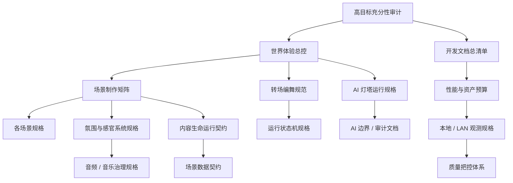

# WorldOS 开发文档总清单

> [!IMPORTANT]
> 本文档用于回答：为了让 WorldOS 真正成为可运行的个人数字世界，开发前、开发中、验收时到底需要哪些文档。它不是阶段流水账，而是后续开发的文档入口和缺口清单。

## 1. 结论

现有文档已经能约束方向，但还不能直接支撑完整开发。要达到“真格世界真正实现和运行”的目标，需要三层文档同时成立：

1. **总控层**：定义目标、边界、质量和技术原则。
2. **生产层**：定义场景、转场、氛围、音频、AI、内容生命和运行状态。
3. **验收层**：定义本地 / LAN、浏览器、性能、权限、人工体验和证据标准。

当前总控层基本就绪；生产层曾是最大缺口；验收层已有基础，但需要补音频、AI、氛围、资产预算和人工体验验收。

> [!NOTE]
> 2026-07-09 更新：本文第 4-6 节列出的 P0/P1/P2 文档已补齐，详见 `docs/00-overview/worldos-predevelopment-document-completion-index-2026-07-09.md`。后续开发应从 `docs/00-overview/worldos-controlled-execution-plan-2026-07-09.md` 进入。

## 2. 需求逐项分析

| 需求 | 必须回答的问题 | 需要的文档 | 当前判断 |
| --- | --- | --- | --- |
| 不再像博客骨架 | 第一眼如何像进入世界 | 世界体验总控、场景制作矩阵、Home 世界入口规格 | 总控已有，生产规格缺 |
| 静态与动态双形态 | JS 失败时如何仍可读，动态成功时如何成世界 | 静态优先 ADR、内容生命契约、性能资产预算 | 基础已有，预算需补 |
| 所有场景具备人格 | Home / Atlas / Timeline / Archive / Paths / Node / Lighthouse 各是什么空间 | 场景制作矩阵、各场景规格 | 缺核心生产文档 |
| 场景切换不是页面切换 | 进入、迁移、抵达、回退、跳过如何表达 | 转场编舞规范、运行状态机 | 缺核心生产文档 |
| 特效有叙事意义 | 哪些特效服务场景语义，哪些是噪声 | 场景制作矩阵、转场编舞、人工体验验收 | 缺体验判定文档 |
| 氛围可运行 | 时间、季节、光线、粒子、AI 状态如何组合 | 氛围与感官系统规格 | 有代码基础，缺规格 |
| 音频 / 音乐可用 | 如何可选、静音、降级、授权、懒加载 | 音频 / 音乐治理规格、资产管线 | 基本缺位 |
| 灯塔 AI 正常高效 | 如何服务端运行、只读公开事实源、缓存、审计、回退 | AI 灯塔运行规格、AI 边界文档 | 边界已有，运行规格缺 |
| 内容真正活起来 | 内容如何被地图、时间河、档案馆、路径、AI 同时吸收 | 内容生命运行契约 | 基础已有，需升级 |
| 权限不前端硬编码 | 后端或契约做事实源，前端只做体现 | AI 边界、公开/私密分离 ADR、权限边界文档 | 方向已有，需贯穿验收 |
| 本地 / LAN 成熟 | 不考虑外部上线，如何本地可信验收 | 本地 / LAN 观测规格、质量把控、本地 RC 文档 | 基础已有，观测需补 |
| 不臃肿 | 新库何时引入，如何按需加载和预算控制 | 技术栈调研、性能资产预算、组件 API | 调研已有，预算/API 缺 |
| 高内聚低耦合 | 场景、内容、AI、音频如何不互相缠死 | 运行状态机、组件 API、模块化架构文档 | 架构基础已有，场景 API 缺 |
| 中文优先低门槛 | 用户不懂背景也能探索 | 场景制作矩阵、内容生命契约、人工体验验收 | 缺生产层验收 |

## 3. 已存在且开发必须阅读的文档

这些文档已经存在，是后续开发的上游准绳。

### 3.1 目标与方向

| 文档 | 用途 |
| --- | --- |
| `docs/00-overview/worldos-high-goal-readiness-audit-2026-07-09.md` | 判断目标是否足够高、文档是否够、技术是否臃肿 |
| `docs/00-overview/worldos-experience-governance-master-control-2026-07-09.md` | 定义世界体验总目标、双形态、场景人格、场景迁移 |
| `docs/00-overview/worldos-world-realization-document-set-2026-07-09.md` | 定义世界实现所需文档集和推进顺序 |
| `docs/00-overview/worldos-tech-stack-and-open-source-research-2026-07-09.md` | 定义技术栈保留、候选工具、引入条件和否决条件 |
| `docs/00-overview/worldos-quality-control-system-2026-07-09.md` | 定义质量门禁、人工验收、视觉 QA、性能和权限边界 |

### 3.2 架构与长期边界

| 文档 | 用途 |
| --- | --- |
| `docs/09-adr/ADR-0001-static-first-protocol-first.md` | 静态优先与协议优先原则 |
| `docs/09-adr/ADR-0002-no-3d-core-in-v1.md` | 禁止把 3D 作为早期核心依赖 |
| `docs/09-adr/ADR-0003-ai-as-lighthouse.md` | AI 是灯塔，不是太阳 |
| `docs/09-adr/ADR-0004-public-private-build-separation.md` | 公开与私密构建边界 |
| `docs/09-adr/ADR-0005-markdown-json-world-protocol.md` | Markdown / JSON 作为世界协议基础 |
| `docs/09-adr/ADR-0006-extension-registry.md` | 扩展注册与边界 |
| `docs/05-engineering/v1-world-kernel.md` | 世界内核基础 |
| `docs/05-engineering/v1-world-ontology-and-semantics.md` | 世界语义与本体 |
| `docs/05-engineering/v1-spatial-protocol.md` | 空间协议 |
| `docs/05-engineering/v1-modular-architecture-contract.md` | 模块化架构约束 |
| `docs/05-engineering/v1-dependency-direction-and-coupling-guard.md` | 依赖方向和耦合约束 |
| `docs/05-engineering/v1-component-and-extension-interface.md` | 组件与扩展接口基础 |

### 3.3 现有产品与体验基线

| 文档 | 用途 |
| --- | --- |
| `docs/02-product/v1-phase-two-atlas-productization.md` | Atlas 既有产品化基线 |
| `docs/02-product/v1-phase-two-timeline-productization.md` | Timeline 既有产品化基线 |
| `docs/02-product/v1-phase-two-archive-productization.md` | Archive 既有产品化基线 |
| `docs/02-product/v1-phase-two-path-guidance-productization.md` | Paths 既有产品化基线 |
| `docs/02-product/v1-phase-two-node-reading-productization.md` | Node 阅读体验基线 |
| `docs/02-product/v1-phase-two-lighthouse-productization.md` | Lighthouse 既有产品化基线 |
| `docs/03-design/v1-phase-two-visual-experience-plan.md` | 视觉体验基线 |
| `docs/03-design/v1-phase-two-navigation-interaction-state.md` | 导航交互状态基线 |
| `docs/03-design/v1-phase-two-reading-comfort.md` | 阅读舒适度基线 |

### 3.4 质量与本地验收

| 文档 | 用途 |
| --- | --- |
| `docs/05-engineering/v1-performance-budget.md` | 既有性能预算基础 |
| `docs/05-engineering/v1-performance-guard.md` | 性能守卫基础 |
| `docs/05-engineering/v1-rendering-and-loading-strategy.md` | 渲染与加载策略 |
| `docs/05-engineering/v1-visual-interaction-qa.md` | 视觉与交互 QA 基础 |
| `docs/05-engineering/v1-browser-qa-execution-matrix.md` | 浏览器 QA 执行矩阵 |
| `docs/05-engineering/v1-local-acceptance-runner.md` | 本地验收运行器 |
| `docs/05-engineering/v1-real-validation-runner.md` | 真实验证运行器 |
| `docs/05-engineering/v1-release-candidate-acceptance-quality-gate.md` | RC 质量门禁 |
| `docs/00-overview/worldos-local-screenshot-review-checklist.md` | 本地截图人工复核 |

### 3.5 AI、权限与私密边界

| 文档 | 用途 |
| --- | --- |
| `docs/05-engineering/v1-ai-boundary-contract.md` | AI 边界合同 |
| `docs/05-engineering/v1-ai-readable-protocol.md` | AI 可读协议 |
| `docs/05-engineering/v1-ai-suggestion-protocol.md` | AI 建议协议 |
| `docs/05-engineering/v1-ai-suggestion-audit.md` | AI 建议审计 |
| `docs/05-engineering/v1-ai-world-companion.md` | AI 世界伙伴基础 |
| `docs/05-engineering/v1-phase-twelve-rbac-service-boundary.md` | RBAC 服务边界 |
| `docs/05-engineering/v1-private-archive-placeholder.md` | 私密档案占位边界 |
| `docs/05-engineering/v1-phase-five-private-boundary.md` | 私密边界 |

## 4. 开发前必须补齐的 P0 文档

这些文档不应再推迟。没有它们，下一轮开发很容易继续变成“加效果”，而不是生产世界。

| 文档 | 产物路径 | 必须包含 |
| --- | --- | --- |
| 场景制作矩阵 | `docs/00-overview/worldos-scene-production-matrix-2026-07-09.md` | Home、Atlas、Timeline、Archive、Paths、Node、Lighthouse 的空间隐喻、结构、动态层、内容层、入口 / 出口、降级、验收 |
| 转场编舞规范 | `docs/00-overview/worldos-transition-choreography-spec-2026-07-09.md` | 首访、进入、迁移、抵达、回退、跳过、reduced-motion、来源残影、目标预告 |
| 氛围与感官系统规格 | `docs/00-overview/worldos-atmosphere-sensory-system-spec-2026-07-09.md` | 时间、季节、光线、粒子、背景、AI 状态、场景状态、reduced-sensory |
| AI 灯塔运行规格 | `docs/00-overview/worldos-ai-lighthouse-runtime-spec-2026-07-09.md` | 服务端 Provider、上下文裁剪、公开事实源、流式输出、缓存、限流、审计、静态回退 |
| 性能与资产预算 | `docs/00-overview/worldos-performance-asset-budget-2026-07-09.md` | JS、CSS、图片、字体、音频、Canvas / WebGL、AI 请求、截图证据的预算 |
| 运行状态机规格 | `docs/00-overview/worldos-world-runtime-state-machine-spec-2026-07-09.md` | 首访、场景、转场、音频、AI、权限、错误、降级状态 |
| 本地 / LAN 观测规格 | `docs/00-overview/worldos-local-lan-observability-spec-2026-07-09.md` | 本地状态面板、错误记录、浏览器证据、LAN smoke、RC 摘要 |

## 5. 第一轮场景开发必须补齐的 P1 文档

这些文档在进入具体场景实现前必须具备。

| 文档 | 产物路径 | 关联开发 |
| --- | --- | --- |
| Home 世界入口规格 | `docs/00-overview/worldos-home-world-gateway-spec-2026-07-09.md` | 首屏、首访仪式、世界状态、主入口 |
| Atlas 世界地图规格 | `docs/00-overview/worldos-atlas-world-map-spec-2026-07-09.md` | 节点地图、关系、区域、路径入口 |
| Node 地点化阅读规格 | `docs/00-overview/worldos-node-place-reading-spec-2026-07-09.md` | 文章节点地点化、关系、下一步 |
| Paths 旅程系统规格 | `docs/00-overview/worldos-paths-journey-system-spec-2026-07-09.md` | 起点、进度、下一步、返回地图 |
| Timeline 时间河规格 | `docs/00-overview/worldos-timeline-river-spec-2026-07-09.md` | 时间流、回看、事件层级 |
| Archive 档案馆规格 | `docs/00-overview/worldos-archive-memory-library-spec-2026-07-09.md` | 记忆库、检索、密度、分区 |
| Lighthouse 观测站规格 | `docs/00-overview/worldos-lighthouse-observatory-spec-2026-07-09.md` | 只读问路、推荐、边界解释、AI 状态 |
| 音频 / 音乐治理规格 | `docs/00-overview/worldos-audio-music-governance-spec-2026-07-09.md` | opt-in、静音、音量、授权、循环、懒加载、降级 |
| 内容生命运行契约 | `docs/00-overview/worldos-content-life-runtime-contract-2026-07-09.md` | 节点、区域、关系、生命周期、路径、AI 可读摘要 |

## 6. 规模化前必须补齐的 P2 文档

这些文档可以不阻塞第一轮试点，但必须在规模化前补齐。

| 文档 | 产物路径 | 作用 |
| --- | --- | --- |
| 资产管线与授权规格 | `docs/00-overview/worldos-asset-pipeline-and-licensing-spec-2026-07-09.md` | 图片、动效、音频、字体、来源、压缩、授权 |
| 场景组件 API 规格 | `docs/00-overview/worldos-scene-component-api-spec-2026-07-09.md` | 场景壳、入口、节点、转场、氛围、AI 面板组件 API |
| 人工体验验收量表 | `docs/00-overview/worldos-human-experience-review-rubric-2026-07-09.md` | 判断是否还像骨架、是否有世界感、是否可读可探索 |
| 场景数据契约 | `docs/00-overview/worldos-scene-data-contract-2026-07-09.md` | 场景如何消费节点、关系、时间、路径、AI 摘要 |
| 错误与降级体验规格 | `docs/00-overview/worldos-fallback-experience-spec-2026-07-09.md` | 无 JS、低性能、音频关闭、AI 不可用、权限不足 |

## 7. 开发时文档阅读顺序

### 7.1 每个开发阶段开始前

1. `worldos-high-goal-readiness-audit-2026-07-09.md`
2. `worldos-experience-governance-master-control-2026-07-09.md`
3. `worldos-development-documentation-master-list-2026-07-09.md`
4. `worldos-quality-control-system-2026-07-09.md`
5. `worldos-tech-stack-and-open-source-research-2026-07-09.md`

### 7.2 做任意场景前

1. `worldos-scene-production-matrix-2026-07-09.md`
2. `worldos-transition-choreography-spec-2026-07-09.md`
3. `worldos-atmosphere-sensory-system-spec-2026-07-09.md`
4. 对应场景规格文档。
5. `worldos-performance-asset-budget-2026-07-09.md`

### 7.3 做 AI 灯塔前

1. `docs/09-adr/ADR-0003-ai-as-lighthouse.md`
2. `docs/05-engineering/v1-ai-boundary-contract.md`
3. `docs/05-engineering/v1-ai-readable-protocol.md`
4. `worldos-ai-lighthouse-runtime-spec-2026-07-09.md`
5. `worldos-local-lan-observability-spec-2026-07-09.md`

### 7.4 做音频 / 音乐前

1. `worldos-atmosphere-sensory-system-spec-2026-07-09.md`
2. `worldos-audio-music-governance-spec-2026-07-09.md`
3. `worldos-performance-asset-budget-2026-07-09.md`
4. `worldos-fallback-experience-spec-2026-07-09.md`

### 7.5 做内容生命前

1. `docs/09-adr/ADR-0005-markdown-json-world-protocol.md`
2. `docs/05-engineering/v1-world-ontology-and-semantics.md`
3. `worldos-content-life-runtime-contract-2026-07-09.md`
4. `worldos-scene-data-contract-2026-07-09.md`

### 7.6 每次提交前

1. `worldos-quality-control-system-2026-07-09.md`
2. `worldos-human-experience-review-rubric-2026-07-09.md`
3. `docs/05-engineering/v1-browser-qa-execution-matrix.md`
4. `docs/05-engineering/v1-performance-budget.md`
5. `worldos-local-lan-observability-spec-2026-07-09.md`

## 8. 文档依赖图

## 9. 不建议创建的文档

为避免文档臃肿，以下文档暂不创建：

- 每个小组件一份独立 PRD。
- 每个动效一份独立说明。
- 外部 Preview / Production 上线计划。
- 大而全的 3D 世界引擎设计。
- 与本地 / LAN 阶段无关的商业化运营方案。

## 10. 下一步执行顺序

开发前文档已经补齐。后续严格从以下文档进入：

1. `worldos-predevelopment-document-completion-index-2026-07-09.md`
2. `worldos-controlled-execution-plan-2026-07-09.md`
3. `worldos-scene-production-matrix-2026-07-09.md`
4. `worldos-transition-choreography-spec-2026-07-09.md`
5. `worldos-performance-asset-budget-2026-07-09.md`

只有对应阶段的检查和人工验收通过，才允许标记阶段完成。
