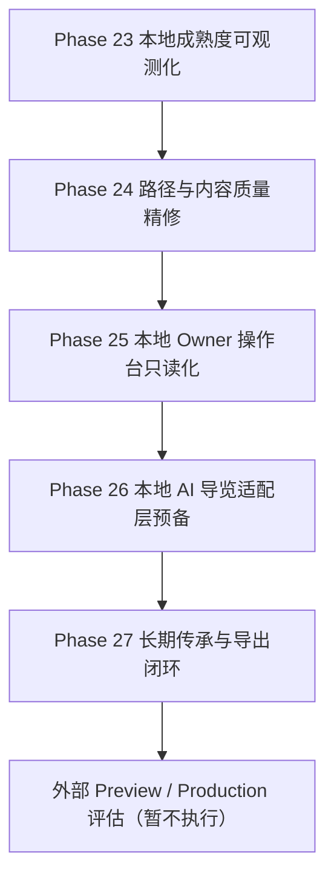

# 古月浮屿（WorldOS）未来全局规划 v3

> 制定日期：2026-07-09  
> 当前范围：只打磨 localhost / LAN IP，本轮不考虑外部 Preview / Production  
> 当前基线：`1625899 feat(world): 完成v2本地内容与灯塔闭环` 之后，Phase 19/20/21 已完成  
> 文档性质：结合项目现状与联网对标后的下一阶段全局规划

---

## 一、结论先行

WorldOS 当前已经不是“静态博客雏形”，而是一个本地可运行、局域网可访问、内容规模达标、权限边界明确、AI 低光导览可用的个人数字世界。下一阶段不应继续盲目堆内容或动效，而应把成熟度转化为“可被低门槛理解和复核的事实源”。

本轮全局建议：

1. **阶段 23：本地成熟度可观测化**  
   把 RC、审计、内容、截图、权限边界从散落报告收束为一个本地事实源，并在 `/status` 页面可读展示。

2. **阶段 24：路径与内容质量精修**  
   不再追求节点数量，改为提升路径叙事、推荐理由、内容差异度、阅读节奏。

3. **阶段 25：本地 Owner 操作台只读化**  
   先做后端事实源与只读状态，不做前端硬编码权限，不做写入操作。

4. **阶段 26：本地 AI 导览适配层预备**  
   保持 provider disabled，先定义上下文包、审核队列、失败降级与成本边界。

5. **阶段 27：长期传承与导出闭环**  
   围绕导出、备份、恢复、传承说明、私密边界审计形成可复跑流程。

外部上线继续冻结。只有当本地/LAN 体验、证据、权限、内容质量都稳定后，才进入外部 Preview / Production。

---

## 二、项目现状复核

### 2.1 当前产品形态

| 维度 | 当前状态 | 判断 |
|---|---|---|
| 公开节点 | 200 | 达到内容规模基线 |
| 公开路径 | 29 | 足够支撑首次访问和主题探索 |
| 关系星线 | 398 | 已具备网络结构 |
| 世界事件 | 50 | 时间线有基本生命感 |
| 本地/LAN RC | `release:local-rc` | 已成为可信入口 |
| AI 灯塔 | low-light / provider disabled | 边界正确 |
| 权限 | API/middleware/server gate | 原则正确 |
| UI 风格 | 中文优先、低门槛、动态世界可见 | 已成型 |

### 2.2 当前主要短板

1. 验收结果对开发者友好，但对普通维护者仍偏“报告目录化”。  
2. `/status` 页面展示世界状态，但还没有集中展示本地 RC、审计、截图、内容质量这些可信证据。  
3. 内容数量已够，下一步应从“更多”转为“更好读、更好走、更好维护”。  
4. 外部上线暂不考虑，因此所有规划必须继续围绕 local-first 和 LAN-first。

---

## 三、联网对标与经验提炼

### 3.1 Local-first

Ink & Switch 的 local-first 软件理念强调本地可用、用户拥有数据、隐私和长期可访问性。其论文/文章提出“数据所有权和协作并不冲突”，并讨论了 local-first 的多项理想，包括本地可用、长期性、隐私和用户控制。

对 WorldOS 的启发：

- 当前“localhost / LAN 先成熟”方向正确。
- 证据链也应 local-first：报告、截图、索引、导出都应可在本机复核。
- 暂不把云端作为事实源，外部 Preview / Production 不是本阶段目标。

参考：
- https://www.inkandswitch.com/essay/local-first/
- https://www.inkandswitch.com/local-first-software/

### 3.2 数字花园与个人知识发布

Maggie Appleton 对 digital garden 的描述强调：数字花园不是按发布日期排列的博客，而是长期生长、亲密但公开、探索式的个人知识空间。Quartz 5 也将自己定位为把 Markdown 内容转为数字花园网站的工具。Obsidian Digital Garden 插件强调“选择性发布”，私密笔记必须保持私密。

对 WorldOS 的启发：

- WorldOS 的独特性不在“发布 Markdown”，而在世界模型、路径、关系、权限、AI 边界和 RC 门禁。
- 内容应继续保持“可生长”，但公开层必须经过选择、脱敏和路径吸收。
- 私密边界不是视觉隐藏，而是事实源和构建层过滤。

参考：
- https://maggieappleton.com/garden-history
- https://quartz.jzhao.xyz/
- https://github.com/oleeskild/obsidian-digital-garden

### 3.3 可访问性、动效与视觉 QA

Next.js 官方文档建议用 ESLint 和 jsx-a11y 类规则尽早捕获可访问性问题。MDN 对 `prefers-reduced-motion` 的解释强调：用户启用减少动态时，界面应删除、减少或替换非必要动效。GSAP 官方 `matchMedia()` 支持将 reduced-motion 纳入动画条件。Playwright 官方视觉对比支持用截图作为回归证据。

对 WorldOS 的启发：

- 当前 reduced-motion 和 GSAP 职责划分应继续保留。
- 视觉 QA 不应只是截图文件，而应有“截图数量、视口、关键区域”的事实源摘要。
- `/status` 应让维护者不用翻报告也知道本地 RC 是否可信。

参考：
- https://nextjs.org/docs/architecture/accessibility
- https://developer.mozilla.org/en-US/docs/Web/CSS/Reference/At-rules/%40media/prefers-reduced-motion
- https://gsap.com/docs/v3/GSAP/gsap.matchMedia%28%29/
- https://playwright.dev/docs/test-snapshots

---

## 四、未来目标树

### G0：核心北极星

让 WorldOS 成为一个**本地优先、中文优先、低门槛、权限可信、可长期维护的个人数字世界**。

### G1：产品体验目标

- 新访客能在 30 秒内理解“这是什么、从哪进、怎么走”。
- 维护者能在 1 条命令内确认本地/LAN 是否可信。
- 动态世界不是装饰，而是首页、地图、时间线、路径、状态页共享的结构语言。

### G2：工程目标

- 继续保持高内聚、低耦合、模块化、页面化。
- 默认入口短、稳定、可复跑。
- 新增功能先有合同、事实源、检查脚本，再有 UI 展示。
- 后端控制权限，前端只展示已授权事实。

### G3：内容目标

- 公开层从“数量达标”转向“质量达标”。
- 每条路径都有明确旅程目标、下一步、返回地图、相关节点。
- 内容扩写优先补真实截图、命令、访问路径和边界解释，少写抽象套话。

### G4：AI 目标

- AI 灯塔继续保持只读导览。
- Provider 未接入前，不暗示真实智能能力。
- 未来若接入本地模型，也必须先经过后端适配层、上下文白名单和审核队列。

---

## 五、阶段规划

### Phase 23：本地成熟度可观测化（本轮执行）

目标：把本地 RC、LAN、audit、内容质量、截图证据收束为一个本地事实源，并在 `/status` 上可读展示。

交付：

- `local-maturity-ledger.json` 本地成熟度事实源。
- `LocalMaturityLedgerPanel` 状态页面板。
- `check:phase23-local-maturity` 检查脚本。
- 规划文档与执行计划文档。
- `check:mainline` 纳入 Phase 23 检查。

验收：

- `npm run check:phase23-local-maturity`
- `npm run check:daily`
- `npm run check:strict`
- `npm run release:local-rc`

### Phase 24：路径与内容质量精修

目标：让 29 条路径从“节点清单”升级为“阅读旅程”。

候选项：

- 路径页加入进度、下一步、返回地图。
- 内容质量仪表加入相似度、过短正文、无图/无证据提示。
- 为核心路径补充真实截图或命令证据。

### Phase 25：本地 Owner 操作台只读化

目标：先让 owner 能看到世界健康状态、内容队列、证据队列，不做写入。

候选项：

- 后端 owner guard 事实源。
- 只读 owner summary API。
- 前端只根据后端返回展示，不在前端硬编码权限。

### Phase 26：本地 AI 导览适配层预备

目标：在不启用真实 Provider 的前提下，定义可审计上下文包和降级协议。

候选项：

- public context slice schema。
- prompt boundary checker。
- provider disabled-dry-run contract。
- 本地模型接入前置风险清单。

### Phase 27：长期传承与导出闭环

目标：把个人世界的长期可维护性落成导出、备份、恢复和传承说明。

候选项：

- 导出包检查。
- 私密内容排除验证。
- 恢复演练脚本。
- 传承协议文档。

---

## 六、阶段关系

---

## 七、成功指标

| 指标 | 当前 | Phase 23 目标 | 后续目标 |
|---|---:|---:|---:|
| 公开节点 | 200 | 200 | 质量优先 |
| 公开路径 | 29 | 29 | 旅程化 |
| 关系星线 | 398 | 398 | 解释更清楚 |
| LAN browser checks | 20 | 20+ | 稳定 |
| 截图证据 | 20 | 20+ | 可摘要 |
| high/critical audit | 0 | 0 | 0 |
| `/status` 可读证据 | 局部 | 完整 | Owner 化 |
| external release flags | false | false | 用户明确后再变 |

---

## 八、当前立即执行范围

本轮只执行 Phase 23。后续 Phase 24-27 保持规划状态，不在本轮引入大范围功能或外部依赖。

