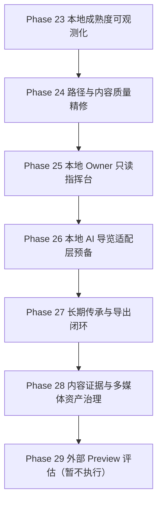

# 古月浮屿（WorldOS）未来全局规划 v4

> 制定日期：2026-07-09  
> 当前范围：继续只打磨 localhost / LAN IP，不考虑外部 Preview / Production  
> 当前基线：`0ae2a12 chore(verify): 刷新本地验收证据`  
> 文档性质：结合项目现状与联网对标后的未来规划

## 一、结论先行

WorldOS 目前已经完成本地 RC 可信化、路径质量账本化和公开动态世界可见化。下一阶段不应急着接真实 AI、数据库或外部部署，而应把维护者视角收束为一个**本地 Owner 只读指挥台**。

本轮未来规划的主线：

1. **Phase 25：本地 Owner 只读指挥台**
   - 目标：Owner 能在本地/LAN 范围内读取世界健康摘要、路径质量、本地 RC、API 边界和 AI 低光状态。
   - 边界：只读、owner-only、服务端守门、no-store、不写入、不调用真实 AI。

2. **Phase 26：本地 AI 导览适配层预备**
   - 目标：定义 public context slice、prompt boundary、provider disabled dry-run、失败降级协议。
   - 边界：真实 Provider 继续 disabled，不读取私密层，不自动发布。

3. **Phase 27：长期传承与导出闭环**
   - 目标：导出包、恢复演练、私密排除验证、传承说明。
   - 边界：先做本地可复跑，不做云端同步。

4. **Phase 28：内容证据与多媒体资产治理**
   - 目标：给核心节点补真实截图、命令证据、素材来源和许可证说明。
   - 边界：公开层只吸收已审查素材。

5. **Phase 29：外部 Preview 评估入口**
   - 目标：仅在本地 Owner、AI 适配、导出传承、内容证据都稳定后，再评估外部 Preview。
   - 边界：当前不执行。

## 二、项目现状复核

| 维度 | 当前事实 | 判断 |
|---|---:|---|
| 公开节点 | 200 | 数量达标，后续转质量 |
| 公开路径 | 29 | 已进入旅程化阶段 |
| 关系星线 | 398 | 网络结构成立 |
| 世界事件 | 50 | 时间线可用 |
| LAN RC | 22 HTTP / 20 browser | 本地可信入口成立 |
| 路径质量 | 平均 8.69 节点，20 条跨区域路径 | Phase 24 通过 |
| Owner API | 4 条 owner-only，5 条 permission-guarded；Phase 25 执行后提升为 5 条 owner-only | 有守门基础，本轮补只读总览 API |
| 状态页 | 已展示本地成熟度和路径质量 | 维护者信息仍散落 |

## 三、联网对标与经验提炼

### 3.1 Local-first 与本地事实源

Ink & Switch 的 local-first 理念强调本地可用、用户拥有数据、长期可访问和隐私控制。对 WorldOS 的启发是：Owner 指挥台不应依赖云端控制台，本地/LAN 就应能看到世界健康事实。

参考：
- https://www.inkandswitch.com/local-first/
- https://www.inkandswitch.com/essay/local-first/

### 3.2 服务端授权与最小暴露

OWASP Authorization Cheat Sheet 强调所有请求都应在服务端执行授权检查，并建议拒绝优先、最小权限、按请求验证。对 WorldOS 的启发是：Owner 指挥台可以有前端表现，但事实源必须来自服务端 guard；前端不能硬编码 owner 状态。

参考：
- https://cheatsheetseries.owasp.org/cheatsheets/Authorization_Cheat_Sheet.html

### 3.3 审计、监控与可追溯

NIST SP 800-53 的 Audit and Accountability / Continuous Monitoring 思路强调系统活动要可记录、可审查、可持续监控。对 WorldOS 的启发是：Owner 指挥台第一阶段应展示账本、门禁、审计摘要和待复核项，而不是直接提供写入按钮。

参考：
- https://csrc.nist.gov/publications/detail/sp/800-53/rev-5/final

### 3.4 可访问动效

MDN 对 `prefers-reduced-motion` 的说明强调应尊重用户减少动态的系统偏好；GSAP `matchMedia()` 也支持把 reduced-motion 纳入动画条件。对 WorldOS 的启发是：Owner 指挥台如果有动效，应继续复用现有入口动效和 reduced-motion 策略。

参考：
- https://developer.mozilla.org/en-US/docs/Web/CSS/@media/prefers-reduced-motion
- https://gsap.com/docs/v3/GSAP/gsap.matchMedia/

## 四、未来目标树

### G0：北极星

让 WorldOS 成为一个**本地优先、中文优先、低门槛、权限可信、可长期维护的个人数字世界操作系统**。

### G1：Owner 维护目标

- Owner 能一眼看到世界是否健康。
- Owner 能区分公开体验、只读后台、AI 低光和外部发布阻断。
- Owner API 必须服务端守门，默认 no-store。
- 第一阶段只读，不做写入、发布、删除或权限变更。

### G2：工程目标

- 合同先行，账本驱动，检查脚本收口。
- 新增 API 必须进入 API 边界注册表。
- 新增默认门禁必须进入脚本注册表。
- `check:mainline` 保持可复跑，`release:local-rc` 保持可信。

### G3：体验目标

- `/status` 面向普通维护者可读。
- Owner 指挥台状态用中文解释，不堆内部术语。
- 只读和阻断状态必须明确，避免让人误以为能在前端直接操作私密数据。

## 五、阶段规划

### Phase 25：本地 Owner 只读指挥台（本轮执行）

交付：

- Phase 25 合同。
- Owner 只读指挥台账本。
- owner-only `/api/owner/summary`。
- `/status` Owner 只读边界面板。
- `check:phase25-owner-console`。
- `check:mainline` 纳入 Phase 25。

验收：

- 未带 owner token 请求 `/api/owner/summary` 返回 403。
- API route 进入注册表，classification 为 `owner-only`，guard 为 `requireOwner`。
- 状态页只展示公开安全摘要，不暴露 token 或私密原文。
- `check:daily`、`check:strict`、`release:local-rc` 通过。

### Phase 26：本地 AI 导览适配层预备

交付：

- public context slice schema。
- prompt boundary checker。
- provider disabled dry-run contract。
- 失败降级和成本边界。

### Phase 27：长期传承与导出闭环

交付：

- 导出包检查。
- 恢复演练脚本。
- 私密内容排除验证。
- 传承说明文档。

### Phase 28：内容证据与多媒体资产治理

交付：

- 核心节点证据矩阵。
- 图片/截图/命令证据来源账本。
- 素材 license 和公开边界检查。

### Phase 29：外部 Preview 评估入口

交付：

- 仅输出评估清单，不执行上线。
- 继续保持 productionLive=false，直到本地阶段全部稳定。

## 六、阶段关系

## 七、本轮成功指标

| 指标 | 目标 |
|---|---:|
| owner-only summary API | 1 |
| 未授权 403 验证 | 通过 |
| Owner 账本 | 生成并可检查 |
| `/status` Owner 面板 | 可读展示 |
| `check:phase25-owner-console` | 通过 |
| `check:mainline` | 包含 Phase 25 |
| 外部发布状态 | false |

## 八、暂不做

- 不做外部 Preview / Production。
- 不接真实数据库。
- 不接真实 AI Provider。
- 不做前端 owner token 输入框。
- 不做发布、删除、改权限、自动归档等写入动作。
- 不把私密、family、vault、sealed、silent 内容投到公开层。
