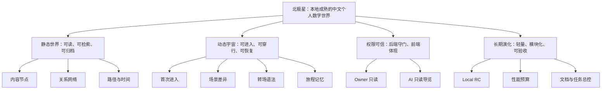

# WorldOS 全局阶段路线图：静态世界 + 动态宇宙，本地/LAN 成熟版

> 日期：2026-07-09
> 范围：localhost / LAN IP；外部 Preview / Production 暂不纳入执行目标。
> 定位：取代“一个小阶段一个小计划”的推进方式，作为后续阶段判断、任务拆分和验收门禁的总控文档。

## 1. 总目标

WorldOS 最终同时支持两种互补形态：

| 形态 | 最终目标 | 用户感受 |
| --- | --- | --- |
| 静态世界 | 一本可长期保存、可检索、可归档、可沿路径阅读的中文世界书 | 不懂项目背景的人也能从首页进入、阅读、理解、继续探索 |
| 动态宇宙 | 一个有进入仪式、场景差异、空间转场、旅程记忆和状态反馈的数字世界 | 不是“带动效的博客”，而是抵达、穿行、回望、继续 |

一句话目标：

> 先在本地/LAN 下，把 WorldOS 打磨成低门槛、中文优先、权限可信、轻量可维护的个人数字世界。

## 2. 当前判断

当前已经不是白屏或纯骨架阶段，但也还没有达到“完整宇宙”的最终体验。

| 维度 | 当前状态 | 判断 |
| --- | --- | --- |
| 静态阅读 | 首页、节点、路径、档案、时间线、星图已可访问 | 基础成立，后续重点是内容生命和路径质量 |
| 动态表现 | 已有 Scene Runtime、首次进入、转场、空气层、旅程记忆、Scene QA、SceneWorldPortal；首页首屏恢复动态世界运行态脉冲层 | 动态地基成立，已不再只是静态博客外壳；下一步增强跨场景转场语义 |
| 视觉观感 | Phase 33/34 已从博客 Hero 推进为场景门户，并收口移动端首屏；Atlas 从完整列表改为星图和代表节点预览 | 已改善“博客骨架”，但还需要更多抵达、穿行、回望行为 |
| 权限边界 | owner/auth/API 边界通过 `check:boundary` 和 `check:strict` 复核 | 继续坚持后端控制权限，前端只做体现 |
| 验收链路 | `release:local-rc` 已成为本地可信入口，本轮通过 22 个 HTTP 检查和 20 个 browser 检查 | 后续每个大里程碑都必须回归本地 RC |
| 外部上线 | 继续冻结 | 不作为当前目标 |

## 3. 设计原则

- 少造新系统：优先复用 `SceneWorldPortal`、Scene Runtime、现有内容事实源和检查脚本。
- 轻量优先：不先上全站 3D、不引入新动效库、不用重媒体堆沉浸感。
- 高内聚低耦合：场景、内容、权限、验收各自有事实源和边界。
- 中文优先：入口、路径、状态、错误和引导都用低门槛中文表达。
- 动效有意义：动效必须表达进入、转场、抵达、回望、继续，不做纯装饰。
- 可访问优先：reduced-motion、移动端、低性能设备必须完整可用。
- 权限可信：后端决定权限，前端只根据后端事实源控制显隐。
- 本地成熟：localhost/LAN 先成熟，一条命令可验收。

## 4. 目标树



## 5. 全局里程碑

| 里程碑 | 名称 | 目标 | 当前状态 |
| --- | --- | --- | --- |
| M0 | 基线可信 | 构建、lint、类型、本地/LAN RC、截图证据可信 | 已基本完成，持续维护 |
| M1 | 世界体验总纲 | 明确静态世界和动态宇宙的目标、边界、语法 | 本文档补齐 |
| M2 | 信息架构收束 | 首页、Atlas、Timeline、Archive、Paths、Node、Ask、Status 职责清晰 | 已完成，持续复核 |
| M3 | 场景化体验闭环 | 首次进入、场景门户、转场、空气层、旅程记忆形成闭环 | 基础完成，下一步增强空间转场 |
| M4 | 内容生命系统 | 节点、关系、区域、生命周期、推荐路径统一驱动各入口 | 已通过内容门禁，后续持续补厚 |
| M5 | 探索体验增强 | 访问者能沿路径连续探索，知道下一步和返回哪里 | 已完成基础旅程体验，后续增强回望感 |
| M6 | AI 灯塔只读导览 | AI 只解释、问路、推荐，不改数据、不越权 | 已完成只读本地形态，真实 provider 仍冻结 |
| M7 | Owner/权限边界成熟 | 本地 Owner 只读工作台、API 边界、私密排除可信 | 已通过边界门禁，持续复核 |
| M8 | 性能与轻量化 | 动态体验不拖慢首屏，移动端和 reduced-motion 稳定 | 本轮通过，持续门禁 |
| M9 | 运营与长期演化 | 内容维护、导出归档、回滚、证据策略可持续 | 待推进 |
| M10 | 外部发布准备 | Preview/Production、HTTPS、回滚演练、人工签收 | 当前冻结 |

## 6. 阶段规划

### 阶段 A：总控与基线

目标：停止零散阶段膨胀，建立全局路线图和总执行清单。

主要项：

- 统一后续文档入口。
- 明确本地/LAN 为唯一近期验收范围。
- 后续新增任务只进入总执行清单，不再默认新增“小阶段文档”。
- 保持 `release:local-rc` 为可信入口。

验收：

- 全局路线图存在。
- 总执行清单存在。
- 工作树干净。
- 文档能指导后续开发。

### 阶段 B：信息架构和页面职责收束

目标：让静态世界不再像博客集合，而是清晰的世界结构。

页面职责：

| 页面 | 最终定位 |
| --- | --- |
| `/` | 世界入口和继续旅程 |
| `/atlas` | 空间地图，展示区域和关系网络 |
| `/timeline` | 时间河，展示事件、阶段、演化 |
| `/archive` | 档案馆，承担检索、过滤、归档 |
| `/paths` | 旅程入口，给新手和主题阅读路径 |
| `/paths/[id]` | 单条旅程，承担进度、下一站、回望 |
| `/node/[slug]` | 节点房间，承担正文阅读、关系、出处 |
| `/ask` | AI 灯塔入口，只读问路和解释 |
| `/status` | 本地维护舱，展示健康、门禁、边界 |

验收：

- 页面职责不重复。
- 主入口不再堆营销式说明。
- 每个页面都能回答“我在世界的哪里”。

### 阶段 C：场景化体验闭环

目标：把动态效果从组件动效升级为场景系统。

主要项：

- 保持 `SceneWorldPortal` 为统一门户组件。
- 强化不同场景的对象、节奏、状态和入口行为。
- 让转场表达空间语义：入口到星图、星图到节点、时间到节点、档案到节点。
- 保留 reduced-motion 静态替代。
- 用 Scene QA 证明场景存在，而不是靠主观描述。

验收：

- Gateway、Atlas、Timeline、Archive、Paths、Node、Ask、Status 有不同场景人格。
- 移动端没有遮挡、溢出、误触。
- 不新增大型依赖。
- `check:scene-qa` 和 `release:local-rc` 通过。

### 阶段 D：内容生命系统

目标：让世界里面有真实可逛的内容，而不是只靠视觉外壳。

主要项：

- 节点必须具备标题、摘要、区域、关系、生命周期、推荐路径。
- 精选内容不得缺摘要、缺关系、缺区域。
- Atlas、Timeline、Archive、Paths、Node 共享同一份内容事实源。
- 关系不只展示“相关”，还要解释“为什么相关”。
- 优先补齐 20 到 30 个高质量代表节点。

验收：

- 每个一级区域有代表节点。
- 每条核心路径有足够正文节点。
- 首页推荐、地图、时间线、档案、路径能吸收同一内容事实。

### 阶段 E：探索与旅程记忆

目标：用户不是看完一个页面就断掉，而是能继续走。

主要项：

- 新手路径像旅程，不像链接清单。
- 路径详情有进度、下一步、返回地图、相关节点。
- 本地只记录公开旅程状态，不作为权限来源。
- 继续旅程入口应清晰、克制、可关闭。

验收：

- 用户可从首页进入路径，读节点，回到地图或下一站。
- 本地记忆不含 token、私密内容或 owner 判断。
- reduced-motion 下功能完整。

### 阶段 F：AI 灯塔只读导览

目标：AI 只负责解释、问路、推荐，不改数据。

主要项：

- 建立 public context slice。
- 后端生成可用上下文，前端不拼接权限判断。
- Provider 可继续 disabled，本地先 dry-run。
- `/ask` 显示边界、来源和推荐路径。

验收：

- 未授权不能访问 owner/private 信息。
- AI 返回只读建议。
- 错误和 disabled 状态用中文解释。

### 阶段 G：Owner 与权限边界成熟

目标：本地维护体验变强，但不把前端当权限系统。

主要项：

- Owner 只读摘要 API 继续服务端 guard。
- `/status` 展示可公开的健康摘要，不泄露私密原文。
- 私密档案、vault、owner 操作都由后端事实源控制。
- 前端只根据服务端结果控制显隐。

验收：

- 未授权请求返回 403。
- API boundary registry 完整。
- 权限扫描无前端硬编码 token。

### 阶段 H：性能与轻量化

目标：世界可以动态，但不能臃肿。

主要项：

- 动效只用 transform / opacity。
- GSAP 按需加载，避免全局静态重依赖。
- 不上 Three.js，除非出现明确 3D 场景需求和性能预算。
- 图片和截图证据分清运行资产与验收资产。
- 维护 First Load JS、route size、移动端截图。

验收：

- `build:production-ci` 无异常增长。
- `release:local-rc` 截图正常。
- reduced-motion 和移动端通过。

### 阶段 I：运营与长期演化

目标：后续内容和场景可以持续加入，而不是每次靠临时补丁。

主要项：

- 内容更新节奏。
- 导出归档和恢复演练。
- 证据报告保留策略。
- 新场景准入规则。
- 大里程碑提交策略。

验收：

- 新内容、新路径、新场景有清晰准入门槛。
- 验收产物不会制造大量无意义 diff。
- 文档和脚本能支撑下一轮维护者接手。

### 阶段 Z：外部发布准备（冻结）

当前不执行。

只有当 M0-M9 在本地/LAN 下稳定后，才重新评估：

- 外部 Preview。
- HTTPS。
- Web Vitals。
- 人工签收。
- 回滚演练。

## 7. 推荐推进顺序

近期不再平均推进所有阶段，而是按影响力排序：

1. 阶段 A：总控与基线。
2. 阶段 B/C：信息架构收束 + 场景化体验闭环。
3. 阶段 D：内容生命系统。
4. 阶段 E：探索与旅程记忆。
5. 阶段 F/G：AI 灯塔只读 + Owner/权限边界。
6. 阶段 H/I：性能、证据、运营长期化。
7. 阶段 Z：继续冻结。

## 8. 验收门禁

每个大里程碑完成后至少执行：

```bash
npm run lint
npm run typecheck
npm run build:production-ci
npm run release:local-rc
```

涉及场景体验时额外执行：

```bash
npm run check:scene-qa
```

涉及权限/API 时额外执行：

```bash
npm run check:api-boundary
```

涉及长期主线时额外执行：

```bash
npm run check:mainline
npm run check:daily
npm run check:strict
```

## 9. 后续文档策略

- 本文档回答“目标、阶段、顺序、边界”。
- `worldos-global-execution-checklist-local-lan-2026-07-09.md` 回答“具体做什么、做到哪一步”。
- 后续不再为每个微小改动新增 Phase 文档。
- 只有跨模块、跨事实源、跨权限边界的大变更，才新增专项设计文档。
