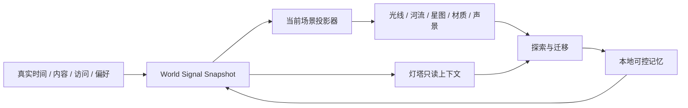

# WorldOS 生命世界战略总控

> 状态：战略提案已完成，开发尚未授权启动
> 日期：2026-07-11
> 适用范围：localhost / LAN，本地单作者、公开世界体验、可选服务端 AI
> 一句话定位：在 Reality-First 已完成的“可进入空间”之上，建立持续运行、因时间与内容而变化、可长期养护的个人数字世界。

## 1. 权威关系

本文件是下一轮“生命世界”工作的唯一战略入口，但当前仍是提案，不自动改写既有冻结控制包。

冲突优先级：

1. 用户最新明确要求。
2. 根目录 `AGENTS.md`。
3. Reality-First 六份冻结文档及 checksum。
4. 本战略包。
5. 其他历史文档。

旧 M8-M30、`ultimate`、Phase、RC 与硬编码评分文档继续只作历史材料。它们不能证明“世界正在运行”，也不得重新成为开发入口。

本战略包只有五份文档：

| 文档 | 作用 | 使用时机 |
| --- | --- | --- |
| 本文件 | 北极星、边界、全局路线、决策与文档索引 | 每次规划、变更方向、进入执行前 |
| `docs/20-research/worldos-living-world-research-benchmark-2026-07-11.md` | 本地事实、官方资料、标杆与技术候选对比 | 选型、ADR、原型取舍时 |
| `docs/01-world-design/worldos-living-world-experience-blueprint-2026-07-11.md` | 世界法则、场景生命、迁移、感官、灯塔与回访体验 | 产品设计、场景设计、人工验收时 |
| `docs/03-engineering-architecture/worldos-living-world-runtime-architecture-2026-07-11.md` | 运行时分层、契约、调度、性能与扩展架构 | 架构设计、代码拆分、技术准入时 |
| `docs/03-engineering-architecture/qa-release/worldos-living-world-quality-governance-2026-07-11.md` | 质量门禁、体验矩阵、长期运行与真实完成口径 | 每个纵向切片及最终验收时 |

后续真正进入开发时，最多再新增两份活文档：一份完整执行计划、一份持续执行账本。禁止为每个小阶段继续新增计划、报告和自评文档。

## 2. 为什么还需要这一层

Reality-First 已解决的是：

- 七个核心场景不再完全共用博客模板。
- 内容可读、可走，JS 关闭后仍有静态路径。
- 场景迁移、声音偏好、回访记忆和低光灯塔已有工程边界。
- localhost / LAN、权限、构建与真实视觉证据已有可信基线。

它没有解决的是：

- 世界时间只在首次挂载时计算，访问过程中不会继续推进。
- 主舞台主要依赖静态 WebP，河流、星光、灯光和季节没有形成持续生命。
- 动效大多由进入、点击或聚焦触发，缺少安静但持续的环境运行。
- 日夜、季节、内容变化、访问记忆、声音和灯塔尚未由一个统一生命循环驱动。
- 当前扩展方式仍会增加场景注册、脚本、文档和检查面的数量。

因此，当前真实状态应分开表达：

| 维度 | 当前结论 |
| --- | --- |
| 工程底座 | 基本成熟 |
| 静态世界 | 可读、可走、可降级 |
| 空间化场景 | 已具备第一版 |
| 场景连续迁移 | 有真实基础，尚未覆盖所有入口 |
| 持续生命运行 | 尚未建立 |
| 四季、昼夜、生态感 | 只有浅层状态映射 |
| 长期内容与回访循环 | 有数据基础，体验仍浅 |
| AI 灯塔 | 低光可用，实时 Provider 未接入 |
| 无限扩展 | 不成立；只能建设可度量、可演进的扩展能力 |

## 3. 当前复杂度真相

2026-07-11 本地扫描结果：

| 项 | 数量 | 判断 |
| --- | ---: | --- |
| 全部文档 | 1480 | 严重超出单人可持续阅读范围 |
| `docs/00-overview` 文档 | 260 | 权威入口过多 |
| `scripts` 文件 | 854 | 历史门禁和报告工具高度膨胀 |
| npm scripts | 301 | 日常命令入口不可掌控 |
| npm 直接脚本引用 | 276 个中 78 个目标文件不存在 | 命令表与实际文件已经漂移 |
| `src` 文件 | 1086 | 其中 740 个在 `_legacy`，约 68% |
| `data` 文件 | 1123 | 其中 480 个在 `_legacy`，约 43% |
| 运行时依赖 | 14 | 依赖本身仍较轻 |
| 当前场景位图 | 约 2.6 MB | 七场景 desktop/mobile 已本地化 |
| 当前音频文件 | 0 | 声音全部为程序化低增益振荡音色 |

抽样执行 `npm run kernel:report` 已真实复现 `ERR_MODULE_NOT_FOUND`，而 `check:worldos-script-taxonomy` 仍会通过。上表的 78 项来自对 `package.json` 中 `node` / `tsx` / `bash` / `sh` 直接文件引用的只读扫描，主要是历史 print / report 命令；它不是对所有复合命令可执行性的完整审计。

结论：项目最大的臃肿不是 npm 依赖，而是历史文档、脚本、注册表和自证面。下一轮不能只增加生命系统，还必须缩短日常认知路径，并让主命令真实可执行。

## 4. 北极星

WorldOS 的高目标不是“像游戏”，也不是“粒子更多”，而是：

> 访问者进入一个由真实内容、关系、时间和记忆构成的个人世界。这个世界在无人操作时仍安静运行；每次抵达都能感知当下，每次探索都会留下可控痕迹，新增内容会自然进入各个空间，灯塔能解释而不篡改事实，作者可以长期养护而不被工程复杂度吞没。

必须同时成立：

1. **真实**：语义变化来自真实时间、真实内容、真实关系和真实访问，不用随机闪烁伪造生命。
2. **空间**：Gateway、Atlas、Timeline、Archive、Paths、Node、Lighthouse 是不同空间，不是同一模板换皮。
3. **连续**：离开、途中、抵达、回退和继续探索共享上下文。
4. **有生命**：昼夜、季节、内容新旧、路径进度和回访状态持续影响世界投影。
5. **可静下来**：阅读、reduced-motion、reduced-sensory、页面隐藏和低性能设备都有完整体验。
6. **可长期养**：新增事实后自动进入场景投影；维护不依赖复制页面和新增一批脚本。
7. **AI 可缺席**：没有 Provider 时世界完整运行；AI 只读、可解释、可回退。
8. **不夸大**：一次开发只能交付“生命世界候选”，多年生命只能靠真实时间与使用证明。

## 5. 成熟度阶梯

成熟度不再使用 8.9、9/10 或平均分。

| 层级 | 真实含义 | 当前状态 |
| --- | --- | --- |
| 博客骨架 | 大标题、卡片、统一模板、少量动态 | 已越过 |
| 空间世界 | 场景可辨认、可操作、可迁移、静态可达 | 当前 Reality-First 基线 |
| 生命世界候选 | 世界时钟持续；七场景均有受控环境生命；切换和回访连续 | 尚未开始 |
| 陪伴世界 | 灯塔具备真实只读 Provider 或高质量本地模型，并通过依据与权限评测 | 未达到 |
| 可持续世界 | 内容、资产、作者流程、规模和质量治理能长期运行 | 只有部分底座 |
| 长期生命宇宙 | 经过数月或数年真实内容、回访、修复和演化验证 | 不能由一次 Goal 声明 |

下一个可开发目标只允许定义为“localhost / LAN 生命世界候选”，不能直接宣称长期生命宇宙。

## 6. 十个系统支柱

| 支柱 | 目标 | 不能退化为 |
| --- | --- | --- |
| 事实主权 | Node、Area、Relation、Path、Event、权限仍是唯一事实源 | 前端场景各自维护副本 |
| 世界时钟 | 同一时刻、时区、昼夜、季节和内容节律持续推进 | 首次挂载计算一次 |
| 场景生态 | 每个场景按自己的物理隐喻投影同一组信号 | 全站统一粒子背景 |
| 空间迁移 | 来源对象、迁移意图、途中、目标对象、抵达连续 | 普通 Link + 整页淡入 |
| 内容生命 | 新旧、成长、关系、路径和回看改变节点表现 | 标签和角标 |
| 感官统一 | 光、材质、运动、环境声和音乐动机表达同一状态 | 音频、动画各自播放 |
| 访问记忆 | 首访、直达、再访、未完成旅程和长期离开有不同响应 | 只存最近 URL |
| 灯塔陪伴 | 解释当前位置、依据和下一站，承认边界 | 通用聊天框 |
| 作者共生 | 新增内容和资产有预览、影响分析、校验、回滚 | 手改多份 JSON 和页面 |
| 可信运行 | 性能、隐私、可访问、静态降级和长期 soak 可验证 | 文件存在或报告自报通过 |

## 7. 世界闭环

### 7.1 生命运行闭环

关键约束：

- 语义状态按分钟、内容事件或用户动作更新，不按帧写 React state。
- 每帧只做视觉插值；页面隐藏后暂停，恢复时从真实时间重新计算。
- 当前场景才运行自己的环境适配器，其他场景不得后台消耗资源。
- 装饰性变化可使用确定性种子；节点状态、推荐和时间语义不得随机。

### 7.2 内容生长闭环

### 7.3 灯塔闭环

位置和问题进入服务端公开上下文切片，经确定性检索后再选择低光、云 Provider 或本地 Provider；输出必须带事实 ID、下一站和不确定性。AI 不直接写入事实源，也不决定权限。

### 7.4 质量闭环

先看真实页面和录屏，再看报告；发现缺陷后修改实现、重建、重录。任何旧证据、平均分、DOM token 或文件存在性都不能替代体验判断。

## 8. 全局工作流

以下工作流并行受控，不再按“做完一个页面才想下一个页面”的方式推进：

| 工作流 | 产出 |
| --- | --- |
| 生命内核 | 世界时钟、信号快照、调度、暂停/恢复、运行质量模式 |
| 场景生命 | 七个场景各自的环境适配器、主体运动和状态投影 |
| 空间迁移 | 全局导航协议、对象几何、路由族编舞和中断恢复 |
| 内容生长 | 生命周期、未读/更新、关系理由、路径与归档投影 |
| 感官系统 | 光线、季节、环境音、音乐动机、静谧模式 |
| 世界记忆 | 首访、再访、长期离开、路径进度、清除和隐私 |
| 灯塔陪伴 | 检索、Provider adapter、低光回退、依据和评测 |
| 作者治理 | 输入、预览、影响分析、资产许可、回滚 |
| 规模与性能 | 渲染阶梯、搜索阶梯、构建规模、运行时预算 |
| 复杂度收束 | 文档入口、命令主干、legacy 边界和重复注册表治理 |

## 9. 里程碑路线

### 方向冻结

目标：本战略包经过复核，北极星、非目标、技术准入、质量口径和数据所有权无歧义。

退出条件：

- 五份文档无冲突、无循环引用、无旧评分复活。
- 明确下一轮只做“生命世界候选”。
- 确认默认不引入 Three.js、PixiJS、XState、Tone 等新运行时依赖。
- 后续只创建一份执行计划和一份账本。

### 生命内核纵向样板

目标：用 Gateway -> Atlas -> Node -> 返回 Gateway 一条完整路径，证明时间持续、环境运行、迁移连续、静态可达、声音可选、回访不同。

退出条件：

- 运行 10 分钟后时间和环境确实变化，而非入场动画。
- 页面隐藏后环境停止消耗，恢复后状态正确追上真实时间。
- 三个场景共用信号，不共用视觉人格。
- 原生能力无法满足的点有测量证据，才允许进入 ADR。

### 七场景生命化

目标：Gateway、Atlas、Timeline、Archive、Paths、Node、Lighthouse 全部接入生命信号，并形成独立的安静运行状态。

退出条件：

- 隐藏文字和停止交互后，静态构图仍可辨认；恢复动态后，生命方式也各不相同。
- 河流在流、星图在呼吸、灯塔在扫光、档案馆与节点房间保持适合阅读的低活动度。
- 春夏秋冬与昼夜不是全站统一滤镜，而是由各场景解释。

### 连续迁移与回访

目标：所有主要导航都进入同一迁移协议，返回、直达、刷新、快速切换和长期离开均能恢复上下文。

退出条件：

- 来源、途中、抵达和目标对象可复查。
- 30 次快速迁移不留下遮罩、ticker、音频或监听器。
- 第二次访问和中断旅程有真实继续价值。

### 内容生命与灯塔陪伴

目标：内容变化驱动世界变化；灯塔基于当前位置和公开事实解释、推荐和陪伴。

退出条件：

- 新节点或更新节点无需改场景组件即可进入各投影。
- 低光模式与 Provider 模式使用同一输出契约。
- 没有合法 Provider 时诚实保留 fallback；有 Provider 时通过中文依据、幻觉和权限评测。

### 规模、作者与治理收束

目标：单作者能长期维护，规模增长时有明确升级触发器，日常命令和文档入口缩短。

退出条件：

- 作者新增事实、关系、资产和路径有预览、校验、回滚。
- 当前规模、十倍规模的构建、搜索和 Atlas 原型有测量。
- 日常开发入口收束为少量主命令，历史脚本不再暴露为认知负担。

### 本地生命世界候选验收

目标：不是“阶段都勾选”，而是连续使用、静态访问、动态运行、声音、回访、AI fallback、权限和性能同时可信。

退出条件详见质量治理文档。即使全部通过，也只能称为本地生命世界候选或完成版，不能称为已经经过多年验证的长期生命宇宙。

## 10. 已收敛的技术方向

| 决策 | 结论 |
| --- | --- |
| 应用形态 | 保持 Next.js 模块化单体和 localhost / LAN |
| 事实源 | 保持现有 World Kernel、JSON / Markdown、Zod 校验 |
| 客户端状态 | 轻量外部 store + React `useSyncExternalStore` 候选，不预装状态框架 |
| 连续调度 | 浏览器时间 + Page Visibility + 单一 ambient scheduler |
| 动效 | GSAP 负责编舞，CSS 负责微状态，Canvas/SVG 负责场景绘制 |
| 转场 | 现有协议为主，原生 View Transition 只作渐进增强 |
| 音频 | 原生 Web Audio，默认关闭，按手势创建和按场景 crossfade |
| 2D 渲染 | SVG / Canvas 2D 优先；PixiJS 只有性能原型失败后才候选 |
| 3D | 当前拒绝全站 Three.js / R3F；只有不可替代的局部空间价值才评估 |
| 图谱 | 当前 200 节点级继续现有模型；千级以上才评估 Sigma / Graphology |
| 搜索 | 当前 Fuse.js；规模或索引预算越界后评估服务端 SQLite FTS5 |
| AI | 服务端 provider adapter；低光、云 Provider、本地 Provider 同一契约 |
| 权限 | 服务端/事实过滤决定，前端只体现；AI 上下文再次过滤 |

## 11. 防臃肿规则

1. 一个概念只能有一个事实模型、一个公共类型和一个权威注册入口。
2. 场景共享信号和协议，不共享视觉模板。
3. 每个场景最多一个持续环境调度器，不允许每个组件各开 rAF / interval。
4. 新依赖必须替代足够复杂的现有代码，不能只为一个效果进入主线。
5. 新文档必须替代或索引旧文档；禁止继续一任务一文档。
6. 新检查优先并入 `check:world-experience`，不新增阶段名脚本。
7. 不为未来规模预装数据库、ECS、3D 引擎、音频框架或通用插件系统。
8. 旧 `_legacy` 保持只读隔离；新主线不得反向依赖。
9. 每次新增能力必须同时给出删除路径和静态降级。
10. “无限扩展”改为“在已测规模区间内稳定，越界时有明确升级触发器”。

## 12. 主要风险

| 风险 | 早期信号 | 控制方式 |
| --- | --- | --- |
| 再次把动态当背景 | 所有页面都出现同一种漂浮粒子 | 场景生命矩阵与逐场景视觉审查 |
| Runtime 变成巨型 Provider | 任一时钟变化导致全树重渲染 | 外部 store、分片订阅、每帧不进 React |
| 生命效果拖慢阅读 | Node / Archive 持续高对比运动 | 活动度分级、静谧模式、阅读场景限额 |
| 资产与音频失控 | 首屏加载和许可表持续增长 | 懒加载、资产 manifest、CC0/自有优先 |
| AI 抢走产品中心 | 无 Provider 时世界无法工作 | AI 永远是可选只读陪伴层 |
| 扩展性变成抽象过度 | 为假想场景创建通用引擎 | 先用七场景归纳，第三次重复才抽象 |
| 文档和脚本继续膨胀 | 每个里程碑新增多份报告和命令 | 五文档上限、单计划单账本、命令主干 |
| 自证式完成复发 | 报告 passed 但实际画面死寂 | 录屏优先、soak、独立审查、否决项 |

## 13. 开发启动门槛

在用户明确批准开发前，只允许完成研究和文档审查。真正启动时必须先满足：

- 本战略包完成交叉审查。
- 所有技术结论区分“已采用、条件候选、明确拒绝”。
- 一份执行计划能从账本跨上下文恢复，不生成新阶段体系。
- 第一个纵向样板有明确基线、性能预算、降级和删除路径。
- 冻结 Reality-First 文档和 checksum 不被改写。

未满足这些条件，不进入代码实现。
