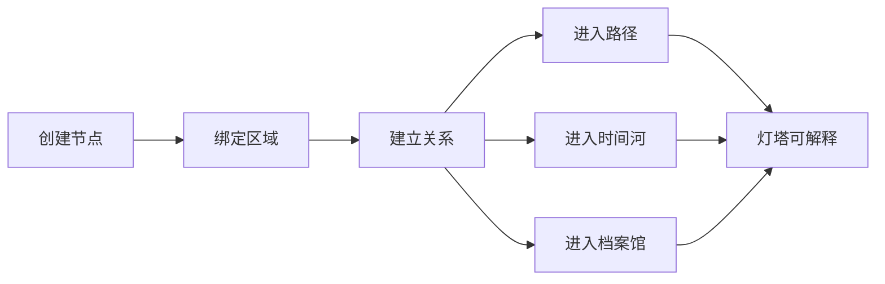

# WorldOS M21 内容生命循环规范

> [!IMPORTANT]
> M21 的目标是让内容像地点和生命体，而不是文章集合。

## 1. 目标

每个重要节点都应能进入：

- Atlas：作为地点。
- Timeline：作为事件或变化。
- Archive：作为卷宗。
- Paths：作为旅程站点。
- Lighthouse：作为可解释事实。

对应支柱：S3 内容生命体、S7 作者共生。

## 2. 节点生命字段

| 字段 | 作用 |
| --- | --- |
| title / summary | 基础识别 |
| area | 所属空间 |
| lifecycle | seed、growing、stable、archived |
| relations | 关系与原因 |
| events | 时间痕迹 |
| paths | 所在旅程 |
| lighthouseSummary | AI 只读摘要 |
| visibility | 权限事实 |

## 3. 循环流程

## 4. 实施步骤

1. 审计节点字段缺口。
2. 补关系 reason。
3. 补路径位置和时间痕迹。
4. 建立单节点多场景吸收检查。
5. 更新作者维护流程。

## 5. 验收

- 至少 30 个核心节点具备完整生命字段。
- 任一核心节点可被 5 个场景吸收。
- 权限字段不由前端硬编码。

