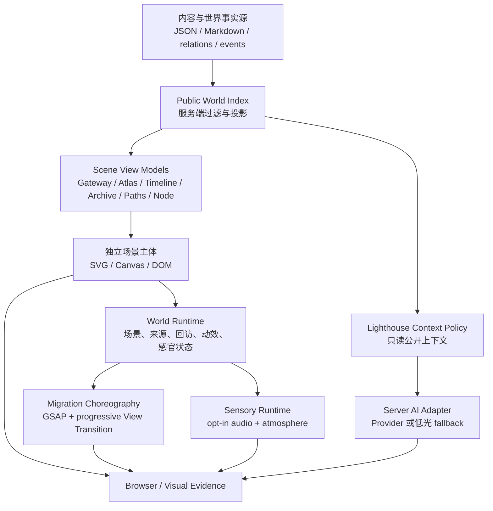

# WorldOS Reality-First 架构、技术栈与调研决策

> [!IMPORTANT]
> 本文档规定如何在不把项目做臃肿的前提下实现真实世界体验。默认策略是重组现有能力，不通过堆新框架制造“宇宙感”。

## 1. 当前工程事实

| 项 | 当前事实 | 判断 |
| --- | --- | --- |
| 应用 | Next.js 15 App Router、React 19、TypeScript | 可继续使用，无需换框架 |
| 样式 | Tailwind CSS 3 + 全局 CSS token | 可继续使用，但现有场景过度依赖圆角面板 |
| 动效 | GSAP 3.15 + Framer Motion 11 | 功能重叠；新场景统一用 GSAP，旧 Framer 逐步收束 |
| 搜索 | Fuse.js + 公开索引 | 可支撑本地档案检索 |
| 校验 | Zod + JSON / Markdown 事实源 | 可继续作为内容和 AI 输出契约 |
| 图标 | Lucide React | 继续使用，不手画通用图标 |
| 可视化 | SVG / CSS / 少量 motion 组件 | 足以先实现地图、时间河和路径主体 |
| 资源 | `public/` 主要是 SVG cover，缺少场景级 bitmap 视觉资产 | 必须补真实场景资产，而非继续画线框 |
| 内容 | 200 节点、29 路径、398 关系、51 事件 | 数据量足够做真实投影，不应继续用假统计卡 |
| 脚本 | 297 个 package scripts | 已明显过量；新主线只增加少量可信入口，并收束旧自证脚本 |
| AI | 当前 `/api/lighthouse/ask` 是 `disabled-dry-run` 低光规则系统 | 边界正确，但不能称实时 AI |
| 证据 | 有截图和录屏，但旧终局分数硬编码 | 证据可作为反基线，旧结论不可复用 |

## 2. 总体架构



架构核心：共享事实、状态和协议；场景表现独立。禁止再次用一个可配置 hero 组件渲染所有空间。

### 2.1 静态优先、动态增强

- `page.tsx` 与 scene model builder 保持 Server Component / server-only 数据读取。
- 每个场景先输出语义标题、主要内容、等价导航和静态视觉，随后由局部 Client Component 接管聚焦、拖动、迁移和声景。
- 不对整个 scene 使用 `ssr: false`；只延迟加载 Canvas engine、Fuse.js、音频和实时 AI console 等确实依赖浏览器的部分。
- JavaScript 关闭时 URL、正文、关系链接、路径顺序、时间锚和公开权限边界仍然成立。
- 动态层不得维护第二份内容或权限状态；它只消费 server 已过滤的 view model。

## 3. 场景模块边界

沿用现有目录边界，减少机械迁移：

| 场景 | 主体文件 | 只负责 |
| --- | --- | --- |
| Gateway | `src/components/product/WorldGatewayStage.tsx` | 首访 / 回访入口、方向选择、世界远景 |
| Atlas | `src/components/atlas/AtlasExplorationStage.tsx` | 区域布局、节点聚焦、关系解释、地图操作 |
| Timeline | `src/components/timeline/TimelineRiverStage.tsx` | 河道、时间锚、事件聚焦、位置恢复 |
| Archive | `src/components/archive/ArchiveHallStage.tsx` | 馆内分区、搜索、筛选、卷宗聚焦 |
| Paths | `src/components/paths/JourneyRouteStage.tsx` | 路线、站点、进度、完成和返回地图 |
| Node | `src/components/node/NodePlaceRoom.tsx` | 地点进入、护照、正文入口、关系门和出口 |
| Lighthouse | `src/components/ask/LighthouseGuideStage.tsx` | 塔体、光束、当前上下文、问路和结果 |

每个主体可以拆分为同目录下 2-5 个局部组件，但禁止把所有场景重新合并成 `UniversalSceneStage`、`SceneWorldPortalV2` 或同义万能组件。

### 3.1 允许共享的 primitive

共享组件只允许表达无场景人格的基础能力：

```text
src/components/world/primitives/WorldViewport.tsx
src/components/world/primitives/SceneObjectButton.tsx
src/components/world/primitives/SceneInspector.tsx
src/components/world/primitives/WorldExitRail.tsx
src/components/world/primitives/AccessibleSceneList.tsx
src/components/world/migration/SceneTransitionLink.tsx
src/components/world/migration/SceneMigrationLayer.tsx
```

约束：

- `WorldViewport` 只负责稳定尺寸、溢出、背景插槽和降级插槽，不决定场景布局。
- `SceneObjectButton` 只负责语义 button / link、焦点和命中区，不决定形状和位置。
- `SceneInspector` 是从属信息面板，desktop 不得超过场景宽度 32%，mobile 使用可关闭 drawer。
- `AccessibleSceneList` 只为键盘 / 屏幕阅读器和降级提供等价入口，不得成为 desktop 视觉主体。
- `SceneMigrationLayer` 只管理迁移状态与取消，不渲染“迁移说明卡”。

### 3.2 必须退出公开主线的组件

完成对应替代后，从公开核心 route 移除：

```text
src/components/world/SceneWorldPortal.tsx
src/components/world/SceneProductionFrame.tsx
src/components/world/SceneDeepInteractionPanel.tsx
src/components/product/ProductRouteGuide.tsx
```

若 `/status` 仍需展示其历史证据，可移动到 `_legacy` 或只在 status 使用；公开 route 禁止导入。

## 4. 数据与状态契约

### 4.1 Scene View Model

各场景从同一 public index 建立自己的 view model，页面组件不直接重新拼接原始 JSON：

```ts
export type SceneContext = {
  sceneId: 'gateway' | 'atlas' | 'timeline' | 'archive' | 'paths' | 'node' | 'lighthouse'
  sourcePath: string | null
  focusedObjectId: string | null
  pathId: string | null
  pathStep: number | null
  timelineAnchor: string | null
}

export type SceneDestination = {
  href: string
  sceneId: SceneContext['sceneId']
  objectId?: string
  transitionObject: 'island' | 'star' | 'ripple' | 'document' | 'waypoint' | 'door' | 'beam'
  accessibleLabel: string
}
```

权威入口建议：

```text
src/lib/scenes/scene-context.ts
src/lib/scenes/scene-destination.ts
src/lib/scenes/build-gateway-model.ts
src/lib/scenes/build-atlas-model.ts
src/lib/scenes/build-timeline-model.ts
src/lib/scenes/build-archive-model.ts
src/lib/scenes/build-path-model.ts
src/lib/scenes/build-node-model.ts
src/lib/scenes/build-lighthouse-model.ts
```

每个 builder 只读 `getPublicWorldObjectIndex()` 的结果，不另建第二套 Node / Area / Relation / Path 类型。

### 4.2 公开策展层

现有 public index 有 200 个节点，其中包含大量 RC、脚本、门禁和 WorldOS 自身说明。它们可以留在 Archive 中检索，但不能继续主导首次进入、Atlas 代表地点和精选 Paths。

新增一个只决定“如何被精选”的策展事实源，不复制正文或权限：

```text
data/domains/content/world-public-curation.json
src/lib/public-world-curation.ts
```

```ts
export type PublicWorldCuration = {
  gatewayNodeIds: string[]
  representativeNodeIdsByArea: Record<string, string[]>
  onboardingPathIds: string[]
  archiveOnlyNodeIds: string[]
  updatedAt: string
  rationaleById: Record<string, string>
}
```

规则：

- `archiveOnlyNodeIds` 仍可公开搜索和阅读，只是不进入首访推荐与场景代表位。
- 首访策展优先项目、记忆、思考片段、世界宣言和真实可复述主题；不由 RC / QA / script 节点占据。
- 不为策展伪造用户经历；只使用仓库已有且可追溯内容。
- 策展不改变 visibility，不能绕过 public index 过滤。

### 4.3 Runtime 状态

保留 `WorldRuntimeProvider`，但拆分职责，避免 300 行 provider 继续增长：

```text
src/lib/runtime/time-context.ts        日夜与季节纯函数
src/lib/runtime/journey-storage.ts     访问与路径记忆、清除、容错
src/lib/runtime/sensory-preference.ts  动效、声音、音量偏好
src/lib/runtime/scene-runtime.ts       当前场景、来源、迁移状态
```

Provider 只组合这些能力并暴露稳定 context；场景自己的 hover、focus、selected state 留在场景组件内，不进入全局。

### 4.4 回访记忆

继续使用 localStorage 作为本地 / LAN 的最低复杂度方案：

- 只记录公开 route、公开 object id、path 进度、scene 偏好和时间。
- 不记录问题全文、私密 slug、正文、AI 回答或 owner 信息。
- schema 带版本；解析失败时丢弃并回到首访，不白屏。
- 提供查看 / 清除入口。
- 不把“localStorage”描述成跨设备长期记忆。

## 5. 视觉实现选择

### 5.1 Bitmap 资产

当前线框和渐变不足以承载世界。需要制作 7 组场景主视觉，优先使用生成或自有 bitmap，保存为 WebP / AVIF，并记录来源：

```text
public/world/scenes/gateway/{desktop,mobile}.webp
public/world/scenes/atlas/{desktop,mobile}.webp
public/world/scenes/timeline/{desktop,mobile}.webp
public/world/scenes/archive/{desktop,mobile}.webp
public/world/scenes/paths/{desktop,mobile}.webp
public/world/scenes/node/{desktop,mobile}.webp
public/world/scenes/lighthouse/{desktop,mobile}.webp
data/assets/world-scene-assets.json
```

资产要求：

- 主视觉必须呈现真实空间对象，不使用纯模糊氛围图。
- desktop 与 mobile 使用不同构图或安全裁切，不只压缩同一张图。
- 通过 `next/image` 提供尺寸、响应式 `sizes` 和 placeholder。
- 生成资产在 registry 中标记工具、日期、提示摘要、用途和许可状态。
- 文本和交互热点不能烘焙进图片。

场景资产采用以下冻结 brief，避免每次续跑重新发明风格：

| Scene | Desktop 构图 | Mobile 构图 | 禁止 |
| --- | --- | --- | --- |
| Gateway | 近景书桌 / 门框，远处月下浮屿与三条可进入光路，中心留出交互门 | 纵向门框与一座主岛，入口动作在下三分之一 | 营销 hero、人物肖像、烘焙文字 |
| Atlas | 俯瞰多座浮屿和清楚星线，区域有远近和尺度层级 | 中央主岛 + 可滑动相邻岛屿 | 随机星点壁纸、纯银河背景 |
| Timeline | 发光河流从近景延伸到远景，沿岸有事件停靠点 | 纵向河道贯穿屏幕，事件点左右交替 | 普通折线图、日历 UI |
| Archive | 月下档案大厅、书架、抽屉和灯池形成纵深 | 单条走廊 / 柜架纵深，搜索区留安全空间 | 现代 SaaS 表格、纯书籍照片 |
| Paths | 多条可辨识道路穿越浮屿、桥与路灯 | 一条纵向主路和明显站点 | 地图 pin 堆叠、步骤卡列表 |
| Node | 安静房间或地点物件，窗外可见所属区域，中央留正文入口 | 物件 / 门 / 窗形成上下层次 | 文章 mockup、设备屏幕、烘焙正文 |
| Lighthouse | 海上石塔、旋转光束照向不同浮屿，来路可见 | 塔体占中轴、光束连接上方世界 | 搜索框海报、霓虹赛博塔 |

统一生成描述必须包含：`古月浮屿、月下个人世界、克制电影感、可探索空间、真实对象、非紫色霓虹、非玻璃卡片、无文字、无 UI`。生成后仍要逐张视觉审查；brief 一致不代表资产自动合格。

### 5.2 字体与控件形态

- 中文场景标题优先本机可用宋体 / 明朝体 fallback，操作和正文使用系统无衬线；不为了字体引入远程阻塞资源。
- 全局 `letter-spacing` 不使用负值；世界标签可少量正向 tracking，但长正文保持 `0`。
- 普通 UI card / inspector / drawer 的圆角不超过 8px；岛屿、光晕、门洞等场景对象可以使用自然形状。
- 按钮优先图标或图标 + 简短命令，不把所有导航做成圆角文字胶囊。

### 5.3 SVG 与 Canvas

- Gateway、Paths、Node、Lighthouse 优先 DOM + SVG overlay。
- Atlas 默认 SVG / Canvas 2D 二选一：节点超过可读密度时分层渲染，DOM 保留当前聚焦对象和等价列表。
- Timeline 默认 SVG path + DOM event markers；只有实测大量事件导致 DOM / SVG 性能问题时才进入 Canvas。
- Canvas 使用 devicePixelRatio 上限、可见区域绘制、离屏缓存和 `visibilitychange` 暂停。
- 不使用 Canvas 绘制正文、按钮、搜索结果或唯一导航。

MDN 建议对重复绘制使用 offscreen canvas 并避免不必要重绘，可作为 Atlas / Timeline 的性能优化依据。[Source: https://developer.mozilla.org/en-US/docs/Web/API/Canvas_API/Tutorial/Optimizing_canvas]

## 6. 动效与迁移

### 6.1 统一选择

- 新场景编舞：GSAP。
- hover / focus / 小型状态：CSS transition。
- 路由快照连续性：原生 View Transition API 作为 progressive enhancement。
- Framer Motion：只维护暂未迁移的旧组件；新代码不得同时用 Framer 与 GSAP 控制同一属性。

GSAP `matchMedia()` 能把 desktop、mobile 和 reduced-motion 的动画创建与清理放在同一上下文中，符合本项目的降级要求。[Source: https://gsap.com/docs/v3/GSAP/gsap.matchMedia%28%29/]

View Transition API 能降低视图切换时的上下文丢失，但同时存在焦点、阅读位置和旧 / 新 DOM 共存的无障碍风险，因此只做增强，不作为导航正确性的前提。[Source: https://developer.mozilla.org/en-US/docs/Web/API/View_Transition_API]

### 6.2 迁移状态机

```ts
export type MigrationState =
  | { kind: 'idle' }
  | { kind: 'leaving'; source: SceneContext; target: SceneDestination }
  | { kind: 'inTransit'; source: SceneContext; target: SceneDestination }
  | { kind: 'arriving'; source: SceneContext; target: SceneDestination }
  | { kind: 'settled'; current: SceneContext }
  | { kind: 'reduced'; current: SceneContext }
```

要求：

- 同一时间只有一个 active transition。
- 新导航覆盖旧导航时，先 kill timeline、清理 temporary layer，再进入新状态。
- 动画结束、取消、路由错误和组件卸载都必须回到可交互状态。
- 迁移时长 desktop 450-900ms；mobile 250-600ms；reduced-motion 0-160ms。
- 不在迁移层展示工程步骤标签。

W3C 要求非必要交互动效可以被关闭，视差和大范围运动尤其需要尊重用户偏好。[Source: https://www.w3.org/WAI/WCAG22/Understanding/animation-from-interactions]

## 7. 音频与感官系统

使用浏览器原生 `HTMLAudioElement` / Web Audio API，不默认引入 Howler 或 Tone：

```ts
export type SoundscapeDefinition = {
  sceneId: SceneContext['sceneId']
  kind: 'ambience' | 'music-motif' | 'transition-cue'
  source: { type: 'file'; src: string } | { type: 'procedural'; patchId: string }
  durationSeconds: number
  loop: boolean
  gain: number
  licenseId: string
  maxBytes: number
}
```

运行规则：

- 由用户点击开启后才创建 / resume `AudioContext` 或加载 loop。
- 同时最多一个主 loop 和一个短迁移 cue。
- 七个场景各有 ambience；Gateway 与 Lighthouse 至少共享一个经变奏的短音乐动机，用来形成世界记忆，而不是持续播放完整歌曲。
- 场景切换 crossfade 300-800ms；页面隐藏时暂停。
- 用户关闭、系统 reduced-motion / reduced-sensory 或资源失败时立即静音并释放无用 source。
- 使用原生 gain，不为简单 crossfade 引入音频框架。
- 程序化音色也必须登记 patch、峰值音量、用途和听感审查；不得用刺耳随机振荡冒充音乐。

MDN 明确建议从用户手势内创建或恢复音频上下文，并提供播放、静音和音量控制。[Source: https://developer.mozilla.org/en-US/docs/Web/API/Web_Audio_API/Best_practices]

## 8. Lighthouse AI 架构

### 8.1 模式

```ts
export type LighthouseMode = 'live-provider' | 'low-light' | 'unavailable'

export type LighthouseAnswer = {
  mode: LighthouseMode
  answer: string
  sourceIds: string[]
  nextSteps: Array<{ title: string; href: string; reason: string }>
  confidence: 'high' | 'medium' | 'low'
  refusalReason?: string
  audit: {
    requestId: string
    elapsedMs: number
    cached: boolean
    provider?: string
    model?: string
    inputTokens?: number
    outputTokens?: number
  }
}
```

### 8.2 服务端边界

建议文件：

```text
src/server/ai/provider/types.ts
src/server/ai/provider/openai.ts
src/server/ai/provider/disabled.ts
src/server/ai/lighthouse-service.ts
src/server/ai/lighthouse-rate-limit.ts
src/server/ai/lighthouse-audit.ts
src/app/api/lighthouse/ask/route.ts
```

规则：

- API 改为 `POST`，问题不进入 URL 和常规访问日志。
- 只从 `buildAIContextSlice()` 获取公开上下文；provider adapter 不接触原始私密数据。
- 环境变量只在 server module 读取；不得使用 `NEXT_PUBLIC_*` Key。
- 请求有长度限制、超时、取消、LAN 单进程速率限制、缓存和审计摘要。
- 输出经 Zod 解析；schema 失败、超时、限流或无依据时回到低光模式。
- UI 必须展示 mode 和来源，但不暴露内部 prompt、Key 或私密排除内容。

OpenAI 明确建议 API 请求经自己的后端转发，避免在浏览器暴露 Key。[Source: https://help.openai.com/en/articles/5112595-best-practices-for-api-key-safety]

### 8.3 无 Provider 情况

当前未发现可用 Key 或本地模型。Goal 仍要完成 provider interface、服务端边界、低光导览和所有测试，但必须把最终模式写成 `low-light`，不能伪造 usage 或实时模型名。

## 9. 权限架构

### 9.1 本地作者维护

为了让作者无需手改多份 JSON，又不在 LAN 上引入脆弱的假登录，当前选择本地 CLI 作为真实写入口：

```text
scripts/world-author.mjs
src/server/authoring/author-draft-schema.ts
src/server/authoring/author-impact-preview.ts
src/server/authoring/author-transaction.ts
src/server/authoring/author-rollback.ts
```

单一命令：

```bash
npm run world:author -- --draft /absolute/path/to/draft.json --mode preview
npm run world:author -- --draft /absolute/path/to/draft.json --mode apply
npm run world:author -- --backup <backup-id> --mode rollback
```

边界：

- 只在本机进程中运行，不暴露公开 / owner HTTP 写接口。
- draft 经 Zod、slug 冲突、visibility、content path、关系目标、路径目标和事件时间校验。
- preview 返回将影响的 Node / Relation / Path / Event / content files，不写磁盘。
- apply 先写时间戳 backup，再对临时文件完整校验，最后 rename；任一步失败不留下半写状态。
- rollback 只能恢复该命令生成、带 manifest 和 checksum 的 backup。
- 测试使用临时 workspace，不向真实内容写入样例节点。
- `/status` 只展示最近一次本地维护摘要，不提供前端写权限。

这把“作者能养世界”落实为真实、可回滚的本地流程，同时继续遵守后端 / 本地受控执行是权限边界、前端只体现状态的准则。

权限仍遵循“服务端控制、前端体现”：

```text
事实层：visibility / permission policy / public index filter
服务层：route handler、server loader、AI context slice、export filter
表现层：隐藏、禁用、解释、登录 / 返回公开路径
```

终局扫描必须覆盖：

- HTML / RSC payload。
- `/api/lighthouse/*` 和公开 JSON。
- 搜索索引、sitemap、manifest、截图和报告。
- source map / client bundle 中的 Key 名值。
- owner / private route 的未授权响应。

前端 role 字符串、按钮隐藏和 localStorage 身份均不能作为授权事实。

## 10. 性能预算

本地 / LAN 仍要按真实用户设备控制：

| 项 | 冻结预算 |
| --- | --- |
| shared First Load JS | 不高于基线约 102 KB 的 130 KB |
| 单场景新增 route JS | gzip 不超过 80 KB；只有 lazy Canvas / visualization 可到 150 KB |
| desktop 首屏 bitmap | 总传输不超过 700 KB |
| mobile 首屏 bitmap | 总传输不超过 350 KB |
| 单 route 延迟视觉资产 | 总计不超过 2.5 MB |
| 单个音频 loop | 不超过 500 KB，用户开启前不得下载 |
| 同时驻留音频 | 不超过 1.5 MB |
| 新运行时依赖 | 默认 0；单项 gzip 增量超过 40 KB 必须拒绝或 ADR |
| LCP | lab 目标 <= 2.5s |
| CLS | <= 0.1 |
| INP / 交互代理 | 真实交互 <= 200ms；lab TBT 作为补充，不冒充 INP |
| 动画 long task | 迁移过程中不得出现 > 200ms 的主线程阻塞 |

Core Web Vitals 当前推荐 LCP 2.5s、INP 200ms、CLS 0.1，并建议 mobile / desktop 分开测量。[Source: https://web.dev/articles/vitals]

Next.js App Router 默认进行 route code splitting；对重型 Client Component 和库应使用 `next/dynamic` 或按用户动作延迟加载。[Source: https://nextjs.org/docs/app/guides/lazy-loading]

## 11. 依赖准入

引入任何新运行时依赖前必须提交 ADR，回答：

1. 哪个冻结验收项无法用现有栈完成？
2. 原生 / 现有依赖原型为什么失败？
3. 新依赖增加多少 gzip JS、资产和初始化时间？
4. mobile 与 reduced-motion 如何降级？
5. 维护状态、许可证和替换路径是什么？
6. 删除该依赖后最低可用体验是什么？

默认结论：

| 候选 | 当前决定 | 原因 |
| --- | --- | --- |
| GSAP | 保留并作为新动效主引擎 | 已安装、编舞与清理能力足够 |
| Framer Motion | 不新增使用；逐步从主线移除 | 与 GSAP 重复 |
| View Transition API | 原生渐进增强 | 无依赖，但需兼容 / 无障碍 fallback |
| SVG | 主线采用 | 可访问、可响应、适合关系和路径 |
| Canvas 2D | Atlas / Timeline 条件采用 | 高密度绘制收益明确，需 DOM 等价层 |
| Three.js / R3F | 当前拒绝 | 不是摆脱骨架的必要条件，成本与资产链高 |
| D3 | 当前拒绝 | 现有数据规模和交互可用纯函数 + SVG 完成 |
| XState | 当前拒绝 | 当前迁移状态机规模可用 discriminated union |
| Howler / Tone | 当前拒绝 | 原生音频足够完成 opt-in loop 与 crossfade |

## 12. 标杆项目对比

| 项目 | 可学习的产品原则 | 不照搬的部分 |
| --- | --- | --- |
| [Bruno Simon](https://bruno-simon.com/) | 一个持续空间、直接操作、位置就是导航 | 不复制完整 3D 驾驶和高资产成本 |
| [Radio Garden](https://radio.garden/settings/radio-garden) | 一个主空间对象承担探索；声音与地点绑定 | 不复制全球地图与持续直播成本 |
| [NASA Eyes](https://science.nasa.gov/eyes/) | 真实数据直接成为可探索宇宙；操作先于说明 | 不复制科学级 3D 引擎和硬件门槛 |
| [Google Curator Table](https://artsexperiments.withgoogle.com/curatortable/) | 档案通过空间、时间和颜色切换组织 | 不复制高速网络前提和海量远程素材 |

调研结论：沉浸感首先来自“一个空间对象承担核心任务、状态连续、内容与位置一致”，不来自粒子数量或技术名称。WorldOS 应先把 SVG / bitmap / DOM 场景做实，再决定是否需要局部 3D。

## 13. 质量入口收束

Reality-First 最终只保留以下面向开发者的可信入口：

```bash
npm run check:world-experience       # 场景结构、禁用工程文案、route / flow 覆盖
npm run evidence:world-experience    # 生产构建后的截图、录屏、浏览器矩阵与 manifest
npm run audit:world-experience       # 独立 Reality Matrix，不生成硬编码分数
npm run release:local-rc             # 原有本地 / LAN 工程 RC
```

旧 M29 / M30 自评脚本移出 `check:mainline` 并登记为 historical-invalidated；不删除历史报告，但任何新完成声明不得依赖它们。
