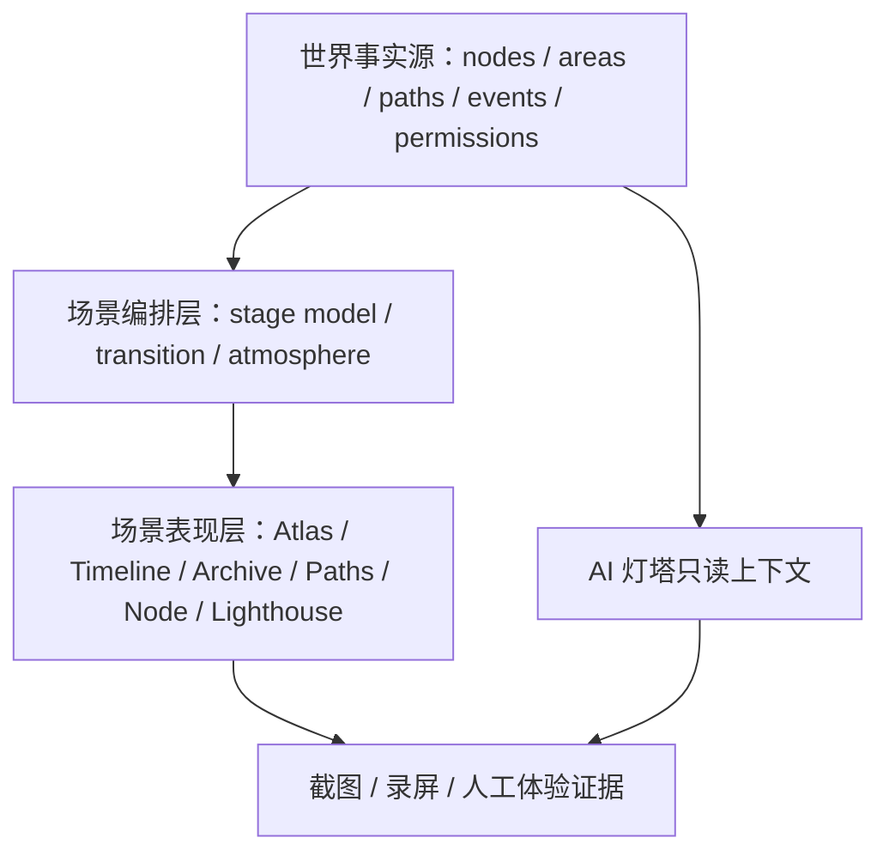

# WorldOS 真格世界全局规范

> [!IMPORTANT]
> 本规范是 2026-07-10 后续开发的新上位准则。目标不是做一个带动态特效的博客，而是做一个 localhost / LAN 阶段可运行、可探索、可迁移、可回看、可导览、可维护的个人数字世界。

## 1. 最高目标

WorldOS 必须同时具备两种形态：

| 形态 | 目标 | 完成定义 |
| --- | --- | --- |
| 静态形态 | 无 JS、低性能或降级时仍可读 | 内容、关系、路径、权限边界清晰 |
| 动态形态 | JS 可用时呈现世界 / 宇宙体验 | 场景主体可见、可操作、可迁移、可回看 |

动态不是装饰，动态必须解释世界：

- 星图解释空间关系。
- 时间河解释变化。
- 档案馆解释检索和沉淀。
- 路径解释旅程。
- 节点解释地点。
- 灯塔解释问路和边界。

## 2. 不像骨架的硬标准

任一核心页面若满足以下任意 2 条，即判定仍像骨架：

- 首屏主要是标题、摘要、按钮，场景主体只是背景。
- 场景之间只是换色、换文案、换线条。
- 用户无法在第一屏或第一交互内理解“我在哪、能去哪、为什么相关”。
- 内容仍以文章卡片 / 列表为主，关系和空间只是附属。
- 动效去掉后页面语义没有任何损失，说明动效没有叙事职责。
- 截图看起来像同一套模板复用。
- 自动检查通过，但人工无法说出每个场景的独特交互。

## 3. 场景主体规范

| 场景 | 场景主体 | 必须可见 / 可操作 | 禁止止步于 |
| --- | --- | --- | --- |
| Home | 世界入口舞台 | 首访 / 再访状态、进入方向、世界状态 | 介绍页 hero |
| Atlas | 可探索星图 | 区域聚焦、节点预览、关系解释 | 静态背景星点 |
| Timeline | 时间河 | 时间锚点、事件水位、节点回看 | 普通时间列表 |
| Archive | 档案馆大厅 | 检索、分区、筛选、卷宗展开 | 文章网格 |
| Paths | 旅程路线 | 起点、进度、下一站、完成态 | 链接清单 |
| Node | 节点房间 | 护照、正文、关系门、出口 | 文章详情 |
| Transition | 场景迁移 | 来源残影、目标预告、抵达沉淀 | fade / scale 入场 |
| Lighthouse | 观测站 | 问路、解释、推荐、权限边界 | 静态问答面板 |
| Status | 维护舱 | 运行证据、本地 RC、故障摘要 | 世界主体验入口 |

## 4. 架构规范

### 4.1 三层分离

要求：

- 世界事实源不依赖 UI。
- 场景编排层消费事实源和运行时状态。
- 表现层只负责呈现和交互。
- AI 灯塔只读公开事实源，不修改数据。
- 权限事实不写死在前端。

### 4.2 组件边界

| 类型 | 职责 | 示例 |
| --- | --- | --- |
| `Stage` | 场景主体 | `AtlasExplorationStage` |
| `Portal` | 入口与首屏壳 | `SceneWorldPortal` |
| `Rail` | 导航 / 出口 | `SceneExitRail` |
| `Overlay` | 迁移 / 状态 | `SceneMigrationOverlay` |
| `Fact Adapter` | 从事实源生成场景数据 | `buildAtlasStageModel()` |
| `Runtime Control` | 声景、动效、降级 | `WorldRuntimeProvider` |

禁止：

- 在页面组件里散落复杂可视化逻辑。
- 多个页面复制同一套数据映射。
- 为了单页视觉效果引入全局依赖。
- 在前端硬编码权限结果。

## 5. 动效规范

动效分 4 级：

| 等级 | 用途 | 技术 |
| --- | --- | --- |
| L0 静态 | 无 JS / reduced-motion | HTML / CSS |
| L1 轻量状态 | hover、focus、局部展开 | CSS / React state |
| L2 场景编舞 | 进入、迁移、抵达、局部漂移 | GSAP |
| L3 局部可视化 | 星图、时间河、路径 | SVG / Canvas，必要时再评估 D3 |

约束：

- 必须遵守 `prefers-reduced-motion`。
- large scale / panning / parallax 必须有替代。
- 动效不得遮挡阅读、导航、CTA。
- 动效不得成为理解内容的唯一方式。
- 默认不引入全站 3D。

参考：

- MDN `prefers-reduced-motion`：https://developer.mozilla.org/en-US/docs/Web/CSS/Reference/At-rules/@media/prefers-reduced-motion
- GSAP `matchMedia`：https://gsap.com/docs/v3/GSAP/gsap.matchMedia/

## 6. 资产与性能规范

| 资产 | 原则 |
| --- | --- |
| 图片 | 优先本地授权资产；使用尺寸、比例和懒加载策略 |
| SVG | 适合图形语义和轻量场景 |
| Canvas | 适合大量节点或连续运动 |
| 音频 | 默认静音，用户主动开启，短、轻、可停 |
| 字体 | 不因氛围引入额外重字体 |
| AI | 服务端运行，缓存、限流、失败回退 |

参考：

- Next.js Image Optimization：https://nextjs.org/docs/app/getting-started/images
- MDN Web Audio API best practices：https://developer.mozilla.org/en-US/docs/Web/API/Web_Audio_API/Best_practices

## 7. 技术栈策略

当前主线优先保留：

- Next.js App Router
- React
- Tailwind CSS
- GSAP
- Framer Motion
- SVG / CSS / 原生 Web API
- Fuse.js

候选但需 ADR / 预算 / 原型证明：

| 工具 | 适合用途 | 当前判断 |
| --- | --- | --- |
| D3 / d3-force | Atlas 大规模关系图布局 | 候选，不默认引入 |
| Canvas | 大量节点渲染 | 可用原生实现，先不加库 |
| Mapbox GL JS | 地理地图 | 当前不是地理地图，不优先 |
| React Three Fiber | 局部 3D 场景 | 后期候选，不作为核心 |
| Howler / Tone | 复杂音频 | 当前声景不需要，暂缓 |
| Observable Framework | 数据叙事参考 | 作为理念参考，不迁移框架 |

参考：

- D3 force simulation：https://d3js.org/d3-force
- React Three Fiber：https://r3f.docs.pmnd.rs/getting-started/introduction
- Observable Framework：https://observablehq.com/framework/

## 8. 质量门禁

每次阶段完成必须有四类证据：

| 证据 | 必须包含 |
| --- | --- |
| 自动检查 | `typecheck`、`lint`、`build:production-ci`、`check:mainline` |
| 浏览器证据 | desktop / mobile / reduced-motion / reduced-sensory 截图 |
| 体验证据 | 人工量表，明确回答是否仍像骨架 |
| 运行证据 | localhost / LAN、白屏、遮挡、死链、权限、音频、AI 边界 |

否决项：

- 旧构建截图。
- 只看 DOM 不看截图。
- 只跑脚本不打开页面。
- 只修桌面不看移动端。
- 截图报告只写“通过”，不写缺陷。

## 9. 阶段完成定义

阶段完成不是“计划项打勾”，而是同时满足：

1. 对应页面肉眼可见地接近场景目标。
2. 截图 / 录屏证据能复查。
3. 页面不再只是同构模板。
4. 自动检查通过。
5. 人工体验量表通过。
6. 失败和修复写入执行账本。
7. 中文 commit 完成。

