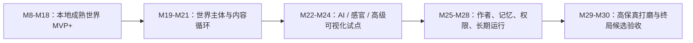

# WorldOS 终局目标执行计划

> [!IMPORTANT]
> 本计划把高目标纳入开发顺序，但明确分期。它避免两个极端：一是停在本地 MVP+ 后误称终局完成；二是过早追求 3D、音频和 AI，导致项目臃肿失控。

## 1. 总体路径

## 2. 阶段计划

### M19：场景主体深度交互

目标：每个核心场景从“舞台壳”升级为“可操作主体”。

具体项：

- Atlas：区域聚焦、节点预览、关系解释。
- Timeline：时间锚点、事件水位、节点回看。
- Archive：检索大厅、分区、筛选反馈。
- Paths：路线进度、下一站、完成状态。

验收：

- 遮掉文案后仍能区分场景。
- 至少 4 个核心场景具备独立交互。

### M20：世界空间连续性

目标：用户感觉自己在移动，而不是跳页面。

具体项：

- 来源场景残影。
- 目标场景预告。
- 抵达后上下文沉淀。
- 返回时保留来源路径。

验收：

- 录屏能看出场景迁移连续性。
- reduced-motion 下仍能理解迁移。

### M21：内容生命循环

目标：内容不只是被展示，而是能在世界里循环。

具体项：

- 新内容进入区域、路径、时间河、档案馆。
- 节点关系有“为什么相关”。
- 作者新增内容后能看到影响范围。

验收：

- 一个节点能同时被 Atlas / Timeline / Archive / Paths / Lighthouse 使用。

### M22：灯塔 AI 深度导览

目标：AI 灯塔成为只读导览者。

具体项：

- 服务端 Provider。
- 公开事实源裁剪。
- grounding 证据。
- 推荐路径。
- 失败回退。

验收：

- 没有前端 AI key。
- AI 不修改数据。
- 回答能指向公开节点和路径。

### M23：感官、音频与资产生产

目标：声景和氛围进入资产治理。

具体项：

- 场景短声景。
- 默认静音和 opt-in。
- 资产授权记录。
- 体积预算。

验收：

- 默认无声。
- 用户可关闭。
- 移动端不卡顿。

### M24：高级可视化试点

目标：只在必要时评估 D3 / Canvas / 局部 3D。

具体项：

- Atlas 大规模关系图原型。
- Timeline 高密度事件河原型。
- 性能对比。
- ADR 决策。

验收：

- 没有 ADR 不引入重依赖。
- 原型收益必须肉眼可见并通过性能预算。

### M25：作者世界编辑台

目标：作者能低门槛维护世界。

具体项：

- 中文内容录入。
- 关系编辑。
- 路径编辑。
- 预览和校验。

验收：

- 作者无需改代码即可维护核心内容事实。

### M26：世界记忆与回访体验

目标：用户再次访问时世界能记得“探索上下文”。

具体项：

- 最近访问节点。
- 继续路径。
- 场景偏好。
- 隐私和清除入口。

验收：

- 回访有连续感。
- 不记录敏感内容。

### M27：多层权限与私密宇宙

目标：公开、私密、owner、家庭等边界清楚。

具体项：

- 权限事实源。
- 私密内容不可进入公开构建。
- 前端只体现显隐。
- 权限审计。

验收：

- 无权限泄漏。
- 无前端硬编码越权。

### M28：长期运行观测与回滚

目标：本地 / LAN 长期运行可维护。

具体项：

- 运行证据。
- 错误记录。
- 回滚手册。
- 备份策略。

验收：

- 失败可定位。
- 回滚可演练。

### M29：高保真体验打磨

目标：把“能用”打磨到“想逛”。

具体项：

- 微交互节奏。
- 空状态。
- 加载状态。
- 错误状态。
- 声景与视觉同步。

验收：

- 多轮截图 / 录屏审查。
- 人工体验量表达到高分。

### M30：终局候选验收

目标：真实判断是否达到 9/10。

具体项：

- 全场景浏览器验收。
- 全路径录屏。
- AI 灯塔问路评估。
- 性能和依赖审计。
- 权限和资产审计。
- 作者维护演练。

验收：

- 不能只说“通过”。
- 必须列出仍未达 10/10 的部分。

## 3. 高目标总验收

| 目标 | 验收方式 |
| --- | --- |
| 不像骨架 | 截图 + 人工量表 |
| 可探索 | 录屏 + 交互路径 |
| 可迁移 | 来源 / 目标 / 抵达状态 |
| 可回看 | Timeline / Archive / Node 证据 |
| 可导览 | AI 灯塔 grounded 问答 |
| 可维护 | 作者编辑台演练 |
| 不臃肿 | 依赖 / bundle / 资产预算 |
| 权限可靠 | 后端 / 数据契约边界扫描 |

## 4. 停止条件

不得因为以下情况停止并宣称终局完成：

- M8-M18 完成。
- 页面有高级视觉。
- 引入了 3D 或音频。
- AI 能回答问题。
- 截图看起来不错。

只有 M30 验收完成，且缺陷清单没有 P0/P1 阻塞，才能称为 9/10 终局候选。

