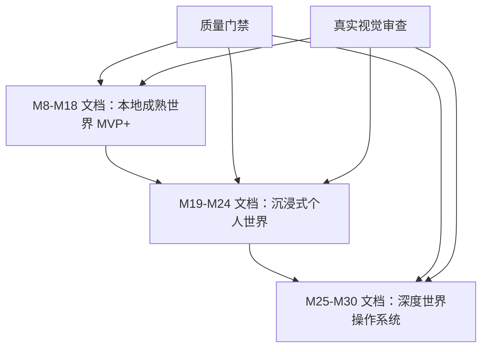

# WorldOS 终局目标所需文档集

> [!IMPORTANT]
> 本文档列出为了冲击 8/10、9/10 高目标，除现有 M8-M18 文档外还需要补齐的文档。它用于防止后续高目标开发再次变成“口号很高，落地仍是骨架”。

## 1. 结论

现有文档足够支撑 M8-M18 的本地成熟世界 MVP+。本次补漏后，M19-M30 的 13 份高目标细文档和 1 份全面执行总计划已补齐，可支撑后续按阶段进入高目标开发。

## 2. 必补文档清单

| 优先级 | 文档 | 建议路径 | 服务阶段 |
| --- | --- | --- | --- |
| P0 | 终局体验宪章 | `docs/00-overview/worldos-ultimate-experience-charter-2026-07-10.md` | M19-M30 |
| P0 | 场景主体深度交互规范 | `docs/00-overview/worldos-m19-scene-deep-interaction-spec-2026-07-10.md` | M19 |
| P0 | 世界空间连续性规范 | `docs/00-overview/worldos-m20-spatial-continuity-spec-2026-07-10.md` | M20 |
| P0 | 内容生命循环规范 | `docs/00-overview/worldos-m21-content-life-loop-spec-2026-07-10.md` | M21 |
| P0 | 灯塔 AI 深度导览与评估规范 | `docs/00-overview/worldos-m22-lighthouse-ai-deep-guidance-eval-spec-2026-07-10.md` | M22 |
| P1 | 感官音频资产生产规范 | `docs/00-overview/worldos-m23-sensory-audio-production-spec-2026-07-10.md` | M23 |
| P1 | 高级可视化技术试点 ADR | `docs/09-adr/ADR-0007-advanced-visualization-candidates.md` | M24 |
| P1 | 作者世界编辑台产品规格 | `docs/00-overview/worldos-m25-author-world-editor-spec-2026-07-10.md` | M25 |
| P1 | 世界记忆与回访体验规范 | `docs/00-overview/worldos-m26-world-memory-returning-visitor-spec-2026-07-10.md` | M26 |
| P1 | 多层权限与私密宇宙规范 | `docs/00-overview/worldos-m27-layered-permission-private-universe-spec-2026-07-10.md` | M27 |
| P2 | 长期运行观测与回滚手册 | `docs/00-overview/worldos-m28-long-running-observability-rollback-runbook-2026-07-10.md` | M28 |
| P2 | 高保真体验打磨标准 | `docs/00-overview/worldos-m29-high-fidelity-polish-standard-2026-07-10.md` | M29 |
| P2 | 终局候选验收协议 | `docs/00-overview/worldos-m30-ultimate-candidate-acceptance-protocol-2026-07-10.md` | M30 |
| P0 | M19-M30 全面执行总计划 | `docs/00-overview/worldos-m19-m30-comprehensive-execution-master-plan-2026-07-10.md` | M19-M30 |

## 3. 每份文档必须回答的问题

| 文档类型 | 必须回答 |
| --- | --- |
| 终局体验宪章 | 是否覆盖独立空间、真实穿梭、内容生命体、陪伴型灯塔、统一世界观、长期回访、作者共生、真实可信 |
| 交互规范 | 用户如何操作、状态如何变化、失败如何回退 |
| 空间连续性 | 从 A 到 B 的迁移如何保持上下文 |
| 内容循环 | 内容如何创建、关联、更新、回看、归档 |
| AI 评估 | AI 回答是否 grounded、是否越权、是否可审计 |
| 音频资产 | 来源、授权、大小、默认静音、停止、降级 |
| 高级可视化 ADR | 为什么现有 SVG / Canvas 不够，新增依赖收益是什么 |
| 作者编辑 | 中文低门槛流程、预览、校验、回滚 |
| 世界记忆 | 记录什么、不记录什么、隐私边界 |
| 权限层 | 后端 / 数据契约事实源，前端只体现 |
| 长期运行 | 如何发现、定位、回滚、恢复 |
| 高保真打磨 | 动效节奏、空状态、微交互、可读性 |
| 终局验收 | 怎么证明达到 9/10，而不是自我感觉良好 |

## 4. 与现有文档的关系

规则：

- M19-M30 文档不能替代 M8-M18。
- M8-M18 未真实完成前，不应跳到高级可视化或复杂音频。
- 高目标文档可以提前补，但开发必须按依赖顺序执行。

## 5. 当前完成口径

- 高目标所需文档已列出。
- M19-M30 阶段细文档已补齐。
- 高级可视化 ADR 已补齐。
- M19-M30 全面执行总计划已补齐。
- 进入开发时仍必须按阶段进行真实截图、录屏、主线检查和人工体验审查。
