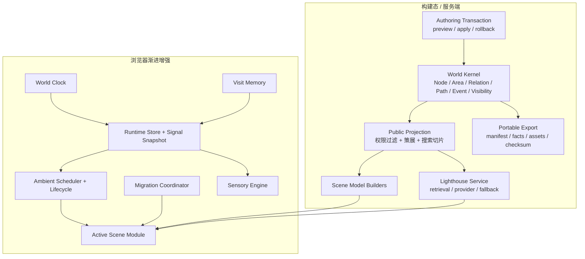
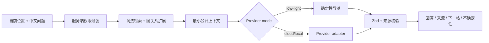

# WorldOS 生命世界架构与数据契约

> [!IMPORTANT]
> 本文档规定如何用现有栈实现生命世界，同时守住事实主权、权限、可移植性、性能和复杂度。它不要求一次性搬迁目录，也不允许用新框架替代尚未理解的体验问题。

固定场景、视图、流程、采样、性能和状态阶梯以 `data/domains/experience/living-world-acceptance.json` 为机器契约；实现只能消费和验证它，不能在 Goal 内重写。

## 1. 架构目标

目标是一个模块化单体：服务端拥有事实与权限，客户端只做当前场景的渐进增强；一个低频世界时钟、一套信号快照、一个环境生命周期、一个迁移协调器、一个可选感官引擎，驱动七个视觉独立的场景。

必须避免：

- 巨型 Provider 每分钟或每帧重渲染整站。
- 每个场景复制时间、季节、访问、声音和权限状态。
- 多个无统一生命周期的 rAF、ticker、interval、AudioContext 和监听器。
- 静态位图成为唯一世界对象。
- 为“宇宙感”预装 3D、ECS、数据库、通用插件和第二套状态框架。
- 把机构级保存标准原样搬进单作者本地项目。

### 1.1 2026-07-11 技术栈复核

选型按稳定性、时效性、本项目匹配度、运行体积、降级能力和替换成本共同决定，不以“最新大版本”单独决定升级。

| 能力 | 当前实装 | 外部状态与决定 | 本 Goal 边界 |
| --- | --- | --- | --- |
| 应用框架 | Next.js 15.5.20 | [npm registry](https://registry.npmjs.org/next/15.5.20) 显示 15.5.20 于 2026-07-01 仍获维护发布；16.2.10 是新主版本。当前 259 个静态页面和 `next start` 已真实通过，因此保持 15.5 维护线，不在体验重构前迁移 16 | Goal 内只接收 15.5 patch；major 迁移需 Goal 外 ADR、迁移清单与全量回归 |
| UI runtime | React / React DOM 19.2.7 | 当前稳定版本；React 官方 19.2 系列继续修复 RSC，现有版本已高于 19.2.6 安全修复线 | 保持 19.2；不引入第二状态框架 |
| 动效 | GSAP 3.15.0 | 官方当前 3.15；`gsap.matchMedia()` 会统一收集并 revert 响应式动画，适合本项目 desktop/mobile/reduced-motion 生命周期 | 只用 core/context/matchMedia/timeline；插件按可见收益单独审查 |
| 契约 | Zod 3.25.76 | Zod 4.4.3 已是新主版本，但现有事实契约和构建稳定；此时迁移只增加类型与序列化回归面 | Goal 内保持 Zod 3；未来独立 ADR 迁移 Zod 4 |
| 检索 | Fuse.js 7.4.2 | 本地小规模公开投影足够，无需搜索服务或向量数据库 | 只读公开投影；规模和质量证据不足前不更换 |
| 场景绘制 | CSS + SVG + Canvas 2D | 与 SSR 静态降级、低体积和七场景差异化最匹配 | Three.js / R3F / PixiJS 等默认不引入 |
| 场景迁移 | 原生 View Transition 渐进增强 + GSAP coordinator | View Transition 已支持 SPA/MPA 迁移，但仍必须 feature-detect 并保留直接导航、焦点和 reduced-motion 路径 | 原生 API 负责浏览器快照能力，GSAP 只编排语义阶段，不建立双状态机 |
| 声音 | 原生 Web Audio + HTMLMediaElement | 浏览器要求用户手势创建或恢复 AudioContext；长音乐流适合 media element，短 cue / 程序化层适合 buffer/audio graph | 单 AudioContext、默认关闭、隐藏暂停、可完全降级；不引入 Howler/Tone |
| 生命周期 | Page Visibility + rAF / timer | Page Visibility 广泛可用；后台 rAF 会暂停、timer 会节流，必须主动释放而不是假设仍按时运行 | 一个 scheduler owner，hidden/quiet/dispose 资源归零 |
| 浏览器验收 | Playwright Python 1.58 + 配套 Chromium 145 headless shell | Playwright 官方要求每个版本安装配套浏览器；配套 Chromium 比依赖本机 Chrome 更可复现 | `check-worldos-living-world-readiness.mjs --repair-browser` 只安装缺失 shell，不升级项目依赖 |
| 媒体验证 | ffmpeg / ffprobe | 成熟本地工具，可回算连续性、时长、帧差、PCM、峰值和频谱 | 作为技术证据，不冒充视觉与人类听感判断 |

主要一手依据：[Playwright 浏览器管理](https://playwright.dev/docs/browsers)、[Next.js production checklist](https://nextjs.org/docs/app/guides/production-checklist)、[GSAP matchMedia](https://gsap.com/docs/v3/GSAP/gsap.matchMedia%28%29/)、[MDN View Transition](https://developer.mozilla.org/en-US/docs/Web/API/View_Transition_API)、[MDN Web Audio best practices](https://developer.mozilla.org/en-US/docs/Web/API/Web_Audio_API/Best_practices)、[MDN Page Visibility](https://developer.mozilla.org/en-US/docs/Web/API/Page_Visibility_API)、[Core Web Vitals 阈值](https://web.dev/articles/defining-core-web-vitals-thresholds)。外部版本只作为决策输入；仓库 lockfile、fresh build 与浏览器实测才是当前实现事实。

## 2. 总体结构



依赖方向只能从事实到公开投影、从信号到场景表现。表现层不得写入事实、读取私密原始文件或持有 Provider Key。

## 3. 世界本体

### 3.1 事实对象

继续复用现有 World Kernel，不创建平行业务模型：

```ts
type WorldFacts = {
  nodes: Node[]
  areas: Area[]
  relations: Relation[]
  paths: Path[]
  events: WorldEventFact[]
  assets: AssetRecord[]
  visibility: VisibilityPolicy[]
}
```

核心语义：

- `Area` 是内容地理，不是 route 或 UI scene。
- `Scene` 是观察和操作事实的镜头，不拥有内容。
- `Node` 是可进入地点，正文和元数据来自同一事实。
- `Relation` 必须有类型、方向和人可读理由。
- `Path` 组织旅程，不修改 Node 事实。
- `Event` 表达时间事实，不等于客户端事件总线。
- `VisibilityPolicy` 在服务端决定公开投影。

### 3.2 体验对象

```ts
export type SceneId =
  | 'gateway'
  | 'atlas'
  | 'timeline'
  | 'archive'
  | 'paths'
  | 'node'
  | 'lighthouse'

export type SceneContext = {
  sceneId: SceneId
  route: string
  sourceRoute: string | null
  focusedObjectId: string | null
  pathId: string | null
  pathStep: number | null
  timelineAnchor: string | null
  archiveQueryKey: string | null
}

export type SceneDestination = {
  href: string
  sceneId: SceneId
  objectId?: string
  transitionObject:
    | 'island'
    | 'star'
    | 'ripple'
    | 'document'
    | 'waypoint'
    | 'door'
    | 'beam'
  accessibleLabel: string
}
```

Scene 类型只能从唯一体验 manifest 派生，不在多个 registry 手写 union。

场景协议引用的辅助类型固定为：

```ts
export type PublicWorldProjection = {
  nodes: PublicNode[]
  areas: PublicArea[]
  relations: PublicRelation[]
  paths: PublicPath[]
  events: PublicEvent[]
}

export type StaticSceneDescriptor = {
  heading: string
  summary: string
  destinations: SceneDestination[]
}

export type ArrivalTarget = {
  objectId: string
  fallbackPosition: { xRatio: number; yRatio: number }
}

export type AmbientResourceSnapshot = {
  adapters: number
  rafCallbacks: number
  tickerListeners: number
  timers: number
  eventListeners: number
  animations: number
  audioContexts: number
  audioSources: number
}

export type SoundPreference = {
  mode: 'muted' | 'enabled'
  volume: number
  sessionArmed: boolean
}
```

`PublicNode` 等公开类型必须由现有 public index 类型派生；这里的名称是边界别名，不允许复制业务字段。

### 3.3 保存对象

当前 Goal 只实现轻量必要字段：

```ts
export type PreservationRecord = {
  objectId: string
  objectKind: 'fact' | 'content' | 'asset' | 'projection'
  originalPath: string
  checksum: string
  checksumAlgorithm: 'sha256'
  version: string
  createdAt: string
  modifiedAt: string
  sourceId?: string
  rightsId: string
  derivedFrom?: string[]
}

export type PreservationEvent = {
  id: string
  kind: 'capture' | 'validate' | 'migrate' | 'export' | 'restore' | 'rollback'
  occurredAt: string
  agent: string
  objectIds: string[]
  outcome: 'success' | 'failure'
  detail: string
}
```

这些字段借用 PREMIS 的对象、事件、代理和权利思想，但不是 PREMIS 实现，也不创建 XML 体系。

## 4. 产品模式与边界

```ts
export type WorldMode =
  | 'public'
  | 'quiet'
  | 'static'
  | 'owner-local'
  | 'status'
  | 'private-future'
  | 'transfer-package'
```

| 模式 | 数据来源 | 写能力 | 暴露位置 |
| --- | --- | --- | --- |
| public | 服务端公开投影 | 无 | 公开 route / API |
| quiet | 同 public | 无 | 公开 route，低刺激 |
| static | 同 public 的 SSR | 无 | JS-off / 失败 |
| owner-local | 原始事实 + 本机授权 | CLI 事务 | 本机进程 |
| status | 公开运行与 QA 摘要 | 无公开写入 | `/status` |
| private-future | 私密事实 | 本 Goal 不实现 | 不进入公开产物 |
| transfer-package | 公开事实投影 | 本机生成 | 文件系统 |

不得因为未来存在 private 模式就在当前前端实现假登录或 role 字符串。

## 5. 数据所有权

| 数据 | 唯一 owner | 消费者 | 持久化 |
| --- | --- | --- | --- |
| Node / Area / Relation / Path / Event | World Kernel | 场景、搜索、灯塔、导出 | JSON / Markdown |
| visibility / rights | 服务端事实与策略 | public projection、AI、导出 | 文件 / 服务端 |
| 策展 | Public Curation | Gateway、代表节点、onboarding | 单一 registry |
| 世界时间 | World Clock | Runtime、场景、声音 | 不持久化 |
| 世界信号 | Signal Builder | 当前场景、声音 | 运行时快照 |
| 场景内部相位 | Active Scene Adapter | 当前绘制 | 不持久化 |
| 访问 / 路径进度 | Visit Memory | Gateway、Paths、Node、灯塔 | 最小 localStorage |
| 声音偏好 | Sensory Engine | Runtime、控制 | 最小 localStorage |
| AI Key | Server Environment | Provider Adapter | 环境变量 |
| AI 回答 | Lighthouse Service / 当前会话 | Lighthouse UI | 默认不长期保存 |
| 保存记录 | Export / Authoring | 恢复、审计 | manifest / event log |

## 6. 静态优先与客户端边界

- `page.tsx` 和 scene model builder 保持 Server Component / server-only 数据读取。
- 每个场景先输出语义标题、主要事实、静态空间对象、等价导航和错误出口。
- Client Component 只接管持续环境、聚焦、拖动、迁移、声音和局部状态。
- 不对整页使用 `ssr: false`，不让 Canvas 成为唯一导航。
- 动态层只消费服务端已过滤的 view model，不在客户端重新拼原始 JSON 或权限。
- 重型绘制和搜索按场景 / 用户动作延迟加载，不进入共享首屏 bundle。

## 7. 唯一体验 Manifest

新增或收束为一个注册入口：

```ts
export type WorldExperienceManifestEntry = {
  id: SceneId
  matchRoute: (pathname: string) => boolean
  buildModelId: string
  sceneModuleId: string
  staticFallbackId: string
  acceptedSignals: Array<keyof WorldSignalSnapshot>
  activityLevel: 'high' | 'medium' | 'low'
  soundscapeId: string
  arrivalObjectIds: string[]
  requiredModes: Array<'desktop' | 'mobile' | 'reduced' | 'static'>
}

export const worldExperienceManifest = {
  gateway: { /* ... */ },
  atlas: { /* ... */ },
  timeline: { /* ... */ },
  archive: { /* ... */ },
  paths: { /* ... */ },
  node: { /* ... */ },
  lighthouse: { /* ... */ },
} as const satisfies Record<SceneId, WorldExperienceManifestEntry>
```

Manifest 只声明能力和引用，不包含每帧参数、组件实现、任意脚本、内容副本和权限判断。现有 scene / transition / ambient / sensory registry 必须由它派生或明确保留单一职责，不能新增平行表。

## 8. World Clock

纯函数与一个低频时间源：

```ts
export type WorldTimeSnapshot = {
  nowEpochMs: number
  timeZone: string
  dayProgress: number
  dayPeriod: 'dawn' | 'day' | 'dusk' | 'night'
  season: 'spring' | 'summer' | 'autumn' | 'winter'
  seasonProgress: number
  worldDateKey: string
}

export function buildWorldTimeSnapshot(
  nowEpochMs: number,
  timeZone: string,
): WorldTimeSnapshot
```

规则：

- 默认项目时区，不能按 LAN IP 猜测。
- 每分钟和边界时刻更新语义；视觉连续性由 adapter 插值。
- hidden 时停止 timer；visible 时从 `Date.now()` 重新计算，不追帧。
- `/status` 测试 override 通过显式 server / query fixture 注入，公开 route 不展示模拟器。
- `/status` 或其只读子路由必须向 localhost 与 LAN 验收返回当前 `buildId`、`sourceCommit` 和完整运行产物 `buildRootHash`；production build 在完成后生成不参与自身 Merkle 的 `.next/worldos-build-identity.json`，endpoint 只读该文件。不包含秘密、权限实现或私密事实，终局校验器现场读取并抽取真实 client chunk 比对。
- 第一版只实现昼夜与四季，不接天气、节气或外部天文服务。

## 9. World Signal Snapshot

共享信号只含低频、可解释状态：

```ts
export type WorldSignalSnapshot = {
  time: WorldTimeSnapshot
  content: {
    recentNodeIds: string[]
    updatedNodeIds: string[]
    activePathIds: string[]
  }
  journey: {
    visitCount: number
    returnGap: 'same-session' | 'same-day' | 'recent' | 'long-away'
    currentPathId: string | null
    recentNodeIds: string[]
  }
  runtime: {
    motion: 'full' | 'reduced' | 'off'
    sensory: 'full' | 'quiet' | 'silent'
    quality: 'auto' | 'low'
    visibility: 'visible' | 'hidden'
  }
  lighthouse: {
    mode: 'live-provider' | 'low-light' | 'unavailable'
    state: 'idle' | 'retrieving' | 'answering' | 'failed'
  }
}
```

全局信号不能包含 `riverSpeed`、`beamAngle`、`particleCount` 等场景私有表现参数。

## 10. Runtime Store 与事件

先测量当前 Context，再决定是否迁移为极小外部 store。目标接口支持分片订阅：

```ts
export type WorldRuntimeSnapshot = {
  signals: WorldSignalSnapshot
  scene: SceneContext
  migration: MigrationSnapshot
  sound: SoundPreference
}

export interface WorldRuntimeStore {
  getSnapshot(): WorldRuntimeSnapshot
  subscribe(listener: () => void): () => void
  dispatch(event: RuntimeEvent): void
}
```

React 使用 `useSyncExternalStore` 订阅所需切片；若 profiler 证明现有 Context 已满足预算，可先保留 reducer 并维持同一接口，不为抽象而迁移。

事件表示已经发生的事实或明确意图：

```ts
export type RuntimeEvent =
  | { type: 'clock/ticked'; snapshot: WorldTimeSnapshot }
  | { type: 'visibility/changed'; value: 'visible' | 'hidden' }
  | { type: 'scene/entered'; context: SceneContext }
  | { type: 'scene/focused'; objectId: string }
  | { type: 'migration/requested'; intent: MigrationIntent }
  | { type: 'migration/settled'; destination: SceneDestination }
  | { type: 'journey/progressed'; pathId: string; nodeId: string }
  | { type: 'sound/changed'; preference: SoundPreference }
  | { type: 'lighthouse/status'; status: WorldSignalSnapshot['lighthouse'] }
```

高频 pointer、frame、粒子和音频 sample 不进入全局事件流。订阅必须绑定 `AbortSignal` 或生命周期。

## 11. Ambient Scheduler 与生命周期

全站只允许一个环境调度入口：

| 通道 | 目标频率 | 用途 |
| --- | ---: | --- |
| logical | 每分钟 / 事件驱动 | 时间、内容、旅程与语义 |
| ambient | 上限约 30fps | 星光、河流、雾、窗光、尘 |
| choreography | 原生刷新率、有限时长 | 入场、迁移、交互反馈 |

```ts
export type AmbientAdapter = {
  start(signals: WorldSignalSnapshot): void
  tick(deltaMs: number, signals: WorldSignalSnapshot): void
  update(signals: WorldSignalSnapshot): void
  pause(): void
  resume(signals: WorldSignalSnapshot): void
  dispose(): void
  debugResources(): AmbientResourceSnapshot
}
```

生命周期：

```text
mount active scene -> register adapter -> start ambient
signal change      -> adapter.update, no full remount
route leave        -> freeze source -> dispose adapter
page hidden        -> pause ambient + suspend audio
page visible       -> rebuild clock -> resume current adapter
quiet / reduced    -> static or non-positional projection
error / unmount    -> abort + kill + dispose
```

ambient 每帧写 CSS custom property、SVG attribute、Canvas 或 GSAP quick setter，不 `setState`。不全局降低 GSAP ticker 帧率，以免影响迁移。

## 12. Scene Module

每个场景共享协议，不共享视觉模板：

```ts
export type SceneModule<TModel> = {
  id: SceneId
  buildModel: (facts: PublicWorldProjection) => TModel
  createAmbientAdapter: (
    host: HTMLElement,
    model: TModel,
    options: { signal: AbortSignal },
  ) => AmbientAdapter
  getStaticFallback: (model: TModel) => StaticSceneDescriptor
  getArrivalTarget: (
    destination: SceneDestination,
  ) => ArrivalTarget | null
  getSoundscape: (
    signals: WorldSignalSnapshot,
  ) => SoundscapeRecipe
}
```

这是静态 import 的架构协议，不是运行时插件平台。场景自己的 hover、selected、river offset 和 camera state 留在场景目录。

## 13. 渲染分层与升级阶梯

### 13.1 场景渲染层

```text
R0 semantic SSR         正文、链接、列表、权限和错误
R1 spatial base         bitmap / CSS 材质 / 静态 SVG
R2 semantic objects     DOM / inline SVG，可聚焦、可命中
R3 ambient life         CSS / SVG / Canvas 2D，可暂停
R4 choreography         GSAP / progressive View Transition
R5 sensory              Web Audio，用户手势后
```

关闭 R1 bitmap 时，R2 仍需表达核心空间；关闭 R3-R5 时，R0-R2 仍可完成任务。

### 13.2 技术升级

| 等级 | 技术 | 允许条件 |
| --- | --- | --- |
| T0 | HTML + bitmap + CSS | 默认底座 |
| T1 | inline SVG + GSAP | 路径、关系、有限节点 |
| T2 | Canvas 2D | 高频环境或密集绘制，且有 DOM 等价层 |
| T3 | Worker + OffscreenCanvas | trace 重复证明 Canvas 拖慢主线程 |
| T4 | PixiJS / Sigma | 数百 sprite 或千级图谱原型明显优于 T2 |
| T5 | Three.js | 深度空间本身承担不可替代任务，局部且可删除 |

不能跳级。引擎不是摆脱骨架的默认答案。

## 14. Migration Coordinator

```ts
export type MigrationSnapshot =
  | { kind: 'idle' }
  | { kind: 'leaving'; intent: MigrationIntent; startedAt: number }
  | { kind: 'in-transit'; intent: MigrationIntent; startedAt: number }
  | { kind: 'arriving'; intent: MigrationIntent; startedAt: number }
  | { kind: 'settled'; context: SceneContext; settledAt: number }
  | { kind: 'cancelled'; reason: string; context: SceneContext }

export type MigrationIntent = {
  source: SceneContext
  destination: SceneDestination
  sourceGeometry: DOMRectReadOnly | null
  returnFocusId: string | null
}
```

Coordinator 拥有状态、取消、覆盖、几何、焦点和返回上下文；不拥有目标内容、权限和持续环境。

所有可见跨场景操作在真实可操作元素上提供 `data-scene-destination="/path"`，Coordinator 在离开、途中、抵达和沉淀时派发只含公开 route / object ID 的 `worldos:migration-phase` 事件。它们用于可访问导航与冻结终局浏览器探针，不包含私密事实，也不得只在测试构建伪造。

目标场景挂载后通过稳定 object ID 注册真实 arrival target。无法解析时使用场景级安全目标，不硬编码所有百分比。

View Transition API 只做渐进增强；导航正确性必须在无该 API 时成立。

## 15. Sensory Engine

```ts
export type SoundscapeRecipe = {
  id: string
  sceneId: SceneId
  ambience: SoundSource | null
  motif: SoundSource | null
  cue: SoundSource | null
  gain: number
  filter: { lowpassHz?: number; highpassHz?: number }
  transitionMs: number
}

export type SoundSource =
  | { kind: 'file'; assetId: string }
  | { kind: 'procedural'; patchId: string }
```

规则：

- 只在用户手势后懒创建一个 `AudioContext`。
- 最多一个 ambience 和一个短 cue；场景切换 crossfade 后释放旧 source。
- recipe 消费 World Signal，不自行计算 route、季节和权限。
- hidden、mute、quiet、异常、unmount 有统一 suspend / dispose。
- 程序化 patch 与文件资产遵守同一许可 / 来源 / hash / 峰值 / 技术验证 / 人类签收状态治理。
- 原生 Web Audio 满足前不引入 Howler / Tone。
- 自动验收只负责 0 B、上下文数量、source 生命周期、true peak、循环接缝、十分钟离线渲染、波形与频谱；它不能产生人类听感结论。
- 人类签收是 Goal 外独立输入：必须记录真实 reviewer、设备和连续试听时间，并由用户明确批准新的控制版本。本 Goal 与脚本始终保留 `HUMAN_AUDIO_PENDING`，不认证签收真实性，也不允许 Codex 代签或自动晋级。

## 16. Visit Memory

```ts
export type VisitMemoryV2 = {
  version: 2
  lastPublicRoute: string | null
  recentPublicNodeIds: string[]
  pathProgress: Record<string, string[]>
  lastVisitedAt: string | null
  soundPreference: SoundPreference
  motionPreference: 'system' | 'reduced' | 'off'
  expiresAt: string
}
```

约束：

- 容量远低于 Web Storage 配额，设置数组上限和过期。
- 只保存公开 ID 与偏好；不保存正文、问题、回答、owner 身份、私密 slug 和 Key。
- schema 解析失败即丢弃并回到首访，不白屏。
- 清除入口删除所有版本和派生缓存。
- localStorage 不是跨设备记忆，不得在文案中夸大。

## 17. 内容生长与作者流程

沿用本机 CLI 事务，不向 LAN 增加写 API：

```text
draft -> schema / visibility / relation / path / date / asset validation
      -> impact preview
      -> backup manifest + checksum
      -> temp write + complete validation
      -> atomic rename
      -> public projection rebuild
      -> restore / rollback verification
```

一个输入只能写 World Kernel；Atlas、Timeline、Archive、Paths、Node、Lighthouse 和 export 都从投影消费。

作者影响预览必须列出：事实变化、公开范围、关系、事件、路径、场景投影、资产、AI context、导出和可回滚文件。

## 18. 可移植导出与恢复

当前 Goal 实现轻量包，不照搬 OCFL 仓库：

```ts
export type WorldExportManifest = {
  schemaVersion: string
  worldCommit: string
  createdAt: string
  scope: 'public'
  toolVersion: string
  counts: Record<'nodes' | 'areas' | 'relations' | 'paths' | 'events' | 'assets', number>
  rootChecksum: string
  preservationEventId: string
}
```

```text
world-export-<timestamp>/
  manifest.json
  facts/
    nodes.json
    areas.json
    relations.json
    paths.json
    events.json
    visibility.json
  content/
  assets/
    registry.json
    files/
  preservation/
    objects.json
    events.json
    rights.json
  checksums.sha256
  README.md
```

规则：

- 本 Goal 只允许 public export；私密 / owner 备份留给未来独立的授权、加密、审计与恢复设计。
- manifest 记录 schema、WorldOS commit、创建时间、对象数、权限范围和工具版本。
- `checksums.sha256` 覆盖包内所有受管文件。
- 原始事实 / 内容与体验投影分开；不导出 build cache、报告或客户端访问记忆。
- 在临时目录校验 checksum、schema、引用完整性和最小恢复构建。
- 固定只读验证接口为 `node scripts/world-export.mjs verify-restore --input <export-root> --output <empty-temp-dir>`；终局校验器必须自行创建系统临时目录执行并删除，不接受 restore 报告自报成功。
- 恢复不能覆盖真实工作区；只有显式本机命令和事务 backup 才可应用。
- 第一版不实现多副本地理分布、WORM、机构保存策略、继承授权和法律工作流。

## 19. Lighthouse 服务



```ts
export type LighthouseAnswer = {
  mode: 'live-provider' | 'low-light' | 'unavailable'
  answer: string
  sourceIds: string[]
  nextSteps: Array<{ title: string; href: string; reason: string }>
  confidence: 'high' | 'medium' | 'low'
  refusalReason?: string
  audit: {
    requestId: string
    elapsedMs: number
    cached: boolean
    provider?: string
    model?: string
    inputTokens?: number
    outputTokens?: number
  }
}
```

先检索后生成；无来源、超时、schema 错误、限流和权限冲突回 low-light。NIST AI RMF 的 Govern、Map、Measure、Manage 用于组织风险，而不是作为打勾替代评测。[来源：NIST AI RMF](https://airc.nist.gov/airmf-resources/airmf/)

`/api/status/lighthouse-eval` 只在本地 QA 模式接受冻结的十个 case ID、context、question 与 fault，返回 `buildId`、`sourceCommit`、`caseId` 和真实服务 payload；它不接受任意私密上下文，不进入访客旅程。终局校验器必须现场重放并与带 hash 的响应逐项相等。

## 20. 权限与隐私

必须保证 private、owner、vault、family、partner、sealed、silent 不进入：

- Public Scene View Model、HTML、RSC、JSON、search、sitemap、manifest。
- Canvas / SVG buffer、客户端 bundle、source map 和 localStorage。
- Lighthouse retrieval、Provider request、缓存和审计正文。
- screenshot、video、trace、音频 cue 名称和公开报告。
- 默认 public export。

前端 `canView`、按钮隐藏、role 字符串、LAN 地址和 localStorage 只能改善体验，不能授权。

## 21. 资产管线

每个视觉 / 音频资产记录：

```text
id, kind, sceneId, source, author, license, sourceUrl,
localPath, bytes, dimensions/duration, checksum,
day/season/device variants, loadPolicy, fallback, reviewStatus
```

规则：

- 首屏只加载当前设备、场景和模式所需资产。
- 现有 WebP 保留为可复用底层，但语义对象和环境层从中解耦。
- 昼夜 / 四季优先参数化光、材质、粒子和有限 overlay，不复制 32 张整图。
- 音频启用前不下载；CC0 / 自有 / 可核验授权优先。
- 资产失败回到静态语义层，不阻塞内容和导航。

## 22. 性能与规模触发器

体验预算以验收契约为准，架构升级触发器为：

| 规模 / 症状 | 默认处理 | 进入下一技术前证据 |
| --- | --- | --- |
| 当前约 200 nodes | JSON / Markdown、预计算、Fuse、SVG | 保持 |
| 1000 nodes 或 public index > 2MB | 分片投影、按区域加载 | 构建和搜索基准 |
| 2000+ nodes、build > 3min、search p95 > 100ms | SQLite FTS5 候选 | ADR + 迁移 / 回滚原型 |
| 同屏 1000+ nodes / 3000+ edges | Sigma / Graphology 候选 | 图谱和可访问替代 A/B |
| 500+ 持续 sprite 且 Canvas p95 > 34ms | PixiJS 候选 | 同设备 A/B trace |

即使事实规模增长，首屏也只发送当前语义子图。

### 22.1 终局原始证据接口

最终 run 的 `manifest.json` 只允许保存 source / build / server 身份和 artifact 索引，不保存可直接决定完成的总分或总 verdict。索引固定指向 13 类带 SHA-256 的原始文件：source snapshot、build fingerprint、flow traces、time causality、migration edges、audio analysis、Lighthouse eval、permission scan、public export/restore、performance samples、complexity metrics、asset audit 和 blind review pack。

- 终局校验器用真实 Git、文件 hash、`.next/BUILD_ID`、localhost / LAN build identity、`ffprobe` / `ffmpeg`、checksum、原始性能数组和临时恢复命令自行回算机器项。
- evidence run 内拒绝 symlink，artifact 不能逃出当前 run；旧 run、任意存在文件和 manifest 自报布尔值均不能替代。
- 两个 reviewer 各自接收不含标题、导航、标签、报告状态和映射的随机盲审包，产出独立只读报告文件；映射只能晚于报告提交揭示。
- reviewer task / thread ID、报告 hash 与只读前后工作树 hash 用于程序性独立审计，但不宣称平台级密码学身份认证。
- 固定 private canary 必须经过 HTML、RSC、JSON、search、AI context、Canvas payload、截图和 public export 实际扫描。
- 终局校验器亲自在系统临时目录创建含六个冻结 canary 的私密 fixture，以 `WORLDOS_PRIVATE_CANARY_FIXTURE` 启动第二个真实 `next start`；`/api/status/permission-canary` 只返回已加载 token 的 SHA-256 正向控制，不返回 token。校验器随后请求 sitemap、全部公开 HTML 与固定公开 API 并扫描原文，不能把 canary 注入和零命中委托给可修改 helper，也不能接受八个空文件。

## 23. 依赖准入

任何新运行时依赖必须通过 ADR，回答：

1. 哪个冻结体验否决项无法用现有栈满足？
2. 最小原生 / 现有依赖原型为什么失败？
3. gzip、资产、初始化、内存和 CPU 增量是多少？
4. mobile、JS-off、reduced、resource-failure 如何降级？
5. 许可证、维护状态、供应链和替换路径是什么？
6. 删除依赖后最低可用体验是什么？

当前默认：GSAP、CSS、SVG / Canvas、View Transition 渐进增强、原生 Web Audio、Fuse、Zod。Three.js、R3F、PixiJS、D3、Sigma、XState、Howler、Tone、SQLite 都是条件候选或当前拒绝。

## 24. 目标文件边界

按纵向样板渐进建立，不一次搬迁：

```text
src/world/
  experience/
    manifest.ts
    types.ts
  runtime/
    clock.ts
    signals.ts
    store.ts
    scheduler.ts
    lifecycle.ts
    events.ts
  migration/
    coordinator.ts
    intent.ts
    geometry-registry.ts
  sensory/
    engine.ts
    recipes.ts
    assets.ts
  memory/
    schema.ts
    store.ts
  scenes/
    gateway/
    atlas/
    timeline/
    archive/
    paths/
    node/
    lighthouse/
src/server/lighthouse/
  service.ts
  retrieval.ts
  providers/
src/server/export/
  build-export.ts
  verify-export.ts
  restore-export.ts
```

现有 `src/components/*` 与 `src/lib/runtime/*` 先通过 adapter 接入；只有文件同时变化、边界稳定且验证通过时才迁移目录。

## 25. 从当前实现迁移

1. 为当前时间、场景、迁移、声音、访问和权限写行为基线测试。
2. 用一个真实内容变更证明投影、authoring、导出和恢复链。
3. 在 Gateway -> Atlas -> Node 样板中建立 Clock、Signals、Scheduler 和 Scene Adapter。
4. 以 profiler、trace 和录屏决定是否迁移 Context / SVG 到外部 store / Canvas。
5. 样板通过后固定接口，接入 Timeline、Archive、Paths、Lighthouse。
6. 收束重复 registry、循环和状态；删除被替代代码，不保留双运行时。
7. 完成迁移、回访、声景、Lighthouse、规模和故障矩阵。
8. 最后才进行目录整理、命令收束和条件依赖 ADR。

每一步都要保持静态世界、fresh build、localhost / LAN 和回滚可用。

## 26. 架构否决项

出现任一项必须停在当前风险门修正：

- Runtime 每帧触发 React 全树更新。
- 两个以上全局 ticker、scheduler 或 AudioContext 无统一 owner。
- 场景离场后仍有 rAF、GSAP、listener、timer、Canvas 或音频运行。
- 表现层直接读取原始私密事实、作者写入逻辑或 Provider Key。
- 新内容需要改场景组件才能出现。
- 新场景需要修改五处以上平行 registry / switch。
- Canvas 取代可访问操作层，JS-off 失去主路径。
- 位图继续承担语义对象、环境和交互全部职责。
- 一个装饰效果引入重型运行时依赖。
- 导出包只有页面截图 / HTML，没有原始事实、checksum 和恢复证明。
- 为本 Goal 实现完整 OCFL、PREMIS、CRDT、家庭继承或通用插件系统。
- 新增阶段脚本、空壳报告和自评分来证明架构完成。
