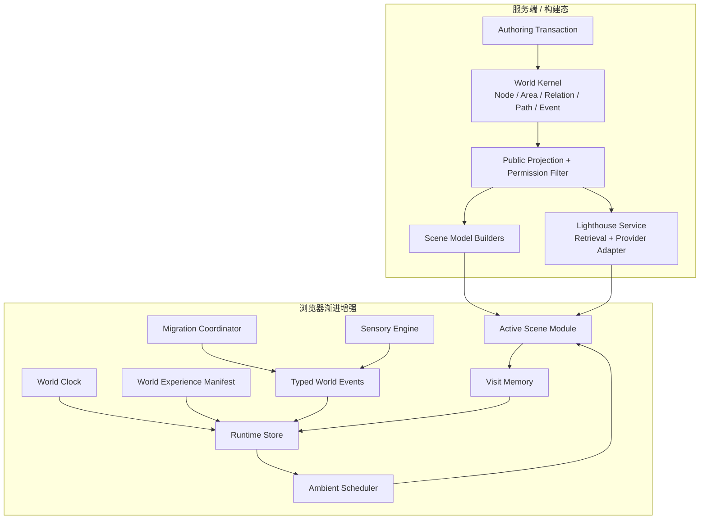
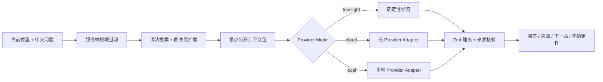

# WorldOS 生命世界运行架构与技术决策

> 状态：目标架构提案，尚未开始迁移
> 日期：2026-07-11
> 架构原则：模块化单体、事实主权、服务端优先、客户端小岛、单一调度、渐进增强、按证据升级。

## 1. 架构目标

建立一个轻量生命运行层，使七个场景能够持续消费同一世界状态，又不出现：

- 巨型 `WorldRuntimeProvider` 每分钟或每帧重渲染全站。
- 每个场景各自维护时间、季节、访问和声音副本。
- 多个 `requestAnimationFrame`、interval、AudioContext 和路由监听器相互竞争。
- 视觉引擎反向污染内容事实和权限。
- 为未来规模预装 3D、ECS、数据库、状态机和通用插件平台。

## 2. 总体架构



依赖只能从事实到投影、从运行信号到表现。场景表现不得导入原始私密数据、作者写入逻辑或 Provider Key。

## 3. 九个模块边界

### 3.1 World Kernel

继续拥有：

- 内容、区域、关系、路径、事件和生命周期事实。
- visibility / permission 与公开投影。
- Zod 校验、生成索引、AI 公开上下文。

不拥有：动画进度、粒子位置、音频节点、当前鼠标坐标和客户端访问偏好。

### 3.2 World Experience Manifest

这是下一轮唯一体验注册入口，负责声明：

- 场景 ID、route matcher、主体对象和静态 fallback。
- 场景可消费的生命信号。
- 迁移路线族与允许的媒介。
- 环境 recipe ID、声景 ID、活动度和资产变体。
- 质量矩阵需要覆盖的 route / mode / flow。

它不存每帧参数，不复制内容事实，不包含任意可执行脚本。现有 scene、transition、ambient、sensory 等注册表应在执行计划中评估合并或由一个入口引用，不能再新增平行注册表。

### 3.3 World Clock

纯函数 + 一个低频计时源：

```ts
type WorldTimeSnapshot = {
  nowEpochMs: number
  timeZone: string
  dayProgress: number
  dayPeriod: 'dawn' | 'day' | 'dusk' | 'night'
  season: 'spring' | 'summer' | 'autumn' | 'winter'
  seasonProgress: number
  worldDateKey: string
}
```

规则：

- 默认每分钟生成新快照，边界时刻可安排一次精确更新。
- hidden 时停止 timer；visible 时从 `Date.now()` 重新生成。
- `/status` 可注入测试时间，公开路由只读真实配置。
- 时区和季节算法可配置，但第一版不引入外部天气或天文服务。

### 3.4 Runtime Store

持有低频共享状态，而不是每帧画面：

```ts
type WorldRuntimeSnapshot = {
  time: WorldTimeSnapshot
  scene: SceneContext
  migration: MigrationSnapshot
  motion: 'full' | 'reduced' | 'off'
  sensory: 'full' | 'quiet' | 'silent'
  quality: 'auto' | 'low'
  visibility: 'visible' | 'hidden'
  sound: SoundPreference
  journey: JourneySnapshot
  lighthouse: LighthouseRuntimeStatus
}
```

建议使用极小自建 store 与 React `useSyncExternalStore` 分片订阅。是否迁移必须先用 React Profiler 证明当前 Context 的更新会造成不必要重渲染；未证明前可以先保留 reducer，但接口要按分片设计。

### 3.5 Typed World Events

事件只表示已经发生的事实或用户意图：

```ts
type WorldEvent =
  | { type: 'clock/tick'; snapshot: WorldTimeSnapshot }
  | { type: 'scene/entered'; context: SceneContext }
  | { type: 'scene/focused'; objectId: string }
  | { type: 'migration/requested'; intent: MigrationIntent }
  | { type: 'migration/settled'; destination: SceneDestination }
  | { type: 'journey/progressed'; pathId: string; nodeId: string }
  | { type: 'sound/changed'; preference: SoundPreference }
  | { type: 'lighthouse/status'; status: LighthouseRuntimeStatus }
```

边界：

- 命令由明确 service / coordinator 发起，不用 event bus 隐式调用写操作。
- 事件 payload 只含公开、最小、可序列化数据。
- 所有订阅都与 `AbortSignal` 或组件生命周期绑定。
- 高频 pointer / frame 数据不进入全局事件流。

### 3.6 Ambient Scheduler

全站只允许一个环境调度入口，提供三种节奏：

| 通道 | 目标频率 | 用途 |
| --- | ---: | --- |
| logical | 每分钟 / 事件驱动 | 时间、季节、内容和访问语义 |
| ambient | 最高约 30fps | 星光、河流、雾、微光等低速环境 |
| choreography | 原生刷新率 | 有限时长的进入、迁移和交互反馈 |

ambient 不通过 React setState 推每帧；场景 adapter 接收 delta 和稳定信号快照，写 Canvas、SVG attribute、CSS custom property 或 GSAP quick setter。

生命周期：

```text
mount active scene -> register adapter -> visible tick
route leave         -> freeze source -> unregister adapter
page hidden         -> stop ambient + suspend audio
page visible        -> recompute clock -> resume active scene
reduced/off         -> adapter switches to static projection
unmount/error       -> abort listeners + kill timelines + release resources
```

不全局调用 `gsap.ticker.fps(30)`，避免影响迁移编舞；ambient adapter 自己按累积 delta 限频。

### 3.7 Scene Module

每个场景高内聚，契约相同，视觉完全独立：

```ts
type SceneModule<TModel> = {
  id: SceneId
  buildModel: (facts: PublicWorldProjection) => TModel
  createAmbientAdapter: (host: HTMLElement, model: TModel) => AmbientAdapter
  getStaticFallback: (model: TModel) => StaticSceneDescriptor
  getArrivalTarget: (destination: SceneDestination) => ArrivalTarget | null
  getSoundscape: (signals: WorldSignalSnapshot) => SoundscapeRecipe
}
```

`SceneModule` 是架构协议，不要求做运行时插件加载器。七个现有场景可由静态 import 注册，类型从 `as const` registry 派生，避免手工维护多个 scene union。

### 3.8 Migration Coordinator

拥有：

- `idle -> leaving -> inTransit -> arriving -> settled / cancelled` 状态。
- 来源真实几何、目标 descriptor、路由 intent、焦点与返回上下文。
- 快速连续导航的取消、覆盖和资源清理。
- reduced-motion 和无 View Transition fallback。

不拥有：目标页面内容、权限判断、场景内部持续环境。

目标几何不得全部硬编码为百分比。目标场景挂载后由 stable object ID 注册真实 arrival target；无法解析时使用场景级安全目标。

### 3.9 Sensory Engine 与 Visit Memory

Sensory Engine：

- 一个懒创建 AudioContext。
- 最多一个 ambience 与一个短 cue。
- 场景切换 crossfade，hidden / mute / silent 时 suspend 或释放。
- recipe 消费同一世界信号；声音不单独判断季节和路由。

Visit Memory：

- 只持久化必要的最近地点、路径进度、已读 / 未读提示和偏好。
- 设置 schema version、容量上限、过期和一键清除。
- 时间、季节和内容事实不写入 localStorage，随时重新派生。
- localStorage 只用于小状态；[浏览器 Web Storage 总上限通常为 10MiB](https://developer.mozilla.org/en-US/docs/Web/API/Storage_API/Storage_quotas_and_eviction_criteria)，项目预算必须远低于这一数值。

## 4. 数据所有权

| 数据 | 唯一所有者 | 消费者 | 持久化 |
| --- | --- | --- | --- |
| Node / Area / Relation / Path / Event | World Kernel | 所有场景、灯塔 | 文件事实源 |
| visibility / permission | 服务端事实与过滤层 | 页面、API、AI | 文件 / 服务端 |
| 世界时间 | World Clock | Runtime、场景、声音 | 不持久化 |
| 场景上下文 | Runtime Store | 当前场景、迁移、灯塔 | 当前会话 |
| 粒子 / 河面 / 光束相位 | 当前 Scene Adapter | 场景绘制 | 不持久化 |
| 访问和路径进度 | Visit Memory | Gateway、Paths、Node、灯塔 | 小型本地存储 |
| 声音偏好 | Sensory Engine | Runtime | 小型本地存储 |
| AI Key | 服务端环境 | Provider adapter | 环境变量 |
| AI 回答摘要 | Lighthouse service / 当前会话 | Lighthouse UI | 默认不长期持久化 |

## 5. 世界信号投影

`WorldSignalSnapshot` 是场景唯一共享输入：

```ts
type WorldSignalSnapshot = {
  time: WorldTimeSnapshot
  content: {
    recentNodeIds: string[]
    updatedNodeIds: string[]
    activePathIds: string[]
  }
  journey: {
    visitCount: number
    returnGap: 'same-session' | 'same-day' | 'recent' | 'long-away'
    currentPathId: string | null
    recentNodeIds: string[]
  }
  runtime: {
    motion: WorldRuntimeSnapshot['motion']
    sensory: WorldRuntimeSnapshot['sensory']
    quality: WorldRuntimeSnapshot['quality']
    visibility: WorldRuntimeSnapshot['visibility']
  }
  lighthouse: LighthouseRuntimeStatus
}
```

场景将信号转为自己的 CSS variables、绘制参数和声音 recipe。全局 Runtime 不输出 `particleCount`、`riverSpeed` 或 `beamAngle` 等场景私有参数。

## 6. 渲染阶梯

按最低足够能力逐级升级：

| 级别 | 技术 | 使用范围 | 升级条件 |
| --- | --- | --- | --- |
| R0 | 语义 HTML + bitmap | 静态世界、内容、fallback | 默认底座 |
| R1 | CSS transform / opacity / custom properties | 光线、微漂移、状态 | 默认动态 |
| R2 | inline SVG + GSAP | 路径、关系、有限节点、可访问图形 | Atlas / Timeline 主线 |
| R3 | Canvas 2D | 高频装饰、大量线 / 粒子、河面 | SVG trace 越界且有 DOM 等价层 |
| R4 | Worker + OffscreenCanvas | Canvas 计算拖慢主线程 | 两台目标设备重复越界 |
| R5 | PixiJS / Sigma | 数百 sprite 或千级图谱 | 专项原型收益明显，ADR 通过 |
| R6 | Three.js | 深度空间是不可替代核心交互 | 局部、可删除、完整降级、资产链成熟 |

升级不能跳级。R5 / R6 不允许作为“摆脱骨架”的捷径。

## 7. 项目规模阶梯

以下阈值是 WorldOS 的项目决策，不是通用行业定律：

| 层级 | 规模 / 症状 | 默认技术 | 触发评估 |
| --- | --- | --- | --- |
| 当前 | 约 200 nodes、398 relations、29 paths | JSON / Markdown、预计算、Fuse、SVG | 保持 |
| 成长 | 1000 nodes 或公开索引 > 2MB | 分片公开索引、按场景 / 区域加载 | 构建和搜索基准 |
| 大型本地 | 2000+ nodes、构建 > 3min、产物 > 100MB 或搜索 p95 > 100ms | 服务端内存索引或 SQLite FTS5 候选 | ADR + 数据迁移原型 |
| 高密 Atlas | 同屏 1000+ nodes 或 3000+ edges | Sigma / Graphology 候选 | 图谱命中、布局和可访问替代验证 |
| 高密环境 | 500+ 持续 sprite 且 Canvas 2D p95 frame > 34ms | PixiJS 候选 | 同设备 A/B trace |

即使数据规模增长，首屏也只投影当前语义需要的子图，不把所有世界对象一次发送到客户端。

## 8. 技术准入矩阵

| 技术 | 当前状态 | 允许进入的证据 |
| --- | --- | --- |
| GSAP | 已采用 | 继续统一编舞、context / matchMedia 清理 |
| Framer Motion | 维护旧代码 | 新生命系统不新增使用；避免与 GSAP 控制同属性 |
| View Transition API | 渐进增强 | 支持检测、焦点 / 滚动正确、可跳过 |
| Canvas 2D | 条件采用 | 场景有明确高频绘制，DOM fallback 完整 |
| OffscreenCanvas | 暂缓 | 主线程 trace 证明 Canvas 是瓶颈 |
| PixiJS | 暂缓 | 原生 Canvas 原型失败且增量包 / GPU 收益明确 |
| Sigma / Graphology | 暂缓 | Atlas 达规模阈值且现有 SVG 失效 |
| Three.js / R3F | 拒绝全局 | 局部 3D 任务不可替代并通过 ADR |
| XState | 暂缓 | 迁移 / AI / 声音组合状态出现不可消除的非法转换 |
| Howler | 暂缓 | 多文件 / codec / sprite 管理超过原生实现复杂度 |
| Tone | 暂缓 | 产品已决定制作同步生成音乐系统 |
| Rive / Lottie | 非主线 | 少量独立预制动画，不能承载世界事实 |
| SQLite FTS5 | 规模候选 | 构建 / 搜索阈值真实越界 |
| Ollama / llama.cpp | Provider 候选 | 硬件、模型、延迟、中文质量和服务边界通过评测 |

任何新运行时依赖必须提交 ADR：解决哪个体验否决项、现有原型为何失败、gzip / 资产 / 初始化增量、mobile / static / reduced 降级、许可证、维护状态和删除路径。

## 9. Lighthouse 服务架构



要求：

- 先检索后生成；Provider 不直接读取仓库或私密原始文件。
- context slice 有节点数量、字符、token 和权限上限。
- POST、超时、取消、速率限制、缓存和审计摘要都在服务端。
- 输出 schema 统一，Provider-specific 字段留在 audit。
- 模型不可用、输出不合 schema、无来源、超时或权限冲突时回到 low-light。
- 第一版不引入向量数据库；词法 + 图扩展先满足可解释推荐。

## 10. 权限与隐私

生命运行层只能接触公开投影。必须验证：

- 私密节点不进入场景 model、Canvas buffer、RSC payload、HTML、public JSON、搜索、AI context、截图、音频 cue 名称和本地访问历史。
- 前端收到的 `canView` 只用于表现，不能反推或请求私密事实。
- localStorage 不保存正文、AI 私密 prompt、Provider Key 或 owner 身份。
- LAN 访问不等于可信身份；作者写操作继续只走本机受控流程。
- `/status` 的时间 / 季节预览和调试数据不进入公开主线。

## 11. 资产管线

每个视觉 / 音频资产至少记录：

```text
id, kind, sceneId, source, author, license, sourceUrl,
localPath, bytes, dimensions/duration, checksum,
day/season/device variants, loadPolicy, fallback, reviewStatus
```

规则：

- 首屏只加载当前设备和当前场景必需资产。
- 日夜 / 季节优先通过参数化图层和有限 overlay 表达，不为 4 x 4 x 2 状态复制整张位图。
- 音频用户启用前零下载；程序化音频也有 recipe 和试听结论。
- 资产失败时回到已有静态图 / 纯色材质，功能不阻塞。

## 12. 建议的未来文件边界

这是执行阶段的目标结构，不在本轮创建代码：

```text
src/world/
  kernel/                 # 现有公开事实适配，不复制事实源
  experience/
    manifest.ts
    types.ts
  runtime/
    clock.ts
    store.ts
    events.ts
    scheduler.ts
    lifecycle.ts
  migration/
    coordinator.ts
    intent.ts
    geometry-registry.ts
  sensory/
    engine.ts
    recipes.ts
    assets.ts
  memory/
    schema.ts
    store.ts
  scenes/
    gateway/
    atlas/
    timeline/
    archive/
    paths/
    node/
    lighthouse/
src/server/lighthouse/
  service.ts
  retrieval.ts
  providers/
```

不强制一次搬迁现有文件。按纵向样板逐步建立边界，旧入口通过 adapter 迁移；每一步保持 build 和静态访问可用。

## 13. 从当前实现迁移

1. 先为现有时间、场景、声音和访问状态写只读契约测试，不改表现。
2. 把 `getDayPeriod` / `getSeason` 扩成纯 `WorldClock`，保持旧字段兼容。
3. 建立 lifecycle 与单一 scheduler，只接 Gateway 样板。
4. 把当前 Context 的高频 / 低频边界测清；需要时再引入外部 store。
5. Gateway -> Atlas -> Node 证明信号共享和场景私有 adapter。
6. 迁移剩余场景；删除被替代的独立循环和重复状态。
7. 合并体验注册入口，旧 registry 进入兼容读取或历史区。
8. 最后才做规模原型和条件依赖 ADR。

任何一步都必须可回退，且不得同时大规模移动文件和重做视觉。

## 14. 架构否决项

出现任一项必须停下修正：

- Runtime 每帧触发 React 全树更新。
- 两个以上全局 ticker 或 AudioContext 无统一生命周期。
- 某场景在离场后仍有 rAF、GSAP timeline、listener 或音频运行。
- 场景直接读取私密事实或 Provider Key。
- 为一个装饰效果引入重型运行时依赖。
- 新场景需要修改五处以上平行 registry / switch 才能接入。
- 新内容仍需手改多个场景组件才能出现。
- Canvas 替代了可访问操作层，JS 关闭后失去主要路径。
- 新增一批阶段脚本和报告来“证明”架构完成。
