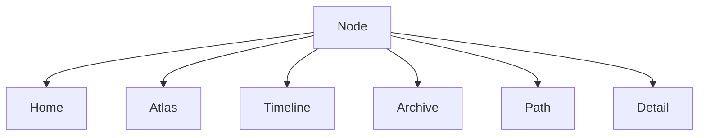

# 古月浮屿｜调研采纳矩阵与 V1 改进动作

> 阶段：V1 开发前研究补充  
> 性质：调研结果落地决策 / Adoption Matrix / V1 Action Plan  
> 目标：把开源项目、数字花园、知识图谱、文档站、静态搜索、类型校验等调研结果转化为明确的采纳、不采纳、延后和开发动作。  
> 核心原则：**研究不是为了堆工具，而是为了让古月浮屿的世界骨架更稳、更清晰、更能长期生长。**

---

## 1. 结论摘要

上一轮调研确认：古月浮屿当前路线不需要推翻。

继续保持：

```text
Next.js
React
TypeScript
Tailwind CSS
Framer Motion
MDX / Markdown
JSON 数据协议
Fuse.js / Pagefind
静态部署
```

但建议从调研中吸收以下改进：

### 1.1 立即采纳

| 能力 | 来源启发 | V1 处理 |
|---|---|---|
| Zod 数据校验 | Zod | 立即加入 |
| Mermaid 文档图示 | Mermaid | 立即加入 docs 规范 |
| Backlinks / ForwardLinks | Quartz / Logseq / Foam | V1 数据层支持，UI 简化显示 |
| LifeStage UI | Digital Garden | V1 NodeCard / NodePassport 显示 |
| WorldEvent 事件化 | Logseq Journal / 时间线思想 | V1 强化时间河 |
| VS Code + Git 作为低成本创世台 | Foam / docs-as-code | V1 采用 |
| Shiki 代码高亮 | 文档站 / 技术博客体验 | V1 可加入 |
| Fuse.js 搜索封装 | Fuse.js | V1 初期采用 |

### 1.2 暂缓采纳

| 能力 | 来源启发 | 暂缓原因 |
|---|---|---|
| Pagefind 全文搜索 | Pagefind | V1 初期内容量不大，V1.1/V2 再加 |
| React Flow 创世台 | React Flow | V2 创世台阶段再做 |
| react-force-graph 星图 | Graph 工具 | V6 高级体验候选 |
| Velite 内容层 | Velite | V1 先 JSON + Zod，避免复杂化 |
| 完整 Obsidian/Quartz 风格 WikiLinks | Quartz/Foam | V1 可预留，不做复杂自动重写 |
| 完整 AI Semantic Search | AI/RAG | V3 再做 |

### 1.3 明确不采纳为主框架

| 工具 / 方向 | 不作为主框架原因 |
|---|---|
| Quartz | 古月浮屿不是 Obsidian vault 发布器 |
| Logseq | 古月浮屿不是纯大纲笔记工具 |
| TiddlyWiki | 不采用单 HTML 自保存模式 |
| Anytype | 不在 V1 引入完整对象数据库范式 |
| Docusaurus | 产品文档味太强，世界感受限 |
| Starlight | 很适合文档，但不适合作为世界前台 |
| MkDocs Material | 技术栈与 Next.js 主路线不一致 |
| 完整 3D 宇宙 | 会拖慢 V1，并掩盖内容骨架 |

---

## 2. 采纳矩阵

## 2.1 Quartz

### 可采纳

- Backlinks
- Explorer 思维
- Graph 概念
- Markdown 发布
- 数字花园结构
- Local graph / related notes

### 在古月浮屿中的对应

| Quartz 能力 | 古月浮屿对应 |
|---|---|
| Explorer | 档案馆 Archive |
| Backlinks | Relation + Backlinks |
| Graph | Atlas 深潜模式 |
| Markdown notes | Node content |
| Digital garden | LifeStage 生命周期 |

### V1 动作

- 新增 `getBacklinks(nodeId)`
- 新增 `getForwardLinks(nodeId)`
- NodePage 显示“从这里可以去哪里 / 哪些节点提到它”
- Archive 支持 area/type/tag/lifeStage 筛选

### 不照搬

- 不直接采用 Quartz 主题
- 不把整个站做成 Obsidian 发布器
- 不让文件夹结构替代世界协议

---

## 2.2 Logseq

### 可采纳

- 本地文件优先
- Journal / 日志思想
- 双链和图谱
- 隐私与用户控制
- 大纲化思考

### 在古月浮屿中的对应

| Logseq 能力 | 古月浮屿对应 |
|---|---|
| Journal | WorldEvent / 时间河 |
| Graph | Relation / Atlas |
| Local files | Markdown + JSON |
| Privacy | private / vault 构建隔离 |
| Blocks | 小粒度 Node / Fragment |

### V1 动作

- 所有关键动作生成 WorldEvent
- 时间河不只按文章日期，而按世界事件
- V1 保持文件可读、可导出
- Node 可以小，但字段必须完整

### 不照搬

- 不采用纯大纲编辑作为主体验
- 不把世界变成日志工具
- 不让图谱优先于阅读与路径

---

## 2.3 TiddlyWiki

### 可采纳

- 微内容单元
- 非线性阅读
- 内容块可复用
- 小而完整的 Tiddler 思维

### 在古月浮屿中的对应

| TiddlyWiki 能力 | 古月浮屿对应 |
|---|---|
| Tiddler | Node |
| 非线性浏览 | RelatedNodes / Paths |
| 单元复用 | Projection |
| 个人 wiki | 世界手册 / 档案馆 |

### V1 动作

- 每个 Node 都必须拥有节点护照
- NodePage 强化相关节点与路径
- Fragment 类型可以短，但不能无元数据

### 不照搬

- 不采用单 HTML 自保存模式
- 不把 UI 做成 wiki 卡片堆叠

---

## 2.4 Foam

### 可采纳

- VS Code + GitHub 工作流
- Markdown 文件为核心
- Link autocomplete / rename links 的方向
- 开发者友好的个人知识库

### 在古月浮屿中的对应

| Foam 能力 | 古月浮屿对应 |
|---|---|
| VS Code 编辑 | V1 低成本创世台 |
| GitHub 工作流 | 世界版本历史 |
| Markdown notes | content/ |
| Graph | Relation 可视化候选 |

### V1 动作

- 明确 V1 不做后台
- 用 VS Code 编辑 `content/` 与 `data/`
- 用 Git 记录世界变化
- 用 Zod 脚本校验世界数据

### 不照搬

- 不把古月浮屿降级为 VS Code 笔记仓库
- 不依赖编辑器插件作为核心能力

---

## 2.5 Anytype

### 可采纳

- Object 思维
- 本地优先
- 私有空间
- 对象类型与关系
- 多视图
- 用户拥有数据

### 在古月浮屿中的对应

| Anytype 能力 | 古月浮屿对应 |
|---|---|
| Object | Node |
| Space | Area / private space |
| Relations | Relation |
| Views | Projection |
| Local-first | Markdown / JSON / 导出 |
| Privacy | visibility / vault |

### V1 动作

- 明确 Node 是对象，不只是文章
- 不同 NodeType 对应不同对象表现
- Projection 作为“同一对象的多视图”进入架构
- data/ 保持可导出

### 不照搬

- 不在 V1 引入完整对象数据库
- 不实现复杂权限空间
- 不做协作空间

---

## 2.6 Docusaurus / Starlight / MkDocs / Nextra / Fumadocs

### 可采纳

- 文档可读性
- 侧边导航
- 目录
- 代码高亮
- 搜索
- 暗色模式
- 内容层级控制

### 在古月浮屿中的对应

| 文档站能力 | 古月浮屿对应 |
|---|---|
| Sidebar | 档案馆 / 文档模式 |
| TOC | 节点正文目录 |
| Code highlight | 技术文章 |
| Search | Archive / Ask low light |
| Versioning | 世界快照 / 年度册 |
| Reading UX | NodeDetail |

### V1 动作

- 技术文章页必须像专业文档一样可读
- NodeDetail 支持目录
- 代码高亮采用 Shiki
- Archive 保持清醒、实用、不诗意过度

### 不照搬

- 不把首页做成产品文档站
- 不牺牲世界入口和地图

---

## 2.7 Pagefind / Fuse.js

### 可采纳

- 无后端搜索
- 静态站搜索
- 本地索引
- 低成本 Ask 低光导览

### V1 决策

```text
V1 初期：Fuse.js
V1.1/V2：Pagefind
V3：AI semantic search
```

### V1 动作

- 新增 `src/lib/search.ts`
- 搜索只读 public / semiPublic 摘要
- Archive 与 Ask 共用搜索接口
- 不让搜索直接读取 private

---

## 2.8 Zod

### 可采纳

- TypeScript-first 校验
- Runtime schema validation
- 构建前守门
- JSON 数据安全

### V1 动作

立即加入：

```text
src/lib/schemas.ts
scripts/validate-world-data.ts
scripts/check-public-build.ts
```

必须校验：

- Node
- Area
- Path
- Relation
- WorldEvent
- WorldState
- public node 是否有 summary
- path 是否引用不存在节点
- relation 是否引用不存在节点
- private 是否进入 public build
- AI 未审核是否 public

---

## 2.9 Mermaid

### 可采纳

- Markdown 中直接画图
- GitHub 可读
- 文档持续维护
- 系统图、流程图、阶段图

### V1 动作

后续 docs 统一优先使用 Mermaid 表达：

- 世界骨架
- 数据流
- 页面投影
- 权限流程
- 构建流程
- AI 草案流程

示例：



---

## 2.10 React Flow / react-force-graph

### React Flow

适合：

- V2 创世台
- 节点关系编辑
- 路径编辑
- 规则流编辑

V1 不引入。

### react-force-graph

适合：

- V6 高级星图
- 技术星域深潜
- 多节点关系可视化

V1 不引入。

---

## 3. 对 V1 技术栈的正式补充

原技术栈：

```text
Next.js
React
TypeScript
Tailwind CSS
Framer Motion
MDX / Markdown
JSON 数据协议
Fuse.js / Pagefind
Vercel / Cloudflare Pages
```

调研后建议补充为：

```text
Next.js
React
TypeScript
Tailwind CSS
Framer Motion
MDX / Markdown
JSON 数据协议
Zod
Fuse.js
Shiki
Mermaid
Vercel / Cloudflare Pages
```

V1.1/V2 候选：

```text
Pagefind
Velite
React Flow
```

V6 候选：

```text
react-force-graph
Three.js / Canvas
Web Audio
```

---

## 4. V1 项目结构调整建议

建议在现有结构基础上新增：

```text
src/lib/schemas.ts
src/lib/search.ts
src/lib/backlinks.ts
src/components/node/Backlinks.tsx
src/components/node/ForwardLinks.tsx
src/components/node/NodeLifeStageBadge.tsx
scripts/validate-world-data.ts
scripts/check-public-build.ts
```

可选新增：

```text
docs/00-overview/research-adoption-matrix-and-v1-actions.md
```

---

## 5. V1 数据模型调整建议

当前 Schema 基本够用，只建议明确 3 点。

### 5.1 Relation 增强 source

```ts
source?: 'manual' | 'rule' | 'ai' | 'markdown-link'
```

原因：

- 未来可以区分手动关系、规则推导、AI 建议、Markdown 链接关系。

### 5.2 Node 增加 links 可选字段

```ts
links?: {
  outgoing?: string[]
  incoming?: string[]
}
```

或不持久化，运行时由 Relation 计算。

建议 V1：

```text
不在 Node 中存 links，
用 Relation + getBacklinks() 计算。
```

### 5.3 Node 增加 maturityLabel 可选，不建议

不建议新增 maturityLabel。  
直接使用 lifeStage 即可，避免字段重复。

---

## 6. V1 页面调整建议

### 6.1 NodePage

新增区块：

```text
从这里可以去哪里
哪些节点提到它
它属于哪些路径
它现在处于什么生命阶段
```

对应组件：

```text
Backlinks
ForwardLinks
NodeLifeStageBadge
RelatedNodes
```

### 6.2 Archive

新增筛选：

- LifeStage
- Source
- AI reviewed
- Visibility

### 6.3 Timeline

只显示 WorldEvent，不直接把所有 node.createdAt 当时间线。

### 6.4 Ask Low Light

低光模式增加：

- 搜索公开内容
- 看精选路径
- 看相关节点
- 看世界地图

### 6.5 Atlas

V1 保持区域卡片地图。  
不要做复杂 graph。

---

## 7. V1 开发任务新增

建议加入 P0：

```text
[ ] 安装 Zod
[ ] 创建 src/lib/schemas.ts
[ ] 创建 scripts/validate-world-data.ts
[ ] 创建 scripts/check-public-build.ts
[ ] 创建 src/lib/search.ts
[ ] 创建 src/lib/backlinks.ts
[ ] 创建 NodeLifeStageBadge
```

建议加入 P1：

```text
[ ] NodePage 增加 Backlinks / ForwardLinks
[ ] Archive 增加 lifeStage 筛选
[ ] NodePassport 增加 lifeStage 解释
[ ] docs 开始使用 Mermaid
[ ] 技术文章接入 Shiki 代码高亮
```

建议加入 Later：

```text
[ ] Pagefind 全文搜索
[ ] React Flow 创世台
[ ] react-force-graph 星图
[ ] Velite 内容层评估
```

---

## 8. V1 骨架原则修订建议

建议在 `v1-skeleton-freeze.md` 增加：

```text
V1 新增底线：
世界数据必须可校验。
节点关系必须可追溯。
搜索必须受权限限制。
图谱能力先数据后 UI。
V1 创世台先用 VS Code + Git + 校验脚本。
```

---

## 9. 技术栈决策修订建议

建议在 `v1-tech-stack-decision.md` 增加：

```text
V1 正式纳入：
- Zod
- Mermaid
- Shiki
```

说明：

- Zod：世界数据守门
- Mermaid：文档图示标准
- Shiki：技术文章代码高亮

不建议 V1 纳入：

- React Flow
- react-force-graph
- Pagefind
- Velite

---

## 10. 设计原则补强

### 10.1 从数字花园吸收

```text
内容不是发布完就结束，而是持续生长。
```

落地：

- lifeStage UI
- 待浇水 seed
- archive / dormant / silent

### 10.2 从知识图谱吸收

```text
内容之间的关系比分类更有生命力。
```

落地：

- Relation
- Backlinks
- ForwardLinks
- RelatedNodes

### 10.3 从文档站吸收

```text
阅读体验必须专业清晰。
```

落地：

- 技术文章代码高亮
- 目录
- 低干扰阅读模式
- 档案馆现实视图

### 10.4 从 local-first 吸收

```text
数据属于自己。
```

落地：

- Markdown / JSON
- Git
- 导出
- public/private 物理隔离

### 10.5 从 AI 工具吸收

```text
AI 只应进入授权范围。
```

落地：

- AI 低光
- AI 草案
- AI reviewed
- vault 不 AI

---

## 11. 不改变的核心

调研不能改变以下底线：

```text
古月浮屿不是普通博客。
古月浮屿不是纯知识库。
古月浮屿不是 Obsidian 发布器。
古月浮屿不是 AI 聊天工具。
古月浮屿不是 3D 炫技站。
古月浮屿不是 CMS 后台。
```

它仍然是：

```text
一个正在生长的个人数字世界。
```

---

## 12. 最终采纳清单

### 12.1 V1 立即加入

```text
Zod
Mermaid
Shiki
Backlinks / ForwardLinks 数据函数
LifeStage UI
WorldEvent 事件化
VS Code + Git + 校验脚本工作流
Fuse.js 搜索封装
```

### 12.2 V1 暂不加入

```text
Pagefind
React Flow
react-force-graph
Velite
完整 WikiLink 自动化
完整 AI RAG
完整 CMS
数据库后台
```

### 12.3 V1 需要修改的文件

建议后续增量修改：

```text
docs/05-engineering/v1-tech-stack-decision.md
docs/00-overview/v1-skeleton-freeze.md
docs/00-overview/v1-build-board.md
docs/05-engineering/v1-schema-final.md
```

建议后续新增代码文件：

```text
src/lib/schemas.ts
src/lib/search.ts
src/lib/backlinks.ts
scripts/validate-world-data.ts
scripts/check-public-build.ts
```

---

## 13. 最终判断

调研的价值不是让古月浮屿变成别人的样子，而是让它更清醒地成为自己。

```text
Quartz 证明 Markdown 数字花园可行。
Logseq 证明本地优先与图谱有价值。
TiddlyWiki 证明微节点可以形成非线性世界。
Foam 证明开发者工作流可以成为创作系统。
Anytype 证明对象、关系和私密空间适合长期个人系统。
Docusaurus / Starlight / MkDocs 证明文档可读性必须专业。
Pagefind / Fuse.js 证明静态搜索足够支撑早期世界。
Zod 证明世界协议可以被校验。
React Flow / graph 工具证明未来创世台和星图有路径。

但古月浮屿要继续坚持：
世界先于内容，
入口清澈，深处浩瀚，
AI 是灯塔，不是太阳，
公开层不是完整世界。
```
