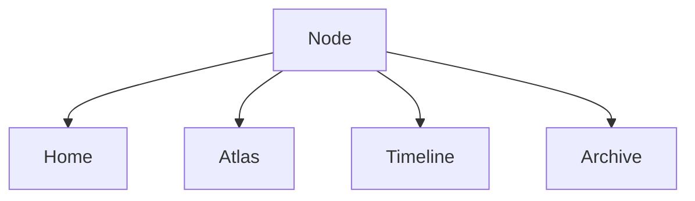

# 古月浮屿｜开源项目与概念调研：数字花园、知识图谱、静态世界与 AI 灯塔

> 阶段：V1 开发前研究补充
> 性质：调研与设计提炼文档
> 目标：联网调研相关开源项目、概念、设计与工具，提炼可借鉴思路，用于完善古月浮屿的世界/宇宙设计。
> 结论先行：**古月浮屿不应变成另一个 Quartz、Logseq、TiddlyWiki 或 Anytype；它应吸收这些系统的结构优点，继续坚持“个人数字世界”的独立定位。**

---

## 1. 调研范围

本次调研覆盖以下方向：

1. 数字花园 / Digital Garden
2. 个人知识管理 / PKM
3. 本地优先 / Local-first
4. 非线性笔记 / Non-linear Notebook
5. 知识图谱 / Personal Knowledge Graph
6. Markdown / MDX 静态内容系统
7. 文档站与内容框架
8. 静态搜索
9. 图谱与节点关系可视化
10. Markdown 图表与开发文档工具
11. 类型安全内容层
12. AI 可插拔与隐私边界

---

## 2. 总体结论

### 2.1 当前方向是对的

古月浮屿当前的核心设计：

```text
World
  ├── Area
  ├── Node
  ├── Relation
  ├── Path
  ├── WorldEvent
  ├── Projection
  ├── Permission
  └── Rule
```

与数字花园、PKM、个人 wiki、文档站、local-first 工具的发展方向高度一致。

但古月浮屿的独特性在于：

```text
它不是工具，
不是单纯笔记库，
不是普通文档站，
不是只给自己看的知识库，
也不是只给访客看的博客。

它是一个以世界观组织内容，
以协议支撑长期生长，
以权限守护私密边界，
以 AI 作为灯塔的个人数字世界。
```

### 2.2 需要吸收的关键能力

本次调研建议吸收 10 个能力：

1. 数字花园的“生长而非发布”理念
2. Quartz 的“Markdown 笔记发布 + backlinks + graph + explorer”
3. Logseq 的“本地 Markdown/Org + 隐私 + 图谱”
4. TiddlyWiki 的“Tiddler 微单元 + 非线性叙事”
5. Foam 的“VS Code + GitHub + Markdown 工作流”
6. Anytype 的“对象类型 + 关系 + 本地优先 + 私有空间”
7. Starlight / Docusaurus / MkDocs 的“文档站可读性、导航、版本、搜索”
8. Pagefind / Fuse.js 的“无后端搜索”
9. React Flow / react-force-graph 的“后续图谱与创世台可视化”
10. Zod / Velite 的“类型安全内容协议与构建时校验”

### 2.3 不应盲目照搬的部分

不建议照搬：

- Quartz 的完整主题结构
- Logseq 的纯大纲编辑模型
- TiddlyWiki 的单 HTML 自保存模式
- Anytype 的完整对象数据库范式
- Docusaurus 的产品文档味
- Starlight 的纯文档站信息架构
- 3D Force Graph 作为 V1 主体验
- 复杂 CMS 或数据库后台

---

## 3. 数字花园理念调研

## 3.1 Digital Garden 的核心启发

数字花园强调：

- 内容可以未完成
- 内容可以持续修剪
- 不以时间流为唯一结构
- 不是社交媒体流
- 不是博客文章仓库
- 思考过程可以公开一部分
- 内容更像植物，有阶段、有养护、有演化

对古月浮屿的启发：

```text
节点生命周期必须成为核心字段，
而不是装饰字段。
```

当前已有：

```text
seed → sprout → growing → bloom → fruit → archive → relic → dormant → silent
```

建议保留，并在 UI 中可见。

### 3.2 对 V1 的建议

V1 中每个 NodeCard 应显示：

- lifeStage
- area
- type
- tags
- updatedAt

并且不同 lifeStage 有不同文案：

| 阶段 | 文案 |
|---|---|
| seed | 这是一颗刚被安放的种子 |
| sprout | 它已经开始发芽 |
| growing | 它仍在继续生长 |
| bloom | 它已经可以被旅人阅读 |
| fruit | 它沉淀为一个成熟结果 |
| archive | 它已进入档案馆 |
| relic | 它是旧时代留下的遗迹 |
| dormant | 它正在低光沉睡 |
| silent | 它被允许保持沉默 |

---

## 4. Quartz 调研

## 4.1 Quartz 是什么

Quartz 是一个面向数字花园和笔记发布的静态站点生成工具，重点是把 Markdown 内容发布成网站。

它的典型能力包括：

- Markdown 笔记发布
- 数字花园结构
- Explorer / 文件树
- 搜索
- backlinks
- graph
- 主题定制
- 适合 Obsidian vault 发布

## 4.2 可借鉴点

### 4.2.1 Backlinks

古月浮屿应当支持双向关系：

```text
当前节点引用了谁
谁又引用了当前节点
```

建议新增或强化：

```ts
getBacklinks(nodeId)
getForwardLinks(nodeId)
```

### 4.2.2 Explorer

Quartz 的 Explorer 对应古月浮屿中的：

```text
档案馆 / Archive
```

建议 V1 档案馆支持：

- 按 Area 浏览
- 按 Type 浏览
- 按 Tag 浏览
- 按 LifeStage 浏览
- 搜索

### 4.2.3 Graph

Quartz 的 Graph 对应古月浮屿中的：

```text
星图 / Atlas 深潜模式
```

但 V1 不做完整 Graph，只做：

- 相关节点
- 手工关系
- 简单关系线索

Graph 留到 V2/V6。

### 4.2.4 Local Markdown Workflow

Quartz 强调从 Markdown 笔记到网站。
古月浮屿应继续坚持：

```text
Markdown / MDX 是内容源。
JSON 是世界协议。
页面是投影。
```

## 4.3 不照搬点

不照搬 Quartz 的原因：

- 古月浮屿不是 Obsidian vault 发布器
- 古月浮屿需要更强的权限模型
- 古月浮屿需要 Area / Path / WorldEvent / Projection
- 古月浮屿不仅是公开笔记，还有私密档案和未来传承

---

## 5. Logseq 调研

## 5.1 Logseq 的启发

Logseq 强调：

- 隐私优先
- 开源
- 本地文件
- Markdown / Org-mode
- 知识图谱
- 日志与任务
- 个人控制

对古月浮屿的启发：

```text
世界不应该只依赖云端数据库。
本地文件、可导出、可长期保存非常重要。
```

## 5.2 可借鉴点

### 5.2.1 日志 / Journal

古月浮屿可借鉴 Logseq 的 daily journal，但不照搬。

对应：

```text
时间河 / WorldEvent
```

建议：

- 每次节点创建生成 WorldEvent
- 每次发布生成 WorldEvent
- 每次归档生成 WorldEvent
- 每次世界规则变化生成 WorldEvent

### 5.2.2 图谱

Logseq 的知识图谱启发古月浮屿的 Relation 层。

建议 V1 先做：

```ts
Relation[]
```

后续再做图谱 UI。

### 5.2.3 隐私与用户控制

古月浮屿应继续强化：

- private 不进入 public build
- vault 不进入搜索
- AI 默认只读 public

---

## 6. TiddlyWiki 调研

## 6.1 TiddlyWiki 的核心启发

TiddlyWiki 是非线性的个人 web notebook，它将内容拆成小块 Tiddler。

对古月浮屿的启发：

```text
Node 应该足够小，能被复用到不同叙事中。
```

这与当前设计的“一个节点，多种投影”高度一致。

## 6.2 可借鉴点

### 6.2.1 Tiddler 思维

Tiddler 对应古月浮屿中的 Node。

建议强化：

```text
节点可以小，但必须有护照。
```

即使是 fragment，也要有：

- id
- slug
- title
- type
- areaId
- visibility
- lifeStage
- createdAt

### 6.2.2 非线性阅读

TiddlyWiki 鼓励沿链接阅读，而不是从头到尾。

古月浮屿应在 NodePage 保留：

- 相关节点
- 所属路径
- 返回区域
- 继续漂流

## 6.3 不照搬点

不采用单 HTML 自保存模式。
古月浮屿需要：

- Git 版本管理
- Markdown 内容
- JSON 协议
- 静态部署
- 后续私密隔离

---

## 7. Foam 调研

## 7.1 Foam 的核心启发

Foam 是基于 VS Code 与 GitHub 的个人知识管理与分享系统。

对古月浮屿的启发：

```text
开发者工作流可以直接成为创世台的早期形态。
```

V1 可以先不做后台，而是用：

- VS Code
- Markdown
- JSON
- Git
- 校验脚本

作为“低成本创世台”。

## 7.2 可借鉴点

### 7.2.1 VS Code 工作流

V1 可以设计为：

```text
用 VS Code 编辑 content 和 data
用脚本校验
用 Git 记录变化
用静态构建发布
```

这比先做后台更稳。

### 7.2.2 Link Autocomplete / Rename Links

后续可以考虑：

- Markdown 链接自动补全
- slug 修改时更新 relation
- 节点重命名检查

### 7.2.3 Graph Visualization

Foam 的图谱能力启发后续 Atlas 深潜模式，但不进入 V1 主线。

---

## 8. Anytype 调研

## 8.1 Anytype 的核心启发

Anytype 强调：

- local-first
- 私有数据
- 对象类型
- 数据库视图
- 图谱关系
- 用户拥有数据
- 空间与权限

对古月浮屿的启发非常大：

```text
Node 不只是文章。
Node 是对象。
Area 是空间。
Relation 是对象关系。
Projection 是对象视图。
```

## 8.2 可借鉴点

### 8.2.1 Object-based World

建议明确：

```text
Node 是古月浮屿的对象单元。
```

不同 NodeType 对应不同对象：

- article
- project
- fragment
- memory
- photo
- letter
- object
- place
- rule

### 8.2.2 多视图

Anytype 的数据库 / 图谱视图启发古月浮屿的 Projection：

同一个 Node 可以被看成：

- 卡片
- 时间事件
- 地图星点
- 档案记录
- 路径步骤
- 记忆光片
- 工坊装置

### 8.2.3 Local-first 与隐私

古月浮屿应继续强调：

```text
数据可离线保存、可导出、可迁移。
```

---

## 9. 文档站框架调研

## 9.1 Docusaurus

优点：

- MDX
- 静态生成
- 文档版本
- 搜索
- SEO
- 导航成熟

可借鉴：

- 文档版本化
- 清晰侧边栏
- 编辑友好
- 发布说明

不采用为主框架原因：

- 产品文档味较重
- 世界感需要更强定制
- 当前已选择 Next.js 自定义世界骨架

## 9.2 Astro Starlight

优点：

- 文档站体验好
- 默认 Pagefind 搜索
- 可读性强
- SEO、代码高亮、暗色模式

可借鉴：

- 阅读体验
- 搜索体验
- 文档导航
- 明暗模式

不采用为主框架原因：

- 古月浮屿已冻结 Next.js
- 世界交互和 Projection 需要自定义

## 9.3 Nextra

优点：

- Next.js + MDX
- 适合快速文档站
- Markdown 链接与图片优化
- 代码高亮

可借鉴：

- MDX 写作体验
- 文档路由
- 内容与组件结合

不直接采用原因：

- 自定义世界地图、时间河、节点护照、权限投影会受限
- 古月浮屿需要更强协议驱动

## 9.4 Fumadocs

优点：

- React / Next.js 文档框架
- 高可定制
- 支持现代文档工作流

可借鉴：

- 文档 UI 组件
- 侧栏、目录、搜索、代码块
- 后续 docs 页面可参考

不作为核心原因：

- 古月浮屿不是纯文档站
- 首页、Atlas、记忆湖、时间河需要更世界化

## 9.5 Material for MkDocs

优点：

- Markdown 文档站成熟
- 搜索、响应式、多语言、漂亮主题
- 文档即代码

可借鉴：

- 文档质量
- 搜索与导航
- 多语言可能性
- 文档站信息密度控制

不采用原因：

- Python 生态，与当前 Next.js 主栈不一致
- 不适合作为世界前台

---

## 10. 搜索工具调研

## 10.1 Fuse.js

适合 V1 初期：

- 小到中等数据量
- 前端 JSON 搜索
- 模糊搜索
- 无后端
- 快速集成

建议：

```text
V1 初期使用 Fuse.js。
```

但必须封装在：

```text
src/lib/search.ts
```

避免未来替换困难。

## 10.2 Pagefind

适合内容增长后：

- 静态站全文搜索
- 低带宽
- 无后端
- 支持大一些的网站
- 构建后生成索引

建议：

```text
V1.1 或 V2 可切换 / 补充 Pagefind。
```

## 10.3 搜索策略

阶段策略：

| 阶段 | 搜索 |
|---|---|
| V1 | Fuse.js 搜 nodes.json |
| V1.1 | Fuse.js + 正文摘要 |
| V2 | Pagefind 静态全文搜索 |
| V3 | AI 语义搜索，但受权限限制 |

---

## 11. 图谱与可视化工具调研

## 11.1 React Flow

适合：

- 创世台
- 节点编辑器
- 关系编辑
- 路径编辑
- 可交互图

不适合：

- 大规模自然知识图谱
- V1 首页主体验

建议：

```text
V2 创世台可考虑 React Flow。
```

## 11.2 react-force-graph

适合：

- 关系星图
- 技术星域深潜
- 大量节点可视化
- 2D / 3D / VR / AR 图谱探索

不适合：

- V1 主地图
- 移动端核心体验
- 阅读页

建议：

```text
V6 高级世界体验可考虑 react-force-graph。
V1 不引入。
```

## 11.3 Mermaid

适合：

- 文档中的系统图
- 世界骨架图
- 数据流图
- 阶段路线图
- 开发说明

建议：

```text
立即采用 Mermaid 作为 docs/ 中的图示标准。
```

原因：

- Markdown 友好
- GitHub 可渲染
- 不依赖复杂设计工具
- 适合持续更新

---

## 12. 类型安全内容层调研

## 12.1 Zod

Zod 可以用于：

- 校验 JSON 数据
- 校验 Node
- 校验 Area
- 校验 Path
- 校验 WorldEvent
- 构建前检查 public/private

建议：

```text
V1 应引入 Zod。
```

原因：

```text
古月浮屿的世界协议必须可验证。
```

## 12.2 Velite

Velite 可把 Markdown / MDX / YAML / JSON 转成类型安全数据层，并可配合 Zod schema。

建议：

```text
V1 可以先不用 Velite。
V1.1 或 V2 再评估。
```

当前先用：

```text
JSON + TypeScript + Zod
```

更简单、可控。

## 12.3 Contentlayer

Contentlayer 也是内容 SDK，能把内容转成类型安全 JSON。

建议：

```text
不作为 V1 首选。
```

原因：

- 当前项目的数据协议更自定义
- 生态状态和长期维护需谨慎
- Zod + 自写读取层更透明

---

## 13. 代码高亮与 Markdown 处理

## 13.1 Shiki

适合：

- 技术文章代码高亮
- VS Code 同源语法体验
- 构建时高亮
- 零运行时高亮

建议：

```text
V1 技术文章应使用 Shiki 或由 MDX 管线间接使用 Shiki。
```

## 13.2 remark / rehype

适合：

- Markdown AST 处理
- 自动生成目录
- 自动处理链接
- 自动给图片加属性
- 自动生成 heading id
- 未来处理 wiki links

建议：

```text
V1 可预留 remark/rehype 管线。
V1 初期不必复杂化。
```

---

## 14. 对古月浮屿设计的直接改进建议

## 14.1 增加 Backlinks 字段与 UI

现有 Relation 是主动关系。
建议在 NodePage 增加：

```text
被哪些节点提及
从这里可以去哪里
```

对应函数：

```ts
getBacklinks(nodeId)
getForwardLinks(nodeId)
```

## 14.2 强化 Node 生命周期 UI

每个 NodeCard 显示 lifeStage。
每个 NodePage 的 NodePassport 中解释 lifeStage。

## 14.3 将时间河从“更新时间”升级为“世界事件”

不要只按文章时间排序。
每个重要动作都生成 WorldEvent。

## 14.4 将档案馆设计为“现实模式”

Archive 不要过度诗意。
它是清醒的检索系统。

## 14.5 将 Atlas 分为两层

V1：

```text
主区域卡片地图
```

后续：

```text
关系星图 / 深潜图谱
```

## 14.6 引入 Mermaid 作为文档图示标准

所有 docs 中复杂结构后续尽量用 Mermaid 表达。

## 14.7 引入 Zod 作为构建前守门

V1 开发时建议新增：

```text
src/lib/schemas.ts
scripts/validate-world-data.ts
```

校验：

- Node
- Area
- Path
- Relation
- WorldEvent
- Visibility
- LifeStage

## 14.8 搜索策略升级

当前技术栈中已经有 Fuse.js / Pagefind。
建议冻结为：

```text
V1：Fuse.js
V1.1/V2：Pagefind
V3：AI Semantic Search
```

## 14.9 将 VS Code + Git 作为 V1 创世台

V1 不做后台，但可以定义早期创世台：

```text
VS Code 编辑
JSON/Markdown 入库
Zod 校验
Git 记录
静态发布
```

## 14.10 为未来导出系统保留 Manifest

受 TiddlyWiki / local-first / docs-as-code 启发，建议每次导出包含：

```text
manifest.json
content/
data/
media/
README.md
```

---

## 15. 建议新增或修改的项目文件

本次调研后，建议后续开发中新增：

```text
src/lib/schemas.ts
scripts/validate-world-data.ts
scripts/check-public-build.ts
docs/00-overview/research-open-source-digital-world-inspirations.md
```

建议后续在 NodePage 增加组件：

```text
Backlinks
ForwardLinks
NodeLifeStageBadge
```

建议在 Archive 增加筛选：

```text
lifeStage
visibility
source
ai.reviewed
```

建议在 docs 中使用 Mermaid：

```md

```

---

## 16. 对当前技术栈的影响

本次调研不建议推翻当前技术栈。

仍保持：

```text
Next.js
React
TypeScript
Tailwind CSS
Framer Motion
MDX / Markdown
JSON 数据协议
Fuse.js / Pagefind
Vercel / Cloudflare Pages
```

但建议补充：

```text
Zod：V1 加入，用于 Schema 校验
Shiki：技术文章代码高亮
Mermaid：文档图示标准
remark / rehype：Markdown 管线预留
React Flow：V2 创世台候选
react-force-graph：V6 星图候选
Velite：V1.1/V2 内容层候选
```

---

## 17. 推荐优先级

### 17.1 立即吸收

- Zod 数据校验
- Mermaid 文档图示
- Backlinks / ForwardLinks 概念
- LifeStage UI
- WorldEvent 事件化
- VS Code + Git 作为 V1 创世台

### 17.2 V1 可做

- Fuse.js 搜索
- Shiki 代码高亮
- NodePassport 增强
- Archive 筛选增强
- 简单 RelatedNodes

### 17.3 V1.1 / V2 再做

- Pagefind 全文搜索
- Velite 内容层
- React Flow 创世台
- Markdown link rename 检查
- 路径编辑器

### 17.4 V3 再做

- AI 语义搜索
- AI 摘要
- AI 隐私检查
- AI 草案区

### 17.5 V6 再做

- react-force-graph
- 2.5D 星图
- 声音层
- 高级沉浸体验

---

## 18. 风险提醒

### 18.1 不要工具崇拜

Quartz、Logseq、Anytype、TiddlyWiki 都值得借鉴，但古月浮屿不是要复制它们。

### 18.2 不要变成纯知识库

古月浮屿必须保留：

- 世界感
- 生活感
- 时间感
- 私密边界
- 未来传承

### 18.3 不要过早图谱化

图谱很酷，但 V1 的地图应简单。

### 18.4 不要过早 AI 化

AI 灯塔必须等世界骨架稳定后再增强。

### 18.5 不要牺牲导出

任何新工具都不能让内容被锁死。

---

## 19. 最终结论

本次调研确认：

```text
古月浮屿当前方向正确。
```

但需要在 V1 开发中强化 5 件事：

1. Node 作为“对象”而不只是“文章”
2. Relation / Backlinks 作为世界星线
3. LifeStage 作为数字花园的生长表达
4. WorldEvent 作为时间河的真实源头
5. Zod / 校验脚本作为世界骨架的守门人

最终判断：

```text
Quartz 给了我们数字花园的发布启发。
Logseq 给了我们本地与图谱启发。
TiddlyWiki 给了我们非线性节点启发。
Foam 给了我们 VS Code + Git 创世台启发。
Anytype 给了我们对象与权限空间启发。
Docusaurus / Starlight / MkDocs 给了我们文档可读性启发。
Pagefind / Fuse.js 给了我们无后端搜索启发。
React Flow / react-force-graph 给了我们未来星图启发。
Zod / Velite 给了我们类型安全内容层启发。

但古月浮屿必须继续做自己：
一个有世界观、有私密边界、有时间河、有 AI 灯塔、有未来传承的个人数字世界。
```

---

## 20. 参考来源

> 以下为本次调研主要参考资料，后续可继续扩展。

### 数字花园 / 概念

- Maggie Appleton｜A Brief History & Ethos of the Digital Garden
  https://maggieappleton.com/garden-history

- Maggie Appleton｜The Garden of Maggie Appleton
  https://maggieappleton.com/garden/

- Andy Matuschak notes｜About these notes / Work with the garage door up
  https://notes.andymatuschak.org/About_these_notes

### 数字花园 / PKM / 知识库

- Quartz
  https://quartz.jzhao.xyz/

- Quartz GitHub
  https://github.com/jackyzha0/quartz

- Logseq GitHub
  https://github.com/logseq/logseq

- TiddlyWiki
  https://tiddlywiki.com/

- Foam GitHub
  https://github.com/foambubble/foam

- Foam Docs
  https://docs.foamnotes.com/

- Anytype
  https://anytype.io/

- Anytype Docs
  https://doc.anytype.io/anytype-docs

### 文档站与静态内容框架

- Docusaurus
  https://docusaurus.io/

- Astro Starlight
  https://starlight.astro.build/

- Nextra
  https://nextra.site/

- Fumadocs
  https://www.fumadocs.dev/

- Material for MkDocs
  https://squidfunk.github.io/mkdocs-material/

### 内容层 / 搜索 / Markdown 工具

- Pagefind
  https://pagefind.app/

- Fuse.js
  https://www.fusejs.io/

- Zod
  https://zod.dev/

- Velite
  https://velite.js.org/

- Contentlayer
  https://www.contentlayer.dev/

- Shiki
  https://shiki.style/

- remark / rehype / unified
  https://unifiedjs.com/

- Mermaid
  https://mermaid.js.org/

### 图谱与可视化

- React Flow
  https://reactflow.dev/

- xyflow GitHub
  https://github.com/xyflow/xyflow

- react-force-graph
  https://github.com/vasturiano/react-force-graph
