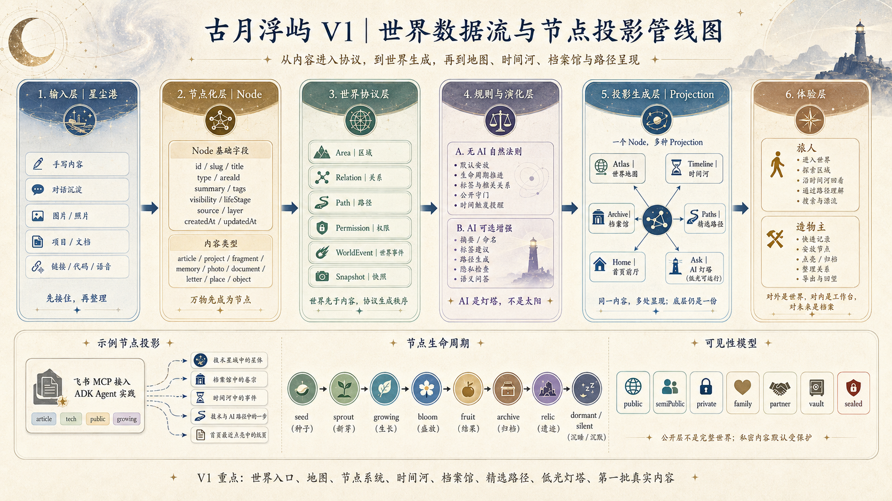

# 古月浮屿｜世界文档总目录

> 古月浮屿不是传统博客，而是一个正在生长的个人数字世界。  
> 本目录整合了所有核心设计与工程文档，作为探索这个世界的入口。

## 一句话定位

**古月浮屿是一个正在生长的个人数字世界。**

它用于安放：技术、项目、灵感、生活、记忆、爱、家庭、孩子、旅行、时间、AI 与未来。它对外是宇宙，对内是工作台，对未来是档案。

---

## 推荐阅读顺序

### 1. 先理解世界 (法则与宣言)

- [**世界宪章**](./01-world/世界宪章.md)  
  定义世界本质、最高法则、主权原则、隐私伦理、AI 边界和长期承诺。
- [**世界手册**](./01-world/世界手册.md)  
  说明世界的区域、页面、导航、内容生命周期及 V1 推进计划。
- [**世界规则**](./01-world/世界规则.md)  
  详细定义节点、权限、投影、路径及无 AI 自然演化规则。
- [**术语词典**](./01-world/术语词典.md)  
  收纳世界语言与现实名的映射，确保命名规范一致。

### 2. 再理解产品 (定位与需求)

- [**产品总览**](./02-product/产品总览.md)  
  定义产品定位、目标用户、价值主张及核心闭环。
- [**PRD 产品需求文档**](./02-product/PRD 产品需求文档.md)  
  将理念转化为可执行的产品需求与功能清单。
- [**阶段划分与文档映射**](./00-overview/阶段划分与文档映射.md)  
  把项目阶段规划、目标与配套文档统一整理。

### 3. 再看设计 (架构与体验)

- [**信息架构与导航设计**](./03-design/信息架构与导航设计.md)  
  确保世界浩瀚但不混乱，宏大但不迷路。
- [**交互体验设计文档**](./03-design/交互体验设计文档.md)  
  定义进入感、探索感与生长感，规范仪式感。
- [**视觉设计系统**](./03-design/视觉设计系统.md)  
  建立长期一致、克制、温柔、有世界感的视觉体系。

### 4. 再看内容与工程 (落地与实现)

- [**内容系统与编辑规范**](./04-content/内容系统与编辑规范.md)  
  定义内容模型，确保各类信息都能被有序安放与生长。
- [**系统设计文档**](./05-engineering/系统设计文档.md)  
  将世界观、需求与技术实现串联成可运行系统。
- [**数据模型与内容协议**](./05-engineering/数据模型与内容协议.md)  
  定义核心数据对象、字段校验及文件组织方式。
- [**技术架构设计**](./05-engineering/技术架构设计.md)  
  确保静态优先、无 AI 可运行及未来可扩展性。
- [**V1 实施蓝图**](./05-engineering/V1 实施蓝图.md)  
  V1 版落地范围、页面、数据结构及验收标准。
- [**V1 开发任务拆解**](./05-engineering/V1 开发任务拆解.md)  
  将 V1 规划拆解为具体可执行的开发任务。
- [**测试验收与质量保障**](./05-engineering/测试验收与质量保障.md)  
  定义可用性、安全性及可维护性的测试原则。

### 5. 最后看安全、AI、路线图与未来

- [**AI 守则**](./06-privacy-ai/AI 守则.md)  
  定义 AI 角色、权限边界、禁止事项及降级模式。
- [**安全隐私与发布守门**](./06-privacy-ai/安全隐私与发布守门.md)  
  确保公开世界不泄露私密，保护家庭与个人资料。
- [**路线图与版本计划**](./07-roadmap/路线图与版本计划.md)  
  按阶段点亮世界，避免概念过度膨胀导致失控。
- [**未来阶段补充文档集**](./00-overview/未来阶段补充文档集.md) / [**未来探索**](./08-future/)  
  包含私密档案、传承系统、主题展览、胶囊设计等 V4+ 规划。

---

## 核心守则

### 总原则
> 先创造一套不会迷路的宇宙法则，再允许万物自由生长。  
> AI 可以参与造物，但世界本身必须在没有 AI 时依然会呼吸。

### 永远不要忘记
- **AI 是灯塔，不是太阳。**
- **公开层不是完整世界。**
- **私密内容默认受保护。**
- **无 AI 时世界仍能运行。**
- **世界为生活服务，不让生活服务世界。**

### 阶段提醒
- **V0**：让世界说得清。
- **V1**：让世界站起来。
- **V2**：让世界可维护。
- **V3**：让灯塔亮起来。
- **V4**：让记忆深处被守护。
- **V5**：让时间形成资产。
- **V6**：让世界更沉浸。

---

## 世界架构概览

---
> 更新日期：2026-05-20  
> 原则：**详细、完整、宁冗余不错漏**。
